<p align="center"></p>

# ChipWhisperer Studio

A desktop application for [NewAE ChipWhisperer](https://github.com/newaetech/chipwhisperer) side-channel and fault-injection hardware. Connect a scope, build and flash target firmware, capture power traces while the waveform updates live, recover AES keys with CPA and sweep glitch parameters without writing Python or setting up Jupyter. Talk to the target over UART, SPI, GPIO and JTAG/SWD, capture and decode logic signals, and see which line of firmware runs at each point of a trace. When you do want code, built-in notebooks run Python cell by cell against the same hardware, including NewAE's own tutorial notebooks. An MCP server lets AI agents drive all of it.

[](https://github.com/keyuraghao/chipwhisperer-studio/actions/workflows/ci.yml)  

**Documentation:** the [ChipWhisperer Studio wiki](https://github.com/keyuraghao/chipwhisperer-studio/wiki) explains every feature, option and setup step in detail, from [installation](https://github.com/keyuraghao/chipwhisperer-studio/wiki/Installation) and a [quick start](https://github.com/keyuraghao/chipwhisperer-studio/wiki/Quick-Start) to the [MCP server](https://github.com/keyuraghao/chipwhisperer-studio/wiki/MCP-Server) and [troubleshooting](https://github.com/keyuraghao/chipwhisperer-studio/wiki/Troubleshooting).

<picture><source media="(prefers-color-scheme: light)" srcset="docs/wiki/images/capture-light.png"></picture>

**See it in action:** every section below has a short clip that plays by itself. There is also a full [video walkthrough of every feature](https://github.com/keyuraghao/chipwhisperer-studio/releases/download/v0.5.0/chipwhisperer-studio-demo.mp4) (a few minutes, made with the built-in simulator), with chapters listed on the [Video Tour](https://github.com/keyuraghao/chipwhisperer-studio/wiki/Video-Tour) wiki page. Screenshots on this page follow your GitHub theme.

[](https://github.com/keyuraghao/chipwhisperer-studio/releases/download/v0.5.0/chipwhisperer-studio-demo.mp4)

> ChipWhisperer Studio is an independent community project. It is not affiliated with or endorsed by NewAE Technology Inc.; it uses their open source `chipwhisperer` Python library for all hardware access.

## Contents

- [Video tour](#chipwhisperer-studio)
- [Features](#features)
- [Install](#install)
- [Walkthrough](#walkthrough): [connect](#1-connect), [scope](#2-configure-the-scope), [target](#3-program-and-talk-to-the-target), [interfaces](#4-use-the-targets-interfaces), [capture](#5-capture-traces), [CPA](#6-recover-the-key-with-cpa), [glitching](#7-sweep-glitch-parameters), [code on the waveform](#8-see-the-code-on-the-waveform), [notebooks](#9-work-in-notebooks), [logic analyser](#10-capture-and-decode-logic-signals), [notes](#11-take-notes-and-do-the-maths)
- [Building firmware](#building-firmware)
- [AI agents (MCP)](#ai-agents-mcp)
- [HTTP API and remote use](#http-api-and-remote-use)
- [Performance](#performance)
- [Architecture](#architecture)
- [Development](#development)
- [Releases](#releases)
- [License](#license)
- [Full documentation (wiki)](https://github.com/keyuraghao/chipwhisperer-studio/wiki)

## Features

| Area | What you get |
|------|--------------|
| Connect | Auto-detect ChipWhisperer Nano, Lite, Pro, Husky and Husky Plus, pick a device by serial number, and follow platform-specific driver and udev help. A built-in **simulator** lets you try everything without hardware, posing as any of these models and even running your own firmware in an emulator. |
| Scope | Every setting of the connected scope (gain, ADC, clock, trigger, IO, glitch, Husky extras) as an editable tree with inline documentation and hardware read-back after each change. |
| Target | Program STM32F, XMEGA, AVR, SAM4S and NEORV32 targets and iCE40 and XC7A35T FPGAs, use a serial terminal (text or hex), send SimpleSerial commands, and edit target interface settings. |
| Interfaces | UART with a terminal, SimpleSerial 1.0 to 2.1, an SPI master with flash shortcuts, GPIO, the Husky's USERIO header, every trigger type (Husky sequencer, UART pattern, edge counter, ADC level, SAD, Pro I/O decode), the bit-banger and 1-Wire, and JTAG/SWD through OpenOCD. Only what the connected model supports is enabled, the rest says why. |
| Firmware | Build any ChipWhisperer firmware project for any platform with **GCC or clang**. Compilers download on demand and sources come straight from NewAE's GitHub. |
| Waveform | Live view of every capture, an overlay of the last N traces, mean and min/max envelope, trace browsing, zoom (drag, buttons or +/- keys), two cursors with delta read-out, a time axis and PNG export. |
| Code | **Code on the waveform**: Studio emulates your firmware (Arm Cortex-M, RISC-V, AVR/XMEGA) for a captured trace, aligns it automatically and shows functions and source lines under the plot; select part of the trace to see the code that made it. |
| Capture | Single, N traces or continuous; fixed, random or counter keys and plaintexts; trigger-only mode; rate limiting; export to `.npz`, `.cwp` (ChipWhisperer project) or `.csv`. |
| Analysis | Progressive CPA with five AES leakage models, per-byte ranking, PGE convergence and correlation plots. |
| Glitch | Cartesian or random sweeps over any `glitch.*` parameters with target reset handling and a live result scatter plot. |
| Notebook | Jupyter-style `.ipynb` notebooks that run inside Studio and share its hardware connection, as tabs or two side by side, each with its own kernel; captured traces land in the Capture tab. Runs NewAE's tutorial notebooks unmodified. |
| Logic | A logic analyser for every model: the Husky's built-in one, any scope's analog input, sigrok analysers, VCD/CSV/sigrok files or simulated traffic, with UART, SPI, I2C, 1-Wire, JTAG, SWD, CAN and SimpleSerial decoders, search, cursors, measurements and exports. |
| Notes and Calc | A text pad, a calculator with side-channel helpers (`hw`, `hd`, `sbox`, XOR), and live statistics of whatever you select. |
| AI agents | `cw-studio mcp`: a Model Context Protocol server with 106 tools covering all of the above. |
| Everywhere | Its own application window (or your browser), light and dark themes, a documented HTTP API (`/api/docs`), and remote use from any browser on the network. |

## Install

### Standalone bundle (no Python needed)

Every [release](https://github.com/keyuraghao/chipwhisperer-studio/releases/latest) has two builds per platform (about 72 MB each): **ChipWhisperer Studio** (`ChipWhispererStudio-<os>-<arch>.zip`) opens in its own application window, and **ChipWhisperer Studio Web** (`ChipWhispererStudio-Web-<os>-<arch>.zip`) opens in your web browser. Unzip one and run:

- **Windows:** `ChipWhispererStudio.exe`. If the device is not detected, install the NewAE WinUSB driver.
- **macOS:** `ChipWhisperer Studio.app` or `ChipWhisperer Studio Web.app` (right-click and choose Open the first time).
- **Linux:** `./chipwhisperer-studio.sh`. Install the udev rule once; the Connect tab shows the exact command. `./ChipWhispererStudio --install-desktop` adds Studio with its icon to the applications menu.

The window uses the system's web engine (Edge WebView2 on Windows, WebKit on macOS, WebKitGTK on Linux, where `sudo apt install python3-gi gir1.2-webkit2-4.1` may be needed once; without it Studio opens in the browser). Details are on the [Installation](https://github.com/keyuraghao/chipwhisperer-studio/wiki/Installation) wiki page.

### With Python

```bash
pip install chipwhisperer-studio
cw-studio              # opens Studio in its own window
cw-studio-web          # or in your web browser
cw-studio --simulate   # try it without hardware
```

Studio is on [PyPI](https://pypi.org/project/chipwhisperer-studio/); the wheel is also attached to every [release](https://github.com/keyuraghao/chipwhisperer-studio/releases). Use Python 3.10 to 3.12: `chipwhisperer` 6.0.0 on PyPI pins numpy 1.26, which has no wheels for newer Pythons.

Options: `--simulate` (pre-select the simulator), `--port 8765`, `--host 0.0.0.0` (remote access), `--browser` (use the web browser), `--app-window` (use Studio's window even with `cw-studio-web`), `--no-browser` (server only), `--data-dir DIR` (exports, firmware, toolchains, notebooks and notes; default `~/ChipWhispererStudio`), `--log-level debug|info|warning|error`.

## Walkthrough

### 1. Connect

Choose your ChipWhisperer (or Auto-detect, or the Simulator and the model it should pose as) and press **Connect scope**, then **Connect target**. Use SimpleSerial v2 for current ChipWhisperer firmware.


<picture><source media="(prefers-color-scheme: light)" srcset="docs/wiki/images/connect-light.png"></picture>

### 2. Configure the scope

Every scope setting is listed with its documentation (hover a name) and read back from the hardware after each change. Press **Single** in the header to check the waveform while you adjust gain, samples, offset and trigger.


<picture><source media="(prefers-color-scheme: light)" srcset="docs/wiki/images/scope-light.png"></picture>

### 3. Program and talk to the target

Program a `.hex` from disk or straight from a Studio build, check the target answers in the serial console, and send SimpleSerial commands by hand.


<picture><source media="(prefers-color-scheme: light)" srcset="docs/wiki/images/target-light.png"></picture>

### 4. Use the target's interfaces

The **Interfaces** tab has a UART terminal, SimpleSerial, an SPI master (read a flash chip's JEDEC ID with one click), GPIO, the Husky's USERIO pins, every trigger type the scope offers, the Husky bit-banger with 1-Wire, and JTAG/SWD debugging and flashing through OpenOCD (installed on demand). Everything the connected model cannot do stays visible with the reason, and the [capability matrix](https://github.com/keyuraghao/chipwhisperer-studio/wiki/Protocols-and-Interfaces) lists it per model.


<picture><source media="(prefers-color-scheme: light)" srcset="docs/wiki/images/interfaces-light.png">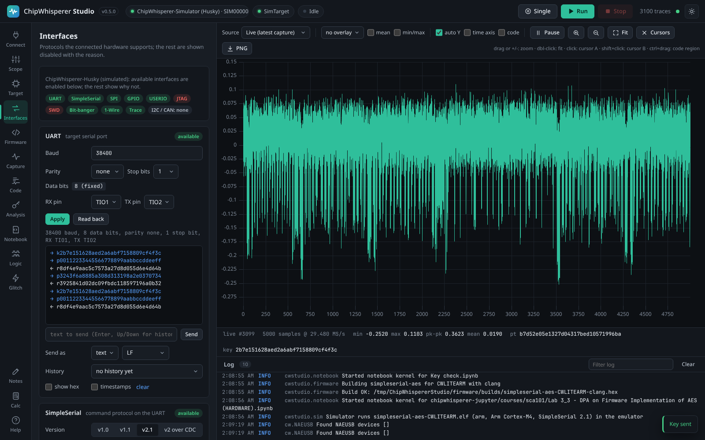</picture>

### 5. Capture traces

Pick a trace count and key/plaintext mode and press **Run**. Traces stream to the waveform view as they are captured. Overlay the last N traces, show the mean and min/max envelope, zoom, and place cursors. Export as a ChipWhisperer project (`.cwp`) or `.npz` to continue in Python.


<picture><source media="(prefers-color-scheme: light)" srcset="docs/wiki/images/capture-light.png"></picture>

Zoom with the magnifier buttons next to **Fit** (or the **+** and **-** keys): each step halves or doubles the visible range around cursor A. Dragging across the plot zooms into a range, and **Fit** or a double-click shows the whole trace again.

<picture><source media="(prefers-color-scheme: light)" srcset="docs/wiki/images/waveform-zoom-light.png">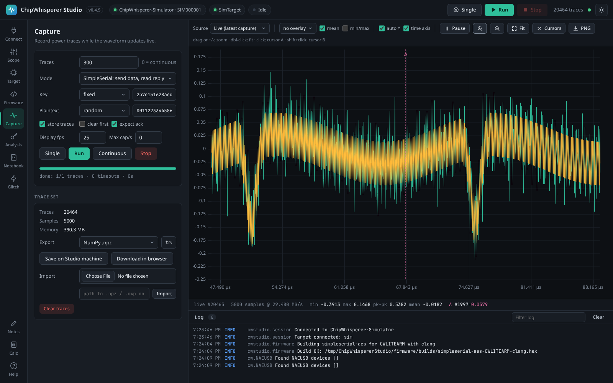</picture>


### 6. Recover the key with CPA

Run a correlation power analysis attack with the leakage model that matches your target. With a known key the partial guessing entropy (PGE) plot shows every byte converging to rank 0; click a byte to see where it leaks in the trace.


<picture><source media="(prefers-color-scheme: light)" srcset="docs/wiki/images/analysis-light.png"></picture>

### 7. Sweep glitch parameters

Configure the glitch module in the Scope tab, then sweep parameters such as `glitch.ext_offset` and `glitch.width`. Each point is classified as normal, success (a valid but wrong answer) or reset, and plotted live.


<picture><source media="(prefers-color-scheme: light)" srcset="docs/wiki/images/glitch-light.png">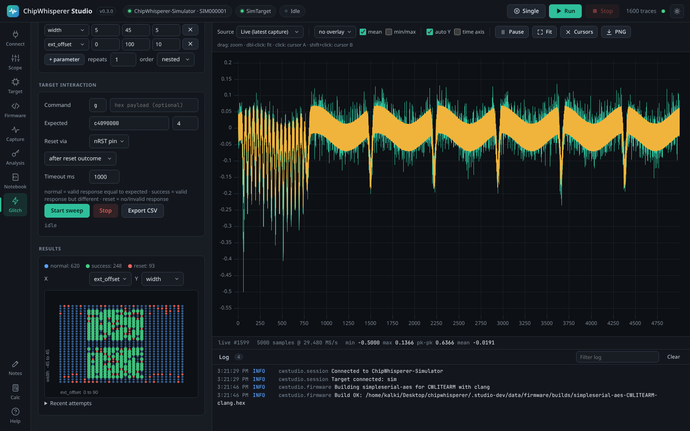</picture>

### 8. See the code on the waveform

Give Studio the firmware's ELF (it uses the one you built or programmed automatically) and the **Code** tab emulates it for the inputs of a captured trace: Unicorn for Arm Cortex-M and RISC-V, Studio's own cycle-accurate emulator for AVR and XMEGA. It maps clock cycles to samples, aligns the result with the measured traces (with a confidence score) and draws the functions and source lines in a band under the waveform. Ctrl+drag across the trace to see the code, source lines and disassembly of that region; click a line to shade every sample where it ran. Peripherals and interrupts are not emulated, so timing is close rather than exact; on a Husky, SWO program counter sampling measures it. Programmed into the simulator, the same ELF runs for real: CPA works on its traces and a glitch skips instructions.


<picture><source media="(prefers-color-scheme: light)" srcset="docs/wiki/images/code-light.png">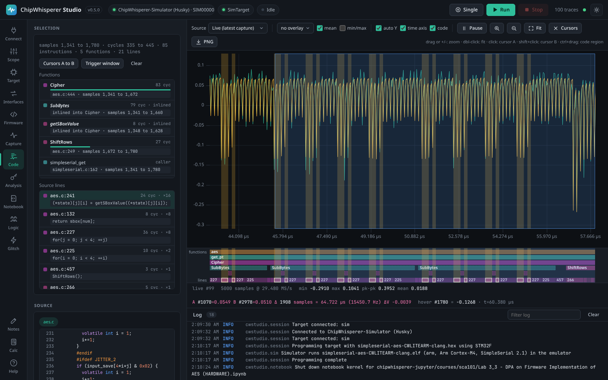</picture>

### 9. Work in notebooks

The **Notebook** tab is a Jupyter-style editor that runs inside Studio. Write Python cell by cell (Shift+Enter runs a cell), mix in Markdown text cells, and see output, errors and matplotlib figures inline. Cells share Studio's hardware connection: `cw.scope()` and `cw.target()` return the devices you connected, and every trace captured with `cw.capture_trace()` or a manual `scope.arm()` / `scope.capture()` loop shows up live in the waveform view. Press **View traces** to jump to the Capture tab with them.


<picture><source media="(prefers-color-scheme: light)" srcset="docs/wiki/images/notebook-light.png">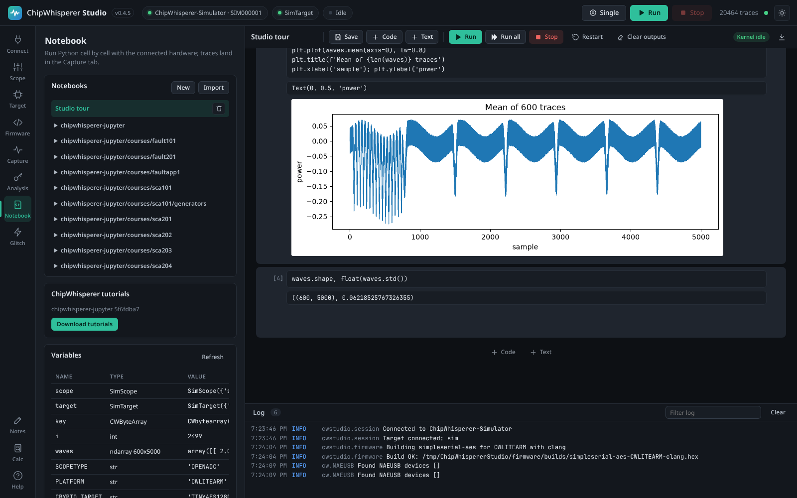</picture>

Open several notebooks as tabs, or drag one to the side to see two at once. Each notebook has its own kernel (its own variables), and cells of all notebooks take turns on the hardware. Notebooks open in several windows, or changed by an agent, stay in sync.


<picture><source media="(prefers-color-scheme: light)" srcset="docs/wiki/images/notebook-split-light.png">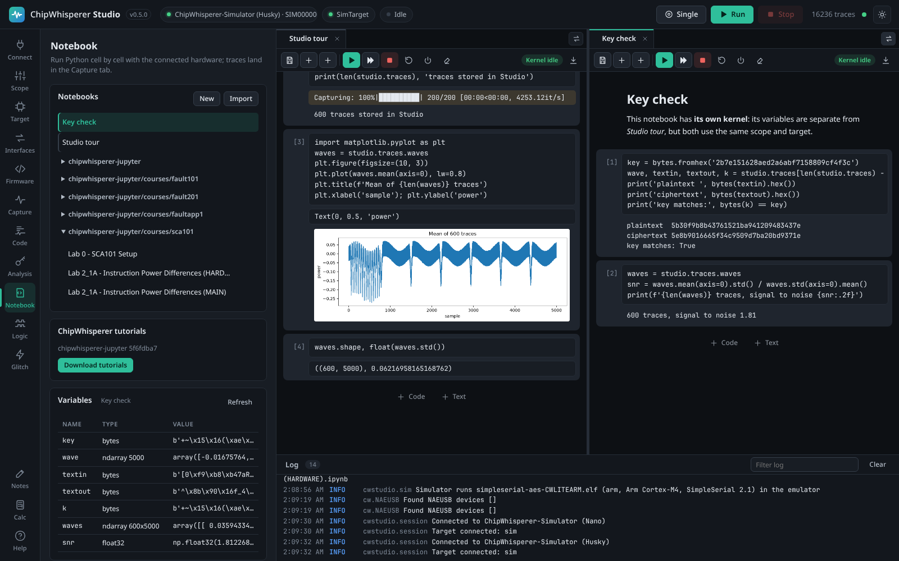</picture>

Notebooks are standard `.ipynb` files: import your own, or export them to use with Jupyter. **Download tutorials** fetches NewAE's chipwhisperer-jupyter courses (SCA101, Fault101 and more) at the version that matches your firmware sources. They run unmodified: `%run` setup scripts, `%%bash` build cells using Studio's compilers, programming and capture loops all work. The `studio` object adds shortcuts such as `studio.traces`, `studio.build_firmware()` and `studio.program()`.

### 10. Capture and decode logic signals

The **Logic** tab is a logic analyser for every ChipWhisperer: the Husky's built-in one (9 signals, up to 65,535 samples on the Husky Plus), one line through any scope's analog input, external analysers through sigrok, PulseView, Saleae and VCD files, or simulated traffic. Decoders for UART, SPI, I2C, 1-Wire (with overdrive), JTAG, SWD, CAN and SimpleSerial run on any capture, with a glitch filter, buses, edge, pattern and value search, cursors, measurements, a results table and exports to VCD, CSV and sigrok. Big captures decode in a background process and the view stays fast at millions of samples.


<picture><source media="(prefers-color-scheme: light)" srcset="docs/wiki/images/logic-light.png">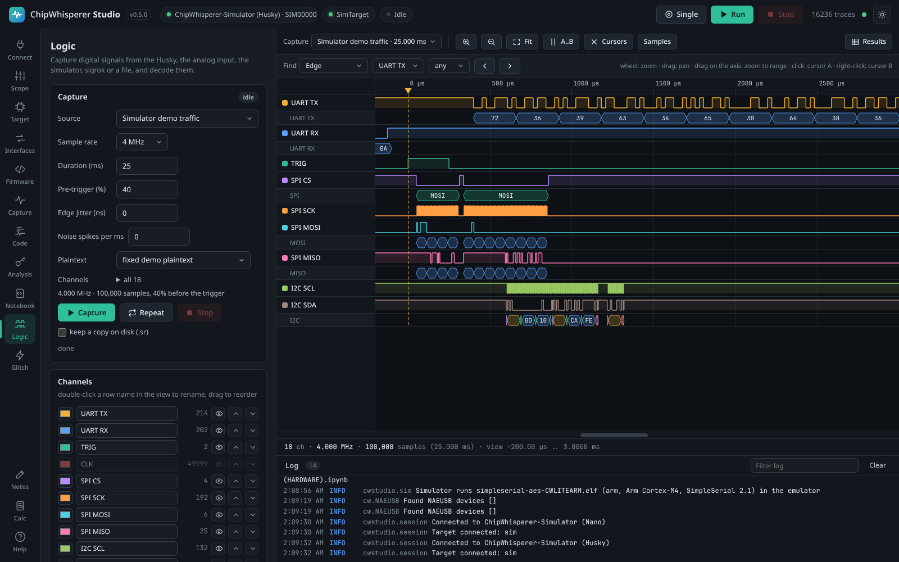</picture>

### 11. Take notes and do the maths

**Notes** is a text pad for keys, glitch settings that worked and to-dos, saved automatically as Markdown files. **Calc** evaluates expressions with side-channel helpers (`0x2b ^ 0x7e`, `hw(x)`, `hd(a, b)`, `sbox(x)`, `mean(...)`) and computes count, sum, mean, median, min, max, peak to peak, standard deviation and RMS of the current selection: the waveform between cursors or in the zoomed range, one sample across all traces, or any selected text.


<picture><source media="(prefers-color-scheme: light)" srcset="docs/wiki/images/notes-light.png"></picture>

Select numbers anywhere in Studio (a note, notebook output, the log or the serial console) and the log bar shows their count, sum, mean, min and max immediately.

<picture><source media="(prefers-color-scheme: light)" srcset="docs/wiki/images/calc-light.png"></picture>

## Building firmware

The **Firmware** tab builds ChipWhisperer's own firmware projects (simpleserial-aes, simpleserial-glitch, simpleserial-ecc and the others) with ChipWhisperer's makefiles, for any of the 38 platforms they support. Choose a project, a platform and GCC or clang, then press **Build & program**: Studio compiles the firmware and flashes the connected target with the right programmer.


<picture><source media="(prefers-color-scheme: light)" srcset="docs/wiki/images/firmware-light.png"></picture>


### Compilers download on demand

Studio does not bundle compilers, which would add hundreds of MB to every download. The first time a build needs one, Studio downloads the official release for your OS, checks it against a pinned SHA-256 checksum, unpacks it into the data folder and uses it offline from then on.

| Toolchain | Version | Targets | Source |
|-----------|---------|---------|--------|
| GNU Arm GCC | 15.2.1 | Arm Cortex-M (CW-Lite Arm, Nano, Husky, STM32, SAM4S, K82F, ...) | [xPack](https://xpack-dev-tools.github.io/arm-none-eabi-gcc-xpack/) |
| GNU AVR GCC + avr-libc | 7.3.0 | XMEGA and ATmega (CW-Lite XMEGA, CW304, ...) | [Arduino](https://github.com/arduino/toolchain-avr) |
| GNU RISC-V GCC | 15.2.0 | NEORV32, Ibex, FE310 | [xPack](https://xpack-dev-tools.github.io/riscv-none-elf-gcc-xpack/) |
| LLVM clang | 21 | Arm, AVR and RISC-V | [Zig 0.16.0](https://ziglang.org/download/) |
| GNU make + sh | 4.4.1 | Windows only | [xPack](https://xpack-dev-tools.github.io/windows-build-tools-xpack/) |

Clang builds compile every C file with clang and let GCC assemble the startup files and link against newlib or avr-libc, so the firmware uses the same C library and linker scripts as a GCC build. For targets without a free pinned toolchain (TriCore, PowerPC, RX) or to pin a specific compiler, add a **custom toolchain** from an archive URL or an existing folder. Compilers already on your `PATH` are detected and used as a fallback.

<picture><source media="(prefers-color-scheme: light)" srcset="docs/wiki/images/toolchains-light.png">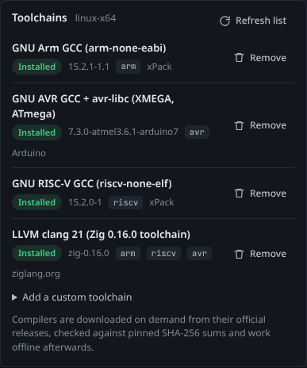</picture>

### Sources come from NewAE, not from Studio

Firmware sources are not packed into Studio either. Studio downloads `firmware/mcu` and the matching `chipwhisperer-fw-extra` HALs straight from [newaetech/chipwhisperer](https://github.com/newaetech/chipwhisperer) and follows a channel of your choice: `develop` (default), the latest release, or any tag or commit. **Check for updates** compares your copy with GitHub and **Update now** pulls new examples and fixes without a new Studio release. You can also point Studio at your own ChipWhisperer checkout to build local changes. If you hit GitHub's limit of 60 anonymous API requests per hour (for example on a shared network), set a `GITHUB_TOKEN` environment variable and Studio will use it for these lookups.

### Platform coverage

Every Arm, AVR and RISC-V platform in ChipWhisperer builds with GCC, apart from three whose upstream HAL sources are broken (CW308_EFM32GG11, CW308_PSOC62, CW308_NRF52). With clang, 28 of the 38 platforms build, including all the common ones (CWLITEARM, CWNANO, CWHUSKY, CWLITEXMEGA, CW304, STM32F0 to F4, SAM4S, K82F, NEORV32, Ibex); a few HALs use GCC-only constructs, so use GCC for those. AURIX, RX65N and MPC5676R need a custom toolchain. Builds are verified in CI on Linux, Windows and macOS.

## AI agents (MCP)

`cw-studio mcp` runs a [Model Context Protocol](https://modelcontextprotocol.io) server with 106 tools for everything in the UI: connecting, every scope and target setting, programming, serial and SimpleSerial I/O, capture with all its options, trace access and export, CPA, glitch sweeps, toolchains, firmware sources and builds, the hardware interfaces (UART, SPI, GPIO, triggers, bit-banger, OpenOCD), logic capture and decoding, the code map, running notebook code and whole notebooks (including NewAE's tutorials) in their own kernels, notes and the calculator. It also offers guided prompts (a CPA attack and a glitch search) and live status resources.

If Studio is already running, the MCP server attaches to it, so you can watch the agent capture and analyse in Studio's window. Otherwise it starts a headless Studio in the background.


<picture><source media="(prefers-color-scheme: light)" srcset="docs/wiki/images/mcp-setup-light.png">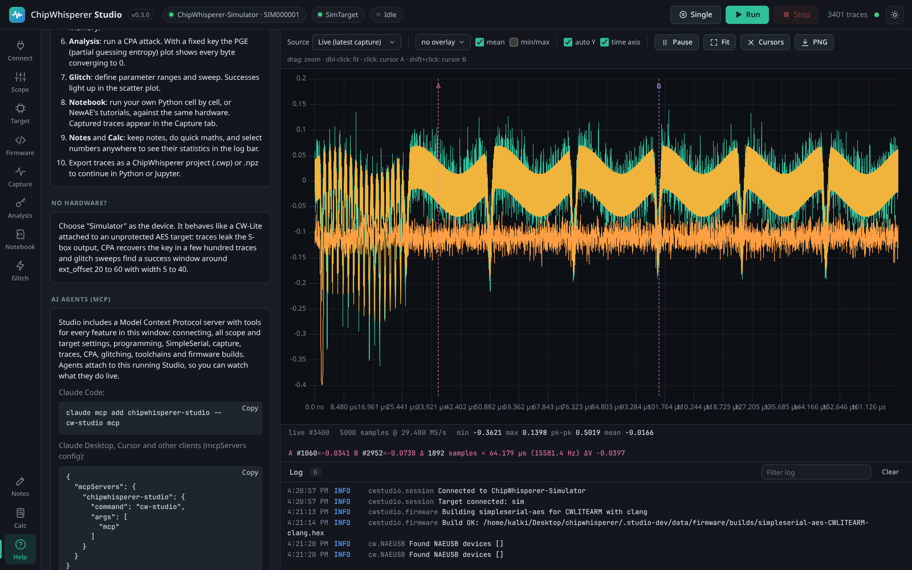</picture>

**Claude Code:**

```bash
claude mcp add chipwhisperer-studio -- cw-studio mcp
```

**Claude Desktop, Cursor and other clients:**

```json
{
  "mcpServers": {
    "chipwhisperer-studio": { "command": "cw-studio", "args": ["mcp"] }
  }
}
```

With the standalone bundle, use the full path to `ChipWhispererStudio` as the command (on Windows, `cw-studio.exe` in the window build); the Help tab shows the exact command for your installation. Useful options: `--simulate` (no hardware), `--url http://host:8765` (attach to a remote Studio), `--transport streamable-http --mcp-port 8766` (serve MCP over HTTP), `--no-embed` (never start a headless Studio).

Try asking your agent: *"Connect to the simulator, capture 100 traces with a fixed key and recover the key with CPA"*, *"Build simpleserial-glitch for CWLITEARM, flash it and find a glitch width and offset that skip the loop"* or *"Capture the demo traffic, decode the I2C bus and tell me which addresses NACKed."*

## HTTP API and remote use

Everything the UI and the MCP server do goes through a documented HTTP API; open `/api/docs` for the list of endpoints and the [HTTP API wiki page](https://github.com/keyuraghao/chipwhisperer-studio/wiki/HTTP-API) for details. Start Studio with `--host 0.0.0.0` on the machine that has the hardware and use it from any browser on the network, or drive captures from scripts and CI.

Studio has a light and a dark theme (the sun and moon button in the top bar):

| Dark | Light |
|------|-------|
| 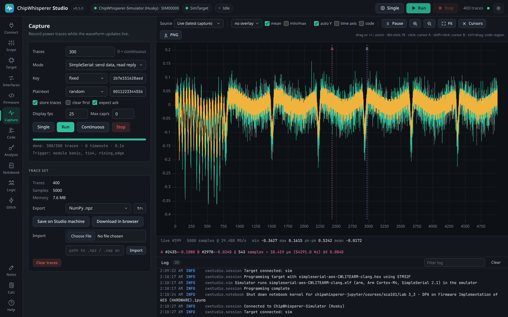 | 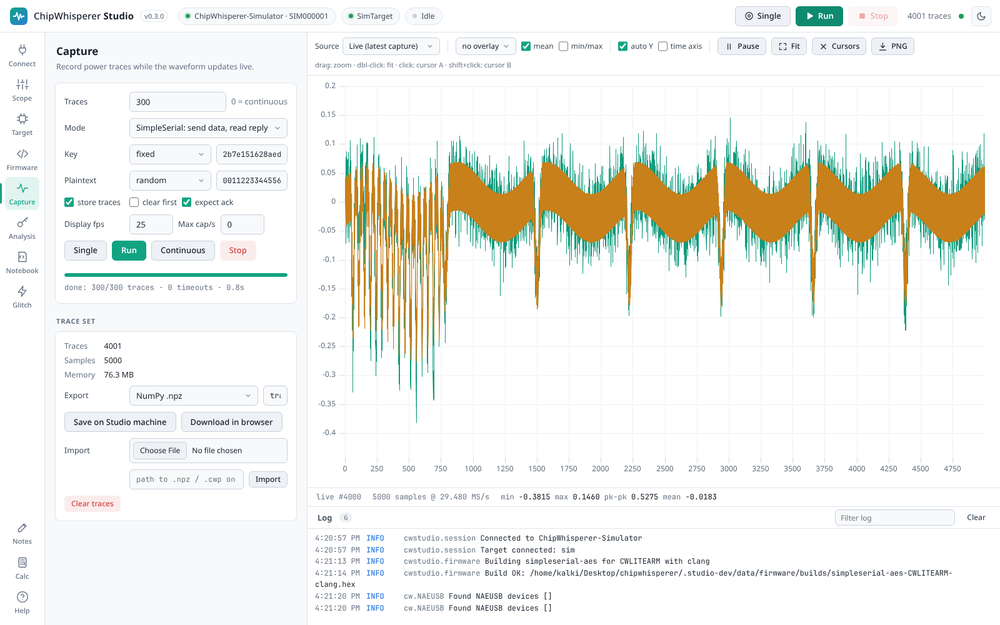 |


## Performance

<!-- performance:start -->

Latest run: 2026-10-01, Studio 0.4.4, on AMD Ryzen 9 5900HS with Radeon Graphics with 39 GB RAM (Linux 7.1.5+kali-amd64). Captures use the built-in simulator, so they measure Studio itself; with real hardware the scope and target set the capture rate. The detailed tables, the comparison with the previous run and how to run the tests are on the [Performance](https://github.com/keyuraghao/chipwhisperer-studio/wiki/Performance) wiki page.

| Test | Result |
|---|---|
| Largest trace set held (200,000 x 5,000 samples) | 3.73 GB of traces in 3.79 GB of memory |
| Mean/min/max of all 200,000 traces | 2.6 s the first time, extra memory +65 MB |
| API under load (50,000 traces, 8 clients, capture running) | status 1.5 ms, one trace 1.5 ms, trace block (200) 31.6 ms, mean/min/max 5.9 ms, settings tree 3.9 ms (medians) |
| Simulated capture, 5,000 samples per trace | 5,685 traces/s (108 MB/s) stored |
| CPA on 100,000 x 5,000 traces | 27 s, key recovered: yes |
| Export 100,000 traces (1.9 GB) to .npz | 35 s (54 MB/s), import 9 s |
| Memory leak tests | 7 of 7 workloads without growth |
| Browser during a long live capture | 5,000 samples: 60 fps, heap +0.0 MB; 100,000 samples: 24 fps, heap -0.1 MB; 131,070 samples: 20 fps, heap -0.1 MB |

**Run history**

| Date | Studio | Commit | Machine | Result files |
|---|---|---|---|---|
| 2026-10-01 | 0.4.4 | `1f274ab` | AMD Ryzen 9 5900HS with Radeon Graphics, 39 GB, Linux | [2026-10-01-v0.4.4.json](docs/benchmarks/2026-10-01-v0.4.4.json) |
| 2026-10-01 | 0.4.3 | `7a3473a` | AMD Ryzen 9 5900HS with Radeon Graphics, 39 GB, Linux | [2026-10-01-v0.4.3.json](docs/benchmarks/2026-10-01-v0.4.3.json) |

<!-- performance:end -->

## Architecture


Studio is one Python process: a Starlette server (with a small built-in router) that serves the web UI, the HTTP API and a WebSocket for live traces, shown in Studio's own window (the system web view) or a browser. A single worker thread owns the USB hardware and runs captures, glitch sweeps, logic captures, interface requests and every notebook's cells in turn, while CPA, logic decoding, firmware emulation, toolchain downloads and firmware builds run on their own threads (big logic decodes in a worker process). A capabilities module decides what the connected model can do for every tab and the API. The MCP server is another client of the same API. Details are in [docs/DESIGN.md](docs/DESIGN.md) and on the [Architecture](https://github.com/keyuraghao/chipwhisperer-studio/wiki/Architecture) wiki page.

## Development

```bash
git clone https://github.com/keyuraghao/chipwhisperer-studio
cd chipwhisperer-studio
pip install -e ".[test]"
cw-studio --simulate --log-level debug
python -m pytest
```

The frontend has no build step: edit `src/cwstudio/static/**` and reload the page (`cw-studio --browser` is handy while developing).

### Tests

`python -m pytest` runs the simulator-based suite, which needs no hardware. A separate staged session in `tests/hardware` drives a real ChipWhisperer through the same HTTP API and MCP server (and runs on the simulator too):

```bash
CWSTUDIO_HW=sim python -m pytest tests/hardware -v -s                 # simulator, no hardware
CWSTUDIO_HW=husky CWSTUDIO_HW_PLATFORM=CW308_SAM4S \
  CWSTUDIO_HW_TARGET=SimpleSerial python -m pytest tests/hardware -v -s   # a real Husky + SAM4S target
```

It runs in dependency-ordered stages (environment, scope, firmware, target, capture, CPA, glitch, logic analyser and the other interfaces, notebook, MCP, robustness) and writes a per-stage summary to `tests/hardware/last_run.json`. `CWSTUDIO_HW_TARGET` selects the SimpleSerial version, and the firmware `ss_ver` and the emulator protocol follow it. [`tests/hardware/README.md`](tests/hardware/README.md) documents all the `CWSTUDIO_HW_*` knobs and records the latest verified run on a Husky with a CW308 SAM4S target: the full AES-128 key recovered by CPA (every byte at PGE 0) and a reliable voltage glitch, with the exported traces and glitch sweep saved under Studio's data folder (`husky_sam4s_glitch_results.csv`).

| Task | Command |
|------|---------|
| Standalone bundles for this OS | `python packaging/build.py` (PyInstaller; produces `dist/ChipWhispererStudio-<os>-<arch>.zip`) and `python packaging/build.py --variant web` (`dist/ChipWhispererStudio-Web-<os>-<arch>.zip`) |
| Regenerate the screenshots (dark and light) | `pip install playwright && playwright install chromium && python tools/screenshots.py` |
| Record the video tour and its clips | `pip install imageio-ffmpeg && python tools/demo_video.py` |
| Release notes for a version | `python tools/release_notes.py 0.5.0` |

Pinned toolchain versions and checksums live in `src/cwstudio/resources/toolchains.json`. To publish a new compiler version, update that file and bump its `revision`; running Studios pick it up with **Refresh list**.

## Releases

Release notes for every version are in [CHANGELOG.md](CHANGELOG.md). To cut a release, move the Unreleased notes under a new version heading, bump `__version__` in `src/cwstudio/__init__.py` and push a tag such as `v0.5.0`. CI then runs the tests and firmware builds on all three operating systems, builds the standalone bundles (window and Web builds for each OS) and the Python packages, publishes a GitHub release using the matching CHANGELOG section as its description, and uploads the Python packages to [PyPI](https://pypi.org/project/chipwhisperer-studio/).

## License

Apache License 2.0, the same as ChipWhisperer. See [LICENSE](LICENSE) and [NOTICE](NOTICE). Compilers downloaded by Studio are covered by their own licences.
