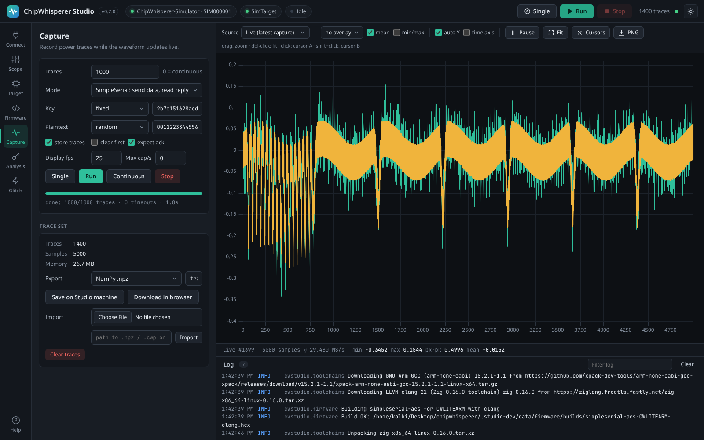
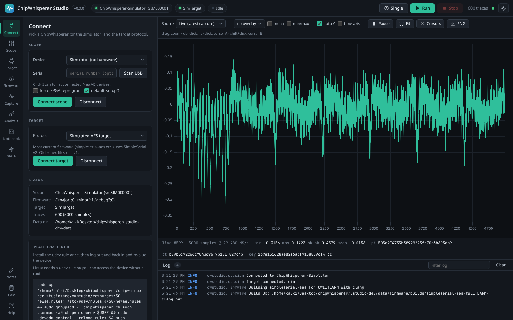
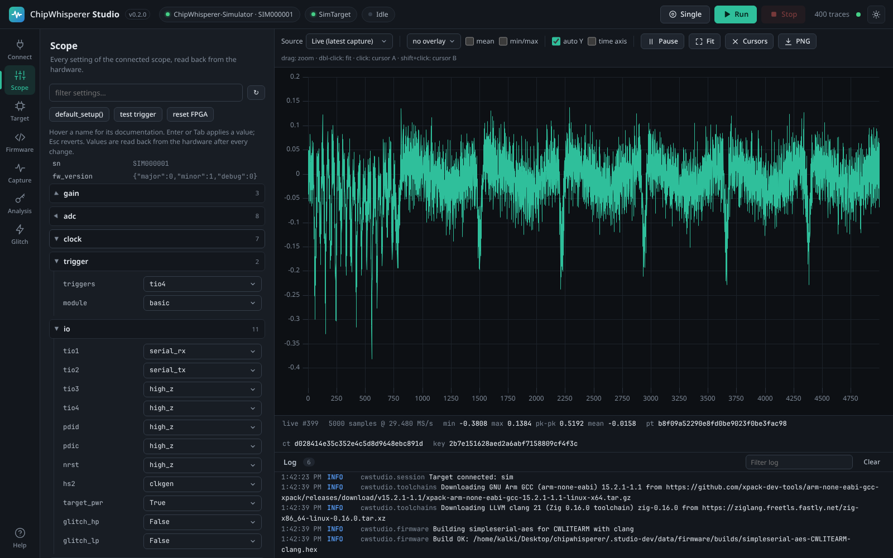
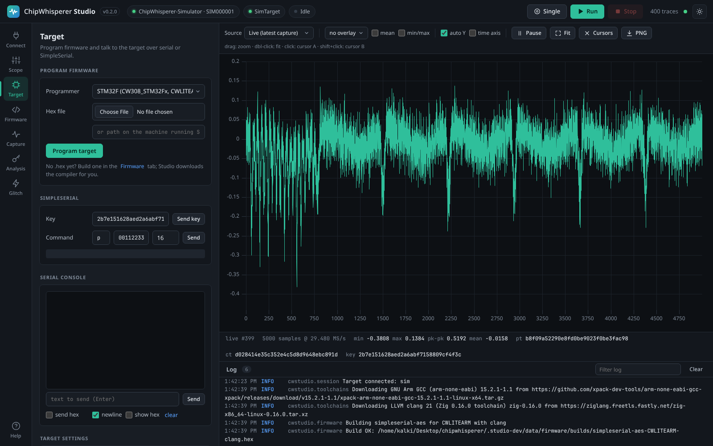
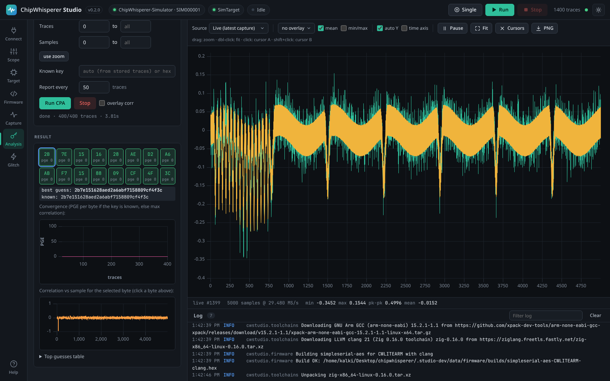
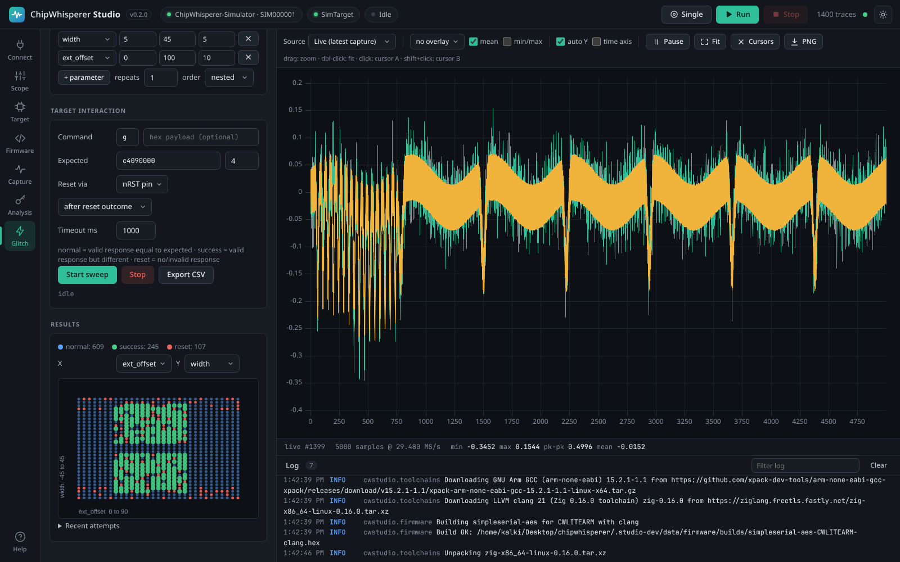
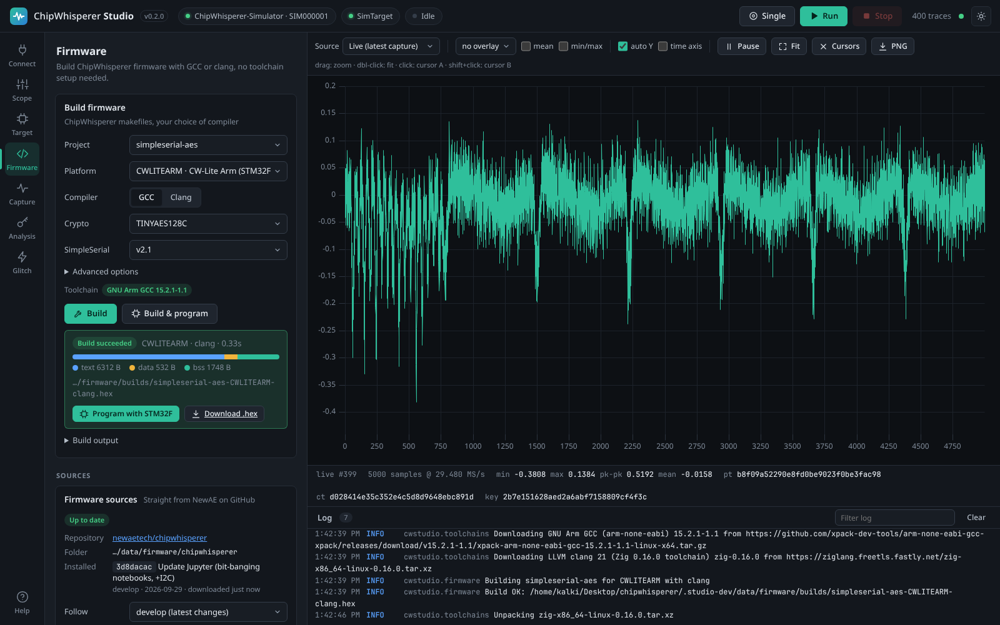
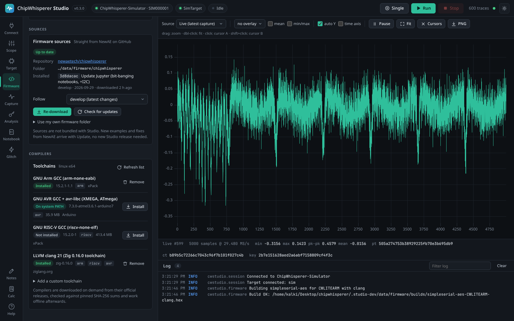
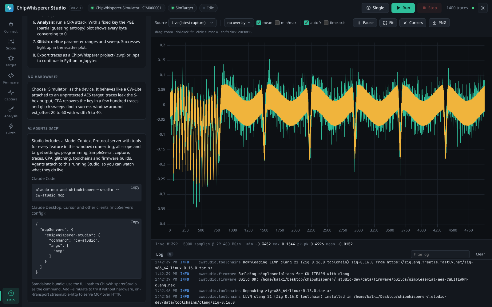
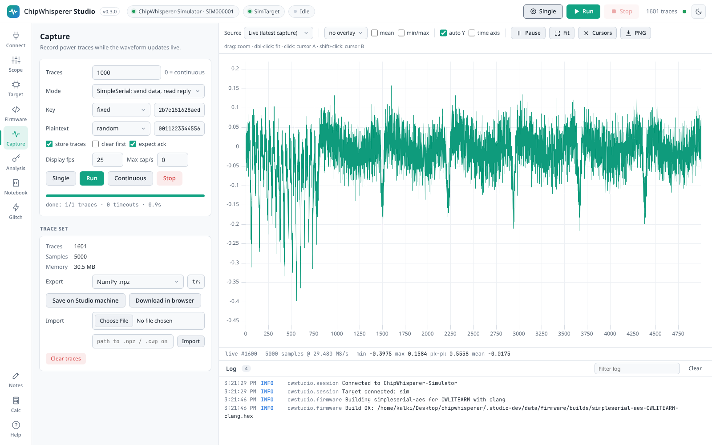

# ChipWhisperer Studio

A desktop application for [NewAE ChipWhisperer](https://github.com/newaetech/chipwhisperer) side-channel and fault-injection hardware. Connect a scope, build and flash target firmware, capture power traces while the waveform updates live, recover AES keys with CPA and sweep glitch parameters, all without writing Python or setting up Jupyter. An MCP server lets AI agents drive the same features.

[](https://github.com/keyuraghao/chipwhisperer-studio/actions/workflows/ci.yml)  



> ChipWhisperer Studio is an independent community project. It is not affiliated with or endorsed by NewAE Technology Inc.; it uses their open source `chipwhisperer` Python library for all hardware access.

## Contents

- [Features](#features)
- [Install](#install)
- [Walkthrough](#walkthrough)
- [Building firmware](#building-firmware)
- [AI agents (MCP)](#ai-agents-mcp)
- [HTTP API and remote use](#http-api-and-remote-use)
- [Architecture](#architecture)
- [Development](#development)
- [Releases](#releases)
- [License](#license)

## Features

| Area | What you get |
|------|--------------|
| Connect | Auto-detect ChipWhisperer Nano, Lite, Pro and Husky, pick a device by serial number, and follow platform-specific driver and udev help. A built-in **simulator** lets you try everything without hardware. |
| Scope | Every setting of the connected scope (gain, ADC, clock, trigger, IO, glitch, Husky extras) as an editable tree with inline documentation and hardware read-back after each change. |
| Target | Program STM32F, XMEGA, AVR, SAM4S and NEORV32 targets, use a serial console (text or hex), send SimpleSerial commands, and edit target interface settings. |
| Firmware | Build any ChipWhisperer firmware project for any platform with **GCC or clang**. Compilers download on demand and sources come straight from NewAE's GitHub. |
| Waveform | Live view of every capture, an overlay of the last N traces, mean and min/max envelope, trace browsing, zoom, two cursors with delta read-out, a time axis and PNG export. |
| Capture | Single, N traces or continuous; fixed, random or counter keys and plaintexts; trigger-only mode; rate limiting; export to `.npz`, `.cwp` (ChipWhisperer project) or `.csv`. |
| Analysis | Progressive CPA with five AES leakage models, per-byte ranking, PGE convergence and correlation plots. |
| Glitch | Cartesian or random sweeps over any `glitch.*` parameters with target reset handling and a live result scatter plot. |
| AI agents | `cw-studio mcp`: a Model Context Protocol server with 54 tools covering all of the above. |
| Everywhere | Light and dark themes, a documented HTTP API (`/api/docs`), and remote use from any browser on the network. |

## Install

### Standalone bundle (no Python needed)

Download `ChipWhispererStudio-<os>-<arch>.zip` from the [latest release](https://github.com/keyuraghao/chipwhisperer-studio/releases/latest), unzip it and run:

- **Windows:** `ChipWhispererStudio.exe`. If the device is not detected, install the NewAE WinUSB driver.
- **macOS:** `ChipWhispererStudio` (right-click and choose Open the first time).
- **Linux:** `./chipwhisperer-studio.sh`. Install the udev rule once; the Connect tab shows the exact command.

Your browser opens `http://127.0.0.1:8765/` automatically.

### With Python

```bash
pip install chipwhisperer-studio
cw-studio              # opens the UI in your browser
cw-studio --simulate   # try it without hardware
```

Use Python 3.10 to 3.12: `chipwhisperer` 6.0.0 on PyPI pins numpy 1.26, which has no wheels for newer Pythons.

Options: `--port 8765`, `--host 0.0.0.0` (remote access), `--no-browser`, `--window` (native window, needs `pip install "chipwhisperer-studio[window]"`), `--data-dir DIR` (exports, firmware, toolchains; default `~/ChipWhispererStudio`).

## Walkthrough

### 1. Connect

Choose your ChipWhisperer (or Auto-detect, or the Simulator) and press **Connect scope**, then **Connect target**. Use SimpleSerial v2 for current ChipWhisperer firmware.



### 2. Configure the scope

Every scope setting is listed with its documentation (hover a name) and read back from the hardware after each change. Press **Single** in the header to check the waveform while you adjust gain, samples, offset and trigger.



### 3. Program and talk to the target

Program a `.hex` from disk or straight from a Studio build, check the target answers in the serial console, and send SimpleSerial commands by hand.



### 4. Capture traces

Pick a trace count and key/plaintext mode and press **Run**. Traces stream to the waveform view as they are captured. Overlay the last N traces, show the mean and min/max envelope, zoom, and place cursors. Export as a ChipWhisperer project (`.cwp`) or `.npz` to continue in Python.


### 5. Recover the key with CPA

Run a correlation power analysis attack with the leakage model that matches your target. With a known key the partial guessing entropy (PGE) plot shows every byte converging to rank 0; click a byte to see where it leaks in the trace.



### 6. Sweep glitch parameters

Configure the glitch module in the Scope tab, then sweep parameters such as `glitch.ext_offset` and `glitch.width`. Each point is classified as normal, success (a valid but wrong answer) or reset, and plotted live.



## Building firmware

The **Firmware** tab builds ChipWhisperer's own firmware projects (simpleserial-aes, simpleserial-glitch, simpleserial-ecc and the others) with ChipWhisperer's makefiles, for any of the 38 platforms they support. Choose a project, a platform and GCC or clang, then press **Build & program**: Studio compiles the firmware and flashes the connected target with the right programmer.




### Compilers download on demand

Studio does not bundle compilers, which would add hundreds of MB to every download. The first time a build needs one, Studio downloads the official release for your OS, checks it against a pinned SHA-256 checksum, unpacks it into the data folder and uses it offline from then on.

| Toolchain | Version | Targets | Source |
|-----------|---------|---------|--------|
| GNU Arm GCC | 15.2.1 | Arm Cortex-M (CW-Lite Arm, Nano, Husky, STM32, SAM4S, K82F, ...) | [xPack](https://xpack-dev-tools.github.io/arm-none-eabi-gcc-xpack/) |
| GNU AVR GCC + avr-libc | 7.3.0 | XMEGA and ATmega (CW-Lite XMEGA, CW304, ...) | [Arduino](https://github.com/arduino/toolchain-avr) |
| GNU RISC-V GCC | 15.2.0 | NEORV32, Ibex, FE310 | [xPack](https://xpack-dev-tools.github.io/riscv-none-elf-gcc-xpack/) |
| LLVM clang | 21 | Arm, AVR and RISC-V | [Zig 0.16.0](https://ziglang.org/download/) |
| GNU make + sh | 4.4.1 | Windows only | [xPack](https://xpack-dev-tools.github.io/windows-build-tools-xpack/) |

Clang builds compile every C file with clang and let GCC assemble the startup files and link against newlib or avr-libc, so the firmware uses the same C library and linker scripts as a GCC build. For targets without a free pinned toolchain (TriCore, PowerPC, RX) or to pin a specific compiler, add a **custom toolchain** from an archive URL or an existing folder. Compilers already on your `PATH` are detected and used as a fallback.



### Sources come from NewAE, not from Studio

Firmware sources are not packed into Studio either. Studio downloads `firmware/mcu` and the matching `chipwhisperer-fw-extra` HALs straight from [newaetech/chipwhisperer](https://github.com/newaetech/chipwhisperer) and follows a channel of your choice: `develop` (default), the latest release, or any tag or commit. **Check for updates** compares your copy with GitHub and **Update now** pulls new examples and fixes without a new Studio release. You can also point Studio at your own ChipWhisperer checkout to build local changes. If you hit GitHub's limit of 60 anonymous API requests per hour (for example on a shared network), set a `GITHUB_TOKEN` environment variable and Studio will use it for these lookups.

### Platform coverage

Every Arm, AVR and RISC-V platform in ChipWhisperer builds with GCC, apart from three whose upstream HAL sources are broken (CW308_EFM32GG11, CW308_PSOC62, CW308_NRF52). With clang, 26 platforms build, including all the common ones (CWLITEARM, CWNANO, CWHUSKY, CWLITEXMEGA, CW304, STM32F0 to F4, SAM4S, K82F, NEORV32, Ibex); a few HALs use GCC-only constructs, so use GCC for those. AURIX, RX65N and MPC5676R need a custom toolchain. Builds are verified in CI on Linux, Windows and macOS.

## AI agents (MCP)

`cw-studio mcp` runs a [Model Context Protocol](https://modelcontextprotocol.io) server with tools for everything in the UI: connecting, every scope and target setting, programming, serial and SimpleSerial I/O, capture with all its options, trace access and export, CPA, glitch sweeps, toolchains, firmware sources and builds. It also offers guided prompts (a CPA attack and a glitch search) and live status resources.

If Studio is already running, the MCP server attaches to it, so you can watch the agent capture and analyse in the browser. Otherwise it starts a headless Studio in the background.



**Claude Code:**

```bash
claude mcp add chipwhisperer-studio -- cw-studio mcp
```

**Claude Desktop, Cursor and other clients:**

```json
{
  "mcpServers": {
    "chipwhisperer-studio": { "command": "cw-studio", "args": ["mcp"] }
  }
}
```

With the standalone bundle, use the full path to `ChipWhispererStudio` as the command. Useful options: `--simulate` (no hardware), `--url http://host:8765` (attach to a remote Studio), `--transport streamable-http --mcp-port 8766` (serve MCP over HTTP), `--no-embed` (never start a headless Studio).

Try asking your agent: *"Connect to the simulator, capture 100 traces with a fixed key and recover the key with CPA"* or *"Build simpleserial-glitch for CWLITEARM, flash it and find a glitch width and offset that skip the loop."*

## HTTP API and remote use

Everything the UI and the MCP server do goes through a documented HTTP API; open `/api/docs` for interactive documentation. Start Studio with `--host 0.0.0.0` on the machine that has the hardware and use it from any browser on the network, or drive captures from scripts and CI.



## Architecture


Studio is one Python process: a FastAPI server that serves the web UI, the HTTP API and a WebSocket for live traces. A single worker thread owns the USB hardware, while CPA, toolchain downloads and firmware builds run on their own threads. The MCP server is another client of the same API. Details are in [docs/DESIGN.md](docs/DESIGN.md).

## Development

```bash
git clone https://github.com/keyuraghao/chipwhisperer-studio
cd chipwhisperer-studio
pip install -e ".[test]"
cw-studio --simulate --log-level debug
python -m pytest
```

The frontend has no build step: edit `src/cwstudio/static/**` and reload the browser. The architecture is described in [docs/DESIGN.md](docs/DESIGN.md).

| Task | Command |
|------|---------|
| Standalone bundle for this OS | `python packaging/build.py` (PyInstaller; produces `dist/ChipWhispererStudio-<os>-<arch>.zip`) |
| Regenerate README screenshots | `pip install playwright && playwright install chromium && python tools/screenshots.py` |
| Release notes for a version | `python tools/release_notes.py 0.2.0` |

Pinned toolchain versions and checksums live in `src/cwstudio/resources/toolchains.json`. To publish a new compiler version, update that file and bump its `revision`; running Studios pick it up with **Refresh list**.

## Releases

Release notes for every version are in [CHANGELOG.md](CHANGELOG.md). To cut a release, move the Unreleased notes under a new version heading, bump `__version__` in `src/cwstudio/__init__.py` and push a tag such as `v0.2.0`. CI then runs the tests and firmware builds on all three operating systems, builds the standalone bundles and the Python packages, and publishes a GitHub release using the matching CHANGELOG section as its description.

## License

Apache License 2.0, the same as ChipWhisperer. See [LICENSE](LICENSE) and [NOTICE](NOTICE). Compilers downloaded by Studio are covered by their own licences.
