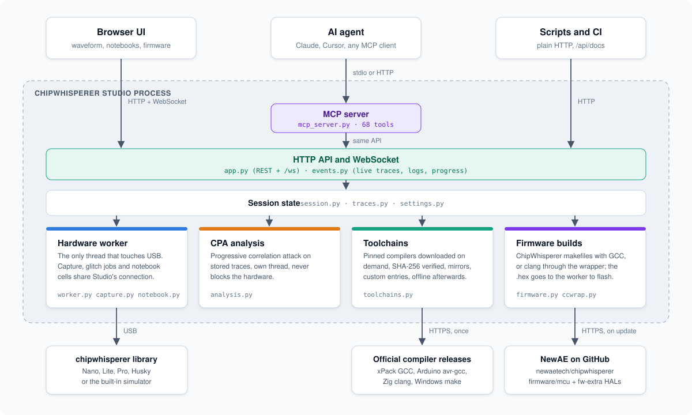
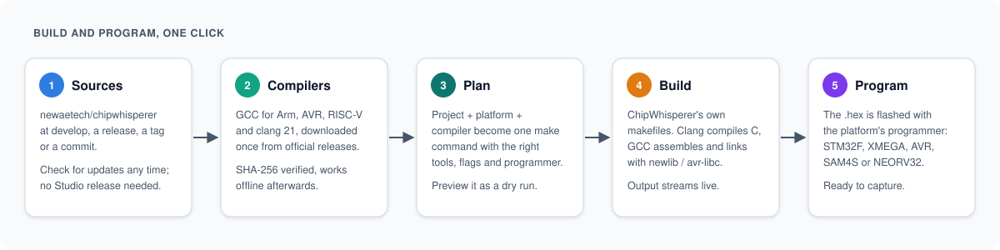
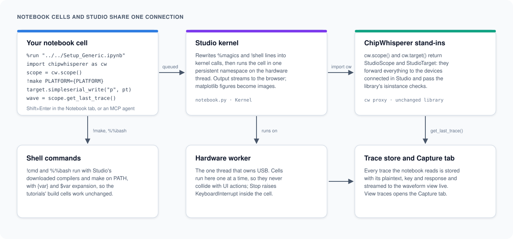

# Architecture

This page is for developers who want to understand how Studio is built before changing it. It covers the process layout, the threads, how events reach the browser, and the designs behind firmware builds, notebooks and the MCP server.

## Design goals

1. **Zero-setup install:** one archive per operating system that carries its own Python, the `chipwhisperer` library and libusb.
2. **See the waveform:** every captured trace is streamed to the screen as it arrives.
3. **Do the whole job in one window:** build firmware, connect, configure, program, capture, attack, glitch, export.
4. **Do not fork the library:** all hardware access goes through the public `chipwhisperer` API, so Studio keeps working as the library evolves.
5. **Hardware optional:** a built-in simulator makes every feature demonstrable and testable without hardware.
6. **Agents are first-class users:** everything is available through a documented HTTP API and an MCP server.

## One process, several threads

Studio is a single Python process running a FastAPI application under uvicorn. The same server delivers the web UI (static files), the REST API and one WebSocket.

| Thread | Job |
|--------|-----|
| asyncio event loop (uvicorn) | HTTP requests and WebSocket connections. Never blocks: blocking work is handed to threads. |
| Hardware worker (`worker.py`) | The only thread that touches the scope and target. `chipwhisperer` objects are not thread-safe and the USB transport keeps state, so every hardware call is queued to this thread and awaited through a future. |
| CPA thread (`analysis.py`) | Progressive correlation analysis over an in-memory numpy array; never touches hardware. |
| Toolchain and source download threads | Downloads, SHA-256 checks and extraction. |
| Firmware build thread | Runs `make` as a subprocess and streams its output. |
| Notebook dispatcher (`notebook.py`) | Takes queued cells and runs each one on the hardware worker. |

### Long jobs

Captures and glitch sweeps are long jobs: objects with a `step()` method. The worker calls `step()` repeatedly and runs queued short jobs (read a setting, write to serial, program) between steps, so the UI stays responsive during a 10 000 trace capture without two hardware calls ever running at once. Only one long job runs at a time.

## Events

`events.py` implements a thread-safe event bus. Producers on any thread publish events; each WebSocket client has a bounded queue on the event loop, and when a slow client falls behind, droppable events (such as intermediate traces) are discarded rather than blocking producers. Recent JSON events are kept for `GET /api/logs`.

Traces travel as binary frames (a little-endian u32 header length, a JSON header, then float32 samples), rate-limited to about 25 per second for display. The trace store (`traces.py`) keeps every trace regardless of what was displayed. See [HTTP API](HTTP-API) for the frame format and event list.

## Settings introspection

Every scope and target sub-object in `chipwhisperer` implements `_dict_repr()`. `settings.py` walks that tree, looks up the matching `property` on each class to learn whether it is writable and to extract its docstring, and emits a JSON tree that the UI renders generically. This supports Nano, Lite, Pro and Husky without device-specific UI code and picks up new settings automatically.

## Modules

| Module | Responsibility |
|--------|----------------|
| `cli.py` | Entry point: arguments, uvicorn, browser or native window, the `mcp` and `--ccwrap` modes. |
| `app.py` | FastAPI application: REST routes, WebSocket, static files. |
| `session.py` | The single application state: scope, target, jobs, trace store, and the toolchain, firmware, notebook and notes managers. |
| `worker.py` | Hardware thread, futures and long job scheduling. |
| `hardware.py` | Connect, detect and program real hardware; platform help (drivers, udev). |
| `simulator.py` | `SimScope` and `SimTarget`: AES leakage and glitch behaviour without hardware. |
| `settings.py` | Settings tree introspection and typed assignment. |
| `capture.py` | `CaptureJob`: key and text generation, capture loop, publication. |
| `glitch.py` | `GlitchJob`: parameter sweep, target reset, result classification. |
| `traces.py` | `TraceStore`: in-memory traces, statistics, import and export (npz, npy, csv, cwp). |
| `analysis.py` | Progressive CPA with five AES leakage models. |
| `toolchains.py` | Pinned, checksummed, on-demand compiler downloads; custom toolchains; registry refresh. |
| `firmware.py` | Firmware sources from GitHub, project and platform catalogue, builds. |
| `ccwrap.py` | Compiler wrapper that lets GCC-oriented makefiles build with clang. |
| `notebook.py` | Notebook kernel, IPython syntax, ChipWhisperer stand-ins, `.ipynb` storage, tutorial download. |
| `tools.py` | Notes storage, safe calculator and statistics. |
| `net.py` | HTTPS using the operating system trust store (certifi fallback). |
| `mcp_server.py` | MCP server that exposes every feature to AI agents through the HTTP API. |
| `events.py` | Event bus and binary trace frames. |
| `static/` | Frontend: vanilla ES modules, uPlot, marked and DOMPurify, light and dark themes. |

## Firmware builds

**Toolchain registry.** `resources/toolchains.json` pins each toolchain (Arm, AVR and RISC-V GCC, clang from the Zig distribution, Windows make) by version, per-host URL, optional mirrors and SHA-256. An install downloads the archive (switching mirrors if a server fails or is too slow), verifies the checksum, extracts it with path traversal checks, creates tool name aliases where ChipWhisperer's makefiles expect a different prefix (for example `riscv32-unknown-elf-gcc` for xPack's `riscv-none-elf-gcc`) and writes a marker file. The registry carries a `revision` and an `update_url`, so a running Studio can fetch a newer list from the repository without a new release. Custom entries and compilers on `PATH` are also resolved.

**Sources.** `firmware.py` asks GitHub which commit the chosen channel (`develop`, `latest-release`, a tag or a commit) points to, downloads `firmware/mcu` from that commit plus the `chipwhisperer-fw-extra` commit it pins as a submodule, and records what it installed so updates can be detected. A known good commit is used when GitHub is unreachable. Projects are discovered from makefiles that include `Makefile.inc`; platforms, HALs and MCUs are parsed from `hal/Makefile.hal`.

**Builds.** `plan()` computes the complete build (make command, `PATH`, environment, output file, programmer) without side effects, which the UI and MCP expose as a dry run. GCC builds pass tool names explicitly and add compatibility flags that older HALs need with current compilers (`-fcommon`, relaxed implicit declaration errors, RISC-V `-misa-spec=2.2`). Clang builds set `CC` to the wrapper in `ccwrap.py`: it compiles C with clang against GCC's newlib or avr-libc headers, removes GCC-only options, spells out RISC-V extensions, and hands hand-written assembly to GCC; GCC links through `LINK_COMPILER`, so the firmware uses the same C library and linker scripts as a GCC build. In the frozen bundle the Studio executable itself acts as the wrapper (`--ccwrap`).

## Notebook kernel

Studio uses a small in-process kernel instead of a Jupyter kernel, because a separate kernel process could not share the USB device that Studio already owns.

- **Execution:** cells are queued to a dispatcher thread and executed one at a time on the hardware worker, in one persistent namespace. A cell therefore behaves like a short job: while it runs, other hardware requests wait.
- **Output:** `sys.stdout` and `sys.stderr` are replaced by routers that send writes from the thread running a cell to that cell (preserving the order of stdout and stderr) and everything else to the real streams. Output is streamed to the browser about ten times a second. matplotlib figures that are still open when a cell finishes are converted to PNG outputs.
- **Interrupt:** Stop raises `KeyboardInterrupt` in the worker thread and drops queued cells.
- **IPython syntax:** line magics, `!shell` lines (with `{expr}` and `$name` expansion) and `var = !cmd` are rewritten into calls to kernel helpers before compiling, keeping indentation so they work inside loops. Cell magics such as `%%bash -s`, `%%writefile` and `%%time` are handled separately. Shell commands get Studio's installed compilers and make on `PATH`.
- **ChipWhisperer stand-ins:** the namespace has its own `__import__`. `import chipwhisperer as cw` returns a thin wrapper of the real module whose `scope()` and `target()` return stand-ins for Studio's connection. The stand-ins forward every attribute to whatever Studio is connected to at that moment and report the real class, so the library's `isinstance` checks pass. The scope stand-in records every trace read with `get_last_trace()` into the trace store, paired with the plaintext and key last sent through the target stand-in and the response read afterwards; `cw.capture_trace()` records its result the same way. `cw.program_target()` is simulated when the simulator is connected.
- **Shims:** `IPython.display` (display, HTML, Markdown, Image, SVG, clear_output) and `tqdm.notebook` (plain tqdm, whose carriage returns the UI renders in place) are provided so tutorials run without IPython or ipywidgets.

## MCP server

`mcp_server.py` builds an MCP server with the official Python SDK. Each tool is a small function that calls the HTTP API, so the MCP server is just another API client. It attaches to a running Studio or starts one headless in the same process. Long operations accept `wait=true` and poll the API, so an agent can do "capture 500 traces" or "build and flash" in one call. See [MCP Server](MCP-Server).

## Frontend

The UI is plain ES modules served as-is, with no build step or Node toolchain. uPlot draws waveforms and analysis plots on canvas; marked renders Markdown; DOMPurify sanitises it. Colours are CSS custom properties with light and dark variants, and charts read them at draw time so switching themes redraws everything.

## Security notes

- The API has no authentication; the default bind address is `127.0.0.1`.
- Markdown from notebooks and notes is sanitised with DOMPurify; HTML outputs are shown in iframes with an empty `sandbox` attribute (no scripts, no same-origin access), so opening an untrusted notebook does not execute its saved HTML.
- Notebook, note, asset and firmware project paths are resolved and checked to stay inside their folders.
- Archive extraction rejects absolute paths, `..` components and links pointing outside the destination.
- The calculator evaluates an allow-listed subset of Python syntax (no attribute access, no names except its own functions and variables, bounded exponents and shifts).
- Downloads are verified with pinned SHA-256 checksums (compilers) and fetched over HTTPS with certificate verification.

See also: [Development and Releases](Development-and-Releases).
