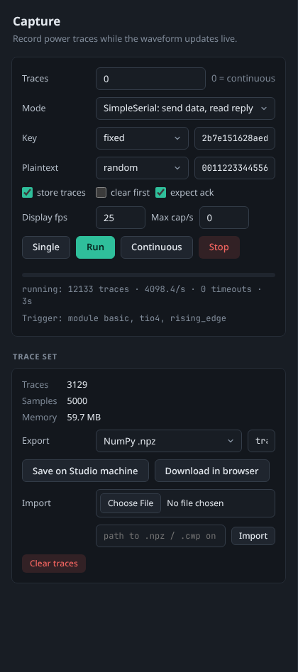

# Capturing traces

The **Capture** tab of ChipWhisperer Studio records power traces: for each trace Studio sends data to the target, arms the scope, waits for the trigger and stores the recorded waveform together with the plaintext, ciphertext and key. The waveform view updates live while it runs.

<picture><source media="(prefers-color-scheme: light)" srcset="images/capture-light.png"></picture>

*A capture in progress: options on the left, the latest trace and the running mean in the main view.*


## Before you start

1. Connect a scope and, for normal captures, a target on the **Connect** tab (see [Connecting Hardware](Connecting-Hardware)).
2. Program the target with firmware that answers SimpleSerial commands, for example `simpleserial-aes` built in the **Firmware** tab (see [Firmware Builds](Firmware-Builds)).
3. Press **Single** in the header and check the trace in the [Waveform Viewer](Waveform-Viewer). Adjust gain, samples and offset in the **Scope** tab (see [Scope Settings](Scope-Settings)) until the waveform looks right.

## Capture options

<picture><source media="(prefers-color-scheme: light)" srcset="images/capture-panel-light.png"></picture>

*The Capture card during a continuous capture (Traces set to 0).*

| Option | What it does | Default |
|--------|--------------|---------|
| Traces | How many traces **Run** records. `0` means capture continuously until you press **Stop**. | 1000 |
| Mode | **SimpleSerial: send data, read reply** sends the key and plaintext to the target for every trace and reads its reply. **Trigger only: arm and wait** just arms the scope and waits for your own firmware to raise the trigger, without talking to the target. | SimpleSerial |
| Key mode + value | **fixed** uses the hex key in the box for every trace. **random** generates a new random key for every trace. | fixed, `2b7e151628aed2a6abf7158809cf4f3c` |
| Plaintext mode + value | **random** generates a new random plaintext for every trace. **fixed** uses the hex value in the box. **counter** starts from the value in the box and adds one for every trace. | random |
| store traces | Keep every trace in memory (the trace set). Turn it off to only watch the waveform, for example while tuning settings. | on |
| clear first | Delete the stored traces before this run starts. | off |
| expect ack | In SimpleSerial mode, wait for the target's acknowledgement after each command, as ChipWhisperer's `capture_trace()` does. Turn it off for firmware that does not send one. | on |
| Display fps | How many traces per second are sent to the waveform view (1 to 60). Capture itself runs as fast as the hardware allows; this only limits screen updates. | 25 |
| Max cap/s | Limit the capture rate to this many traces per second. `0` means no limit. Useful for slow targets or to watch a capture step by step. | 0 |

Under the progress bar, a line shows the trigger the scope is set to (module, pins and mode). Change it in the [Interfaces](Protocols-and-Interfaces#triggers) tab or the Scope tab; the line follows changes made anywhere.

> **Tip:** For CPA on AES, the classic setup is a **fixed** key and **random** plaintexts, which is the default. Random keys are used for other experiments such as leakage assessment.

## Running a capture

| Button | What it does |
|--------|--------------|
| **Single** | Captures exactly one trace with the current options (it never clears the stored traces). Also in the header and on the **S** key. |
| **Run** | Captures the number of traces in **Traces**. Also in the header and on the **R** key. |
| **Continuous** | Captures until you press **Stop**, whatever **Traces** says. |
| **Stop** | Stops the running capture (or glitch sweep) after the current trace. Also in the header and on the **Esc** key. |

Only one hardware job runs at a time. The header's job chip shows progress (for example `capture: 420/1000 · 850/s`), and the progress bar and status line under the buttons show traces done, traces per second, the number of timeouts and the elapsed time.

**Timeouts:** if the scope does not see a trigger in time (see `adc.timeout` in [Scope Settings](Scope-Settings#adc-what-and-when-to-record)), the trace is skipped, counted as a timeout and a warning appears in the log. After 10 timeouts in a row the capture stops with an error ("10 consecutive timeouts - check trigger and target"), because something is clearly wrong: the target may not be running, the trigger line may be wrong, or the firmware may not match the protocol.

**Settings during a capture:** you can read and change scope settings while a capture runs. Studio interleaves your request between two traces, so the UI stays responsive.

## The trace set

The **Trace set** card summarises what is stored in memory:

| Field | Meaning |
|-------|---------|
| Traces | Number of stored traces. |
| Samples | Samples per trace. If traces of different lengths were stored (because you changed `adc.samples` mid-way), it shows the shortest length and "(mixed lengths)"; analysis uses the shortest length. |
| Memory | Memory used by the stored waveforms. |

Traces are stored in memory as 32 bit floats, up to a limit of 200,000 traces per session. At 5,000 samples per trace that is about 20 KB per trace, so 10,000 traces use about 200 MB. Export traces you want to keep: the trace set is not saved when Studio closes.

## Exporting traces

Choose a format next to **Export** and type a name, then:

- **Save on Studio machine** writes the file on the computer running Studio. A plain name like `traces` is saved inside the Studio data directory (by default `~/ChipWhispererStudio`); an absolute path is used as is.
- **Download in browser** creates the file in the data directory's `exports` folder and downloads it through your browser. For the NumPy `.npy` set, which consists of four files, the download is a single `traces_npy.zip` containing all of them. A ChipWhisperer project downloads as `traces_cwp.zip` with the `.cwp` file and its `traces_data` folder; unzip it to open it with `cw.open_project()`, or import the zip into Studio as it is.

| Format | What you get | Best for |
|--------|--------------|----------|
| NumPy .npz | One compressed file with the arrays `waves` (traces x samples, float32), `textins`, `textouts`, `keys` (traces x bytes, uint8) and a `meta` JSON string. | Python analysis, re-importing into Studio |
| ChipWhisperer project .cwp | A ChipWhisperer project (`name.cwp` plus its `name_data` folder), opened with `cw.open_project()`. | ChipWhisperer notebooks and the analyzer |
| CSV | One row per trace: `index`, `textin`, `textout`, `key` (hex), then all samples. | Spreadsheets and other tools (large files) |
| NumPy .npy set | Four files: `name_waves.npy`, `name_textins.npy`, `name_textouts.npy`, `name_keys.npy`. | Tools that want plain `.npy` arrays |

Loading an export in Python:

```python
import numpy as np
d = np.load("traces.npz")
waves, textins, keys = d["waves"], d["textins"], d["keys"]
print(waves.shape)  # (number of traces, samples)

import chipwhisperer as cw
proj = cw.open_project("traces.cwp")
print(len(proj.traces), proj.traces[0].textin)
```

## Importing traces

Import brings a previously saved trace set back into Studio, replacing the traces currently in memory:

1. Choose a file with the **Import** file picker (it is uploaded to the data directory's `imports` folder), or type a path on the Studio machine into the box below it (a relative path is looked up inside the data directory).
2. Press **Import**.

Supported files are `.npz` (Studio's own format, or any file with a `waves` array and optional `textins`, `textouts`, `keys`), `.cwp` (ChipWhisperer projects, with their `_data` folder next to them), `.zip` (a ChipWhisperer project as **Download in browser** saves it, or a zip holding an `.npz`) and `.npy` (a single array of waveforms; plaintexts are then empty, so CPA is not possible on them).

**Clear traces** deletes all stored traces from memory after asking for confirmation. Exported files are not touched.

## Capturing from code

- A [Notebook](Notebooks) cell that calls `cw.capture_trace(scope, target, text, key)` in a loop, or a manual `scope.arm()` / `scope.capture()` / `scope.get_last_trace()` loop, adds its traces to the same trace set.
- [HTTP API](HTTP-API): `POST /api/capture/start` with the same options (`count`, `mode`, `key_mode`, `text_mode`, `key`, `text`, `store`, `clear`, `ack`, `max_rate`, and a few extras such as `seed` for repeatable random data).
- [MCP Server](MCP-Server): the `capture_start`, `capture_single` and `capture_stop` tools.

## See also

- [Waveform Viewer](Waveform-Viewer) to inspect what you captured.
- The **Analysis** tab to run a CPA attack on the stored traces, see [Interface Tour](Interface-Tour#navigation-and-tabs).
- [Troubleshooting](Troubleshooting) for timeouts and empty traces.
