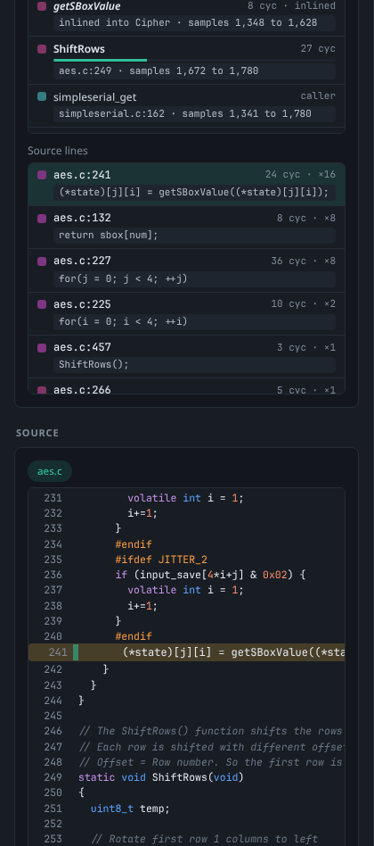

# Code on the Waveform

The **Code** tab shows which firmware functions and source lines run at each point of a captured power trace. Give Studio the firmware's ELF file (it uses the one you programmed or built in Studio automatically) and it emulates that firmware for the exact key and plaintext of a trace, converts clock cycles to ADC samples, aligns the result with the measured traces and draws the code as a band under the waveform. Pick a region of the trace and Studio lists the functions, source lines and instructions that produced it.

<picture><source media="(prefers-color-scheme: light)" srcset="images/code-light.png"></picture>

*simpleserial-aes on an emulated Cortex-M4: the band under the plot shows `aes`, `Cipher` and the rounds of `AddRoundKey`; the shaded region is the one picked with Ctrl+drag.*

## Quick start

1. Build firmware on the [Firmware](Firmware-Builds) tab (Studio keeps the `.elf` next to every `.hex` it builds) and program it, or program any `.elf` from the [Target](Target-and-Programming) tab.
2. Capture some traces on the [Capture](Capturing-Traces) tab.
3. Open the **Code** tab and press **Build code map**. Studio emulates the firmware for the newest trace, maps it onto the samples and, when traces are stored, aligns it automatically.
4. Tick **code** in the waveform toolbar if the band is not shown yet (it switches on by itself after a build).
5. Hold **Ctrl** (or **Alt**, or **Cmd** on macOS) and drag across the waveform to pick a region. The **Selection** card lists the code that ran there; click a function or line to see its source and disassembly and to shade every sample where it ran.

The whole flow also works with the [simulator](Simulator): programming an ELF into the simulated target makes it run that firmware, so its traces come from the same code and the map lines up exactly.

## Choosing the firmware

The **Firmware** card picks what to emulate:

| Field | What it does |
|-------|--------------|
| **ELF** | `default (programmed or newest build)` uses the ELF programmed in this session, else the `.elf` of the newest Studio build. The list also offers the programmed ELF and every build by name, and **Other ELF file...** for a path on the Studio machine (an `.elf` or a project folder, in which the newest `.elf` is used) or an upload from your computer. The refresh button reloads the list. |
| **Sources** | The folder with the firmware's source files. By default Studio uses the paths stored in the ELF's debug information, which works for anything built on this machine; give the folder when the sources moved or the firmware was built elsewhere. Studio matches files by their path and, failing that, by file name anywhere under the folder. The field shows the folder in use; clear it to go back to the paths in the ELF. |
| **Trace** | The stored trace whose key and plaintext are emulated (default: the newest). |
| **Core** | The timing model. `auto` picks it from the ELF (see the table below). |
| **SimpleSerial** | `auto` asks the firmware (it sends a `v` command), or force `2.1`, `1.1` or `1.0`. |
| **Wait states** | Flash wait states added to branches, calls and loads on Arm and RISC-V (0 to 15, default 0). Set it to match the clock configuration of your target. |
| **Command** | The SimpleSerial command to emulate (`p` encrypts) and its data in hex; empty data uses the trace's plaintext. Use `g` and similar for other firmware such as simpleserial-glitch. |

A `.hex` alone is not enough: the code map needs the symbols and debug information in the `.elf`. Without DWARF debug information (built without `-g`) Studio still works from the symbol table, but it can only show functions, not source lines (the info says *no debug info: functions only*).

After a build the card shows the firmware, the core, the SimpleSerial version and how the trigger was found, the inputs, the emulated response (**correct AES ✓** when an encryption gives the right ciphertext), whether it matches the ciphertext stored with the trace (**same ciphertext ✓**), and how many instructions and cycles ran. **Simulator** says whether the simulator runs this same firmware.

### Supported processors

| Architecture | Emulator | Cores (timing models) |
|--------------|----------|------------------------|
| Arm Cortex-M (Thumb) | [Unicorn](https://www.unicorn-engine.org/) | Cortex-M0, M0+, M3, M4, M7 (M4 timing), M33 (M4 timing) |
| RISC-V RV32 | Unicorn | generic in-order RV32, Ibex, NEORV32 |
| AVR and XMEGA | Studio's own cycle-accurate emulator | classic AVR (AVRe/AVRe+), XMEGA (AVRxm) |

This covers the common ChipWhisperer targets: CW-Lite Arm, CW-Nano and Husky (STM32 and SAM4S), the CW308 Arm boards, CW-Lite XMEGA, CW304 (ATmega), NEORV32 and Ibex. Unicorn is included in the standalone bundles and installed with the pip package.

**Automatic core selection:** the Arm core comes from the ELF's architecture attributes (v6-M gives M0, v7-M gives M3, v8-M gives M33, otherwise M4), RISC-V picks Ibex or NEORV32 when their names appear in the symbols or the file name, and AVR picks XMEGA from the ELF flags or the device name.

## How the emulation works

Studio does not emulate the target's peripherals. Instead it hooks the ChipWhisperer HAL functions that talk to hardware by name:

- `getch` and `putch` (or `input_ch_0` and `output_ch_0`) are fed from and collected into buffers: Studio sends the SimpleSerial commands (the key with `k`, then the command) as bytes and reads the firmware's answer. When `getch` has nothing more to give, the firmware is waiting for the next command and the run ends.
- `trigger_high` and `trigger_low` mark the trigger window. Cycle 0 of the map is where the trigger goes high, as on the scope. On AVR firmware without these functions Studio watches the trigger port bit instead (PORTA bit 0 on XMEGA, PORTC bit 0 on ATmega).
- Set-up functions (`platform_init`, `init_uart`, `trigger_setup`, `led_ok`, `led_error`, `SystemInit`, `HAL_Init` and similar) return at once.

Each instruction's cost in clock cycles comes from a per-core table built from the processor manuals (the Cortex-M technical reference manuals, the Ibex and NEORV32 documentation, the AVR instruction set manual), including taken branches, pipeline refills, load and store pipelining on the M3 and M4, and the flash wait states you set. The AVR and XMEGA emulator counts cycles exactly as the instruction set manual gives them. Arm and RISC-V timings are models that are good to a few percent on straight-line code; the alignment fits the rest.

A power model is computed at the same time: each instruction costs a base amount by its class plus the Hamming weight and Hamming distance of the values it loads, stores or writes. It is only used to align the map with the measured traces.

Limits per run: 5,000,000 instructions to boot and 4,000,000 per command. Firmware that ends in an endless loop after answering (for example a password check that halts) is reported with the address and function where it stopped.

### What is modelled and what is not

| Modelled | Not modelled |
|----------|--------------|
| Every instruction of the firmware, including inlined code and library calls | Peripherals: unknown I/O addresses read back the last value written (0 after reset) |
| Cycle timing per core, taken branches, flash wait states (one fixed value) | Interrupts, exceptions and system calls: firmware that does its work in interrupt handlers cannot be emulated |
| SimpleSerial 1.0, 1.1 and 2.1 framing | Timers and peripheral flags: a loop that waits for one stops with a hint to skip that function |
| The trigger window (`trigger_high` / `trigger_low`, or the AVR trigger port) | UART timing: `getch` and `putch` cost only a function return |
| A power model from data values, for alignment | Caches, flash accelerators, prefetch, and the Cortex-M7's dual issue (it uses the M4 table, an upper bound) |
| | Data-dependent divide timing (a fixed middle value is used) |

So the code map is exact about *which* code runs and in what order, and close about *when*: on real hardware the alignment absorbs the small timing differences, and the exact mode below measures them.

## Cycles to samples

The **Cycles to samples** card shows the mapping from target clock cycles to ADC samples:

`sample = cycle x samples per cycle x scale - adc.offset / decimate + adc.presamples + shift`

with samples per cycle = ADC clock / target clock / decimate (4 with the default `clkgen_x4` ADC clock). Studio reads the target clock, the ADC clock, `adc.offset`, `adc.presamples` and `adc.decimate` from the scope when you build the map; build again (or set the values over the API) after changing them.

### Automatic alignment

On a real target the trigger pins cycle 0 to within a few cycles, and the instruction timing tables are not perfect, so Studio fits a **shift** and a **scale** by cross-correlating the emulated power model with the measured traces. It runs automatically after a build when traces are stored, and again with **Auto align**:

- **Align on** chooses the mean of all stored traces (the default, least noisy) or *this trace* (the trace the map was built from).
- The search covers scales from 0.9 to 1.1 and shifts of up to 200 target cycles (at least 256 samples) either way, which is wide enough for trigger delays and narrow enough that repetitive code such as AES rounds does not match a whole round early or late.
- Both signals are filtered first (clock ripple and the slow baseline removed), and a negative correlation counts too: on the shunt resistor more current means a lower voltage, so a good fit is usually shown as *inverted, as on the shunt*.

The **Confidence** meter rates the fit from 0 to 1, from the strength of the correlation and how clearly the best match stands out from the next best one:

| Label | Confidence | Meaning |
|-------|------------|---------|
| high | above 0.6 | Strong correlation and no rival match within the search window. Applied. |
| medium | 0.3 to 0.6 | Probably right; check a known function (such as the first AES round) against the trace. Applied. |
| low | up to 0.3 | Not applied: the nominal mapping is kept, because the firmware or the trace is probably not the right one. |

You can also set the mapping by hand: type a **Shift** (in samples) or **Scale**, or nudge it with the buttons (**-cyc** / **+cyc** move by one target cycle, **-1** / **+1** by one sample, **-0.1%** / **+0.1%** stretch or shrink, **1:1** resets to shift 0 and scale 1).

## The code band

Tick **code** in the waveform toolbar to show the band under the plot. It follows the plot's zoom and pan exactly.

- The **functions** rows are a flame chart: the outer call spans the functions it calls, up to five levels deep (the deepest levels in view are shown). Each function keeps its own colour; inlined functions are drawn one row below their caller with a lighter fill and a dashed outline.
- The **lines** strip shows which source line runs when. Zoom in to see it (it says *zoom in to see source lines* until each cycle is wide enough), and further to see line numbers.
- Dashed markers show where the trigger goes high (cycle 0) and low.
- Hover a block for its name, file and line, cycle range and sample range. Click one to open it in the Code tab: a function also becomes the selected region.
- The mouse wheel over the band zooms the waveform.

Without a code map the band says *No code map yet* with a button to the Code tab.

## Picking a region

Hold **Ctrl** (**Cmd** on macOS) or **Alt** and drag across the waveform: instead of zooming, this selects a sample range for the code map (cursor A stays where it is). You can also use the **Selection** card's buttons: **Cursors A to B** takes the range between the [waveform cursors](Waveform-Viewer), **Trigger window** selects the whole trigger window, and **Clear** removes the selection.

<picture><source media="(prefers-color-scheme: light)" srcset="images/code-region-light.png"></picture>

*The functions and source lines of a region, with the source file and the executed lines marked.*

The **Selection** card then shows:

- The sample and cycle range with the number of instructions, functions and lines in it.
- **Functions**: those with their own code in the region, in the order they run, with their cycles in the region and a bar for their share. Inlined functions say which function they were inlined into. Functions the region runs inside are listed after them as *caller*.
- **Lines**: each source line that ran, with its cycles, how often it ran (`x3`) and its text. Code without line information (compiler-generated code, DWARF line 0) is listed once as *(no line info)*.

Click a function or a line to shade every sample where it ran on the waveform and the band, zoom to it, open its source file at that line and show its disassembly. In the **Source** card, executed lines are marked (hover for their cycles), lines in the region are highlighted, and you can click any line with code to pick it. The disassembly lists each instruction with how often it ran; instructions that never ran are dimmed.

## Exact mode (Husky SWO)

The emulation predicts timing. On a ChipWhisperer-Husky with an Arm target you can measure it instead: the target's debug unit samples the program counter every N cycles and sends the samples over SWO, and the Husky's trace port timestamps them in target cycles from the trigger. **Record PC samples** on the **Exact mode** card captures one trace this way, sampling every **Every** cycles. The Arm DWT can only sample every 64 or 1024 cycles times 1 to 16 (64 to 16,384 cycles), so Studio rounds the request to the nearest of those and shows the interval it really used. It then compares the samples with the emulation: the result says how many samples were recorded, what share of them fell in the function the emulation predicted, and the fitted cycle scale. Samples that disagree are marked on the waveform. If no samples arrive, it says *no PC samples arrived* with the likely cause (wiring, firmware without the trace commands).

Requirements: a Husky (the card is shown only when the connected model has Arm trace), Arm firmware built from ChipWhisperer's **simpleserial-trace** project (it has the commands that set up PC sampling), and the target's SWO pin wired to the Husky (TDO to USERIO D2 through the 20-pin connector). With the simulator posing as a Husky, the samples come from the emulated run through the same decoder.

## In the simulator

Programming an ELF (or a `.hex` that Studio built, which keeps its `.elf` next to it) into the [simulated target](Simulator) makes the simulator run that firmware in the emulator from then on:

- SimpleSerial responses are computed by the firmware itself, and traces are made from its power model at the scope's ADC rate, gain and trigger window. CPA recovers the key from them like from the built-in model.
- A glitch makes the emulated core skip instructions where it lands (`glitch.ext_offset` target cycles after the trigger) or crash it, so simpleserial-glitch and password-check firmware behave as they would on hardware. See [Simulator](Simulator#simulated-glitches).
- The code map built from the same ELF lines up at shift 0 with high confidence.

Programming any other file switches back to the built-in AES model.

## Limitations

- Peripherals, interrupts, timers and real UART timing are not emulated (see the table above). Firmware that polls a peripheral flag needs that function skipped (`options.skip` in the [HTTP API](HTTP-API#code-map)).
- Only the 32-bit Arm Cortex-M, RV32 and AVR/XMEGA architectures are supported.
- The mapping is a snapshot: after changing the scope's clocks, `adc.offset`, `presamples` or `decimate`, build the map again.
- In the Code tab, empty command data means "use the trace's plaintext"; to emulate a command without data (`text: ""`), or raw serial input for firmware that is not SimpleSerial, use the [HTTP API](HTTP-API#code-map) or the [MCP tools](MCP-Server#code-map).

## From the API and MCP

| Action | HTTP API | MCP tool |
|--------|----------|----------|
| Build the code map | `POST /api/codemap/build` | `code_map_build` |
| What a sample range ran | `POST /api/codemap/region` | `code_map_region` |
| Where a function or line ran | `POST /api/codemap/lookup` | `code_map_lookup` |
| Align, or set the mapping by hand | `POST /api/codemap/align`, `PUT /api/codemap/mapping` | `code_map_align` |
| Disassembly | `GET /api/codemap/disasm` | `code_map_disassemble` |
| Exact mode (SWO PC samples) | `POST /api/codemap/pctrace` | `code_map_pc_trace` |

See [HTTP API](HTTP-API#code-map) and [MCP Server](MCP-Server#code-map) for the parameters.
