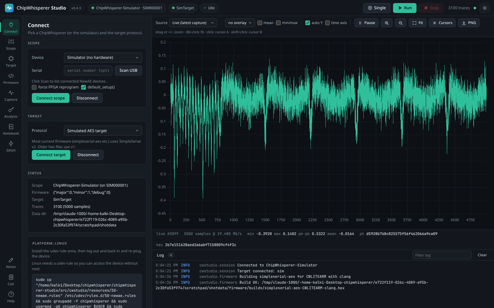
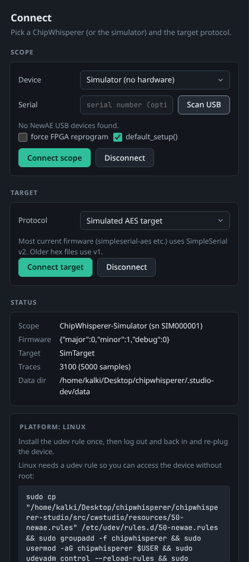

# Connecting Hardware

The **Connect** tab is where you choose which ChipWhisperer scope to use and which protocol to speak to the target device. This page explains every option on it, which choice fits which hardware, and how to fix common connection problems.

<picture><source media="(prefers-color-scheme: light)" srcset="images/connect-light.png"></picture>
*The Connect tab with the Scope, Target, Status and Platform cards.*

Studio talks to the hardware only through NewAE's `chipwhisperer` Python library (`cw.scope()`, `cw.target()` and friends), so any device that library supports should work in Studio.

> **Note:** Studio 0.4.4 has been tested with the built-in [simulator](Simulator) and in CI. It has not yet been tested on physical ChipWhisperer hardware.

## Scope card

<picture><source media="(prefers-color-scheme: light)" srcset="images/connect-panel-light.png"></picture>
*The Scope card (device, serial number, options) and the Target card (protocol).*

| Option | What it does | Default |
|--------|--------------|---------|
| Device | Which kind of scope to connect (see the table below). | Auto-detect (Simulator if Studio was started with `--simulate`) |
| Serial | Serial number of the device to use, for when more than one ChipWhisperer is plugged in. Leave empty to use the first one found. | empty |
| Scan USB | Lists the NewAE devices connected to this computer with their serial numbers and USB bus and address. Click **use** next to a device to copy its serial number into the Serial field. | |
| force FPGA reprogram | Passes `force=True` to `cw.scope()`, which reloads the scope's FPGA bitstream even if it already looks programmed. Use it if the scope behaves strangely after another program used it, or after a firmware update. It makes connecting slower. | off |
| default_setup() | Runs the scope's `default_setup()` right after connecting. This applies NewAE's recommended settings for the standard targets (gain, sample count, 7.37 MHz target clock, trigger on TIO4, serial pins). Untick it if you want to keep the scope's current settings. | on |
| Connect scope | Connects with the options above. If a scope is already connected, Studio disconnects it (and the target) first. | |
| Disconnect | Disconnects the scope and releases the USB device so other programs can use it. | |

### Device choices

| Device | When to use it |
|--------|----------------|
| Auto-detect | Connects to whichever ChipWhisperer is found (or the one with the given serial number). Good for most people. |
| ChipWhisperer-Lite | Only connect to a ChipWhisperer-Lite (CW1173), including the Lite with built-in XMEGA or ARM target. |
| ChipWhisperer-Pro (CW1200) | Only connect to a ChipWhisperer-Pro. |
| ChipWhisperer-Nano | Only connect to a ChipWhisperer-Nano. |
| ChipWhisperer-Husky | Only connect to a ChipWhisperer-Husky. |
| ChipWhisperer-Husky Plus | Only connect to a ChipWhisperer-Husky Plus. |
| Simulator (no hardware) | Uses Studio's built-in simulated scope and AES target. See [Simulator](Simulator). |

Choosing a specific model (instead of Auto-detect) is useful when several different ChipWhisperers are plugged in, or to get a clear error if the wrong one is connected.

When the connection succeeds, a toast confirms it, the scope chip in the top bar turns green, and Studio switches to the **Scope** tab so you can check the settings. With the simulator, Studio also connects the simulated target for you.

## Target card

The target is the device under test, usually a microcontroller on a target board running firmware that talks to the scope over a serial link. The **Protocol** chooses how Studio talks to it.

| Protocol | When to use it |
|----------|----------------|
| SimpleSerial v2 (default firmware) | Firmware built with `SS_VER=SS_VER_2_1`, the current default for ChipWhisperer's examples (simpleserial-aes, simpleserial-glitch and others) and for Studio's [firmware builds](Firmware-Builds). Use this for most targets. This is the default choice in the Target list. |
| SimpleSerial v1 (legacy firmware) | Firmware built with `SS_VER=SS_VER_1_1` or older ChipWhisperer releases. |
| SimpleSerial v2 over USB-CDC | Targets that speak SimpleSerial v2 over a USB CDC serial port instead of the scope's serial pins. |
| CW305 Artix FPGA board | NewAE's CW305 FPGA target board. Its settings then appear in the Target tab's settings tree. |
| Simulated AES target | The simulator's target. Only works together with the Simulator scope. |

Click **Connect target** after the scope is connected (the target uses the scope's serial pins, so a scope is required). **Disconnect** closes the target connection.

> **Tip:** If you are not sure which SimpleSerial version your firmware uses, try v2 first. If SimpleSerial commands in the [Target tab](Target-and-Programming) get no response, switch to v1 and connect again.

Studio passes the protocol name to `cw.target(scope, <protocol class>)`, so the target object is exactly what the ChipWhisperer library would create in a notebook.

## Status card

The Status card shows what is connected right now:

| Row | Meaning |
|-----|---------|
| Scope | Name and serial number of the connected scope, or "not connected" |
| Firmware | The scope's firmware version as reported by the library |
| Target | The target type, or "not connected" |
| Traces | Number of stored traces and samples per trace |
| Data dir | The folder where Studio stores exports, builds, compilers, notebooks and notes |

## Platform card

The last card gives setup hints for your operating system:

- **Linux:** the udev command that lets you use the device without root, with a **Copy command** button. Install it once, log out and back in, and re-plug the device. See [Installation](Installation#linux).
- **Windows:** a reminder that ChipWhisperer devices need the WinUSB driver, and a link to NewAE's driver instructions.
- **macOS:** no driver is needed.

## Several devices

- To choose between several plugged-in ChipWhisperers, click **Scan USB** and then **use** next to the one you want, or type its serial number.
- Studio connects to one scope and one target at a time. Connecting another scope disconnects the current one first.
- You can run two Studio instances at once (each on its own port and data folder, for example `--port 8766 --data-dir ~/studio2`), each connected to a different device.

## Disconnecting and closing

Disconnect the scope before unplugging it, so the library releases the USB device cleanly. When you quit Studio (close the console window or press Ctrl+C in it), it disconnects everything automatically.

Only one program can use a ChipWhisperer at a time. If a Jupyter notebook or another tool already has the device open, disconnect there first (or restart that program), or connect in Studio with **force FPGA reprogram** ticked.

## Common problems

| Symptom | What to try |
|---------|-------------|
| Scan USB shows "No NewAE USB devices found." | Check the cable (some USB cables are charge-only) and try another port. On Windows install the WinUSB driver; on Linux install the udev rule and log out and in. |
| Connecting fails with a permission or access error (Linux) | The udev rule is missing or your user is not yet in the `chipwhisperer` group. Run the command from the Platform card, log out and back in, and re-plug. |
| Connecting fails because the device is in use | Another program (Jupyter, a second Studio) has the device open. Close it or disconnect there. |
| Scope connects but behaves oddly | Disconnect, tick **force FPGA reprogram** and connect again. |
| Target connects but SimpleSerial gets no response | The firmware may not be programmed, or uses the other SimpleSerial version. Program the right firmware in the [Target tab](Target-and-Programming) or [Firmware tab](Firmware-Builds), and try the other protocol. |
| Scan USB shows "enumeration failed" in red | The USB library could not list devices. On Windows this usually means the driver is missing; on Linux check the udev rule. The exact error is in the log. |

More fixes are on the [Troubleshooting](Troubleshooting) page.
