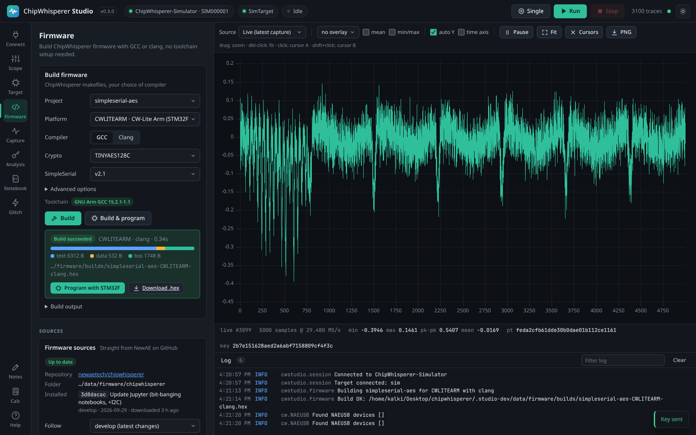
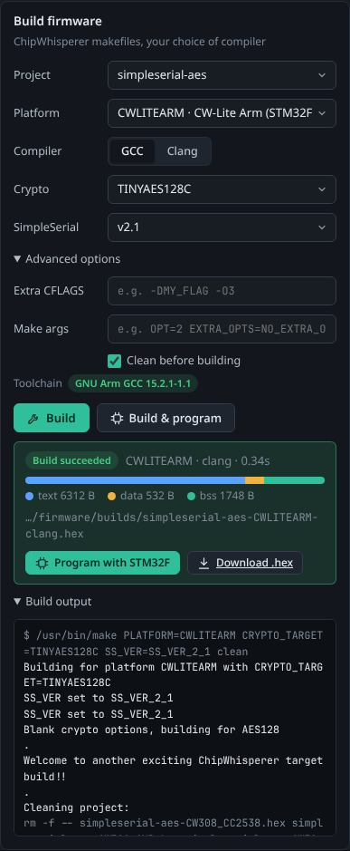

# Firmware Builds

The **Firmware** tab compiles ChipWhisperer's own target firmware (simpleserial-aes, simpleserial-glitch and the other example projects) for any supported platform, with GCC or clang, and can flash the result onto your target in the same click. You do not need to install a compiler, `make` (on Windows) or the ChipWhisperer repository yourself: Studio downloads what it needs the first time.



*The Firmware tab: build options at the top, the result of a successful build below.*

> **Note:** Studio has so far been tested with its built-in [Simulator](Simulator) and in CI on Linux, Windows and macOS, where it downloads real compilers and builds real firmware. Flashing the built firmware onto physical hardware has not been verified yet.

## What happens when you press Build


*The five steps behind the Build & program button.*

1. **Sources.** Studio uses the ChipWhisperer `firmware/mcu` folder it downloaded from NewAE's GitHub, or your own checkout. See [Firmware Sources](Firmware-Sources).
2. **Compilers.** Studio picks the GCC toolchain for the platform's CPU architecture (and clang if you chose it). If one is missing, the tab offers to install it. See [Toolchains](Toolchains).
3. **Plan.** Your choices become a single `make` command with the right tool names, flags and environment.
4. **Build.** ChipWhisperer's own makefiles run, exactly as they would in a terminal. The output streams live into the build log.
5. **Program (optional).** The resulting `.hex` file is flashed with the programmer that matches the platform, using the scope connected on the [Connect](Connecting-Hardware) tab.

## Quick start

1. Open the **Firmware** tab.
2. If the **Firmware sources** card says *Not downloaded*, press **Download** (about 20 MB).
3. Choose a **Project** (for example `simpleserial-aes`) and a **Platform** (for example `CWLITEARM`).
4. If the **Toolchain** line shows a warning such as *No GCC for Arm Cortex-M*, press **Install now** and wait for the download to finish.
5. Press **Build**. A green *Build succeeded* box appears with the firmware size.
6. To flash it, connect your scope and target first, then press **Program with STM32F** (or whichever programmer is shown), or use **Build & program** next time to do both at once.

## Build options

| Option | What it does | Default |
|--------|--------------|---------|
| Project | The firmware project to build. Studio lists every folder in the sources whose makefile includes ChipWhisperer's `Makefile.inc`, for example `simpleserial-aes`, `simpleserial-glitch`, `simpleserial-ecc`, `basic-passwdcheck`. | `simpleserial-aes` (remembered between sessions) |
| Platform | The target board or chip. The list comes from `hal/Makefile.hal` in the sources and is grouped by CPU architecture (Arm Cortex-M, AVR / XMEGA, RISC-V, TriCore, PowerPC, Renesas RX). Each entry shows the platform name and its description, for example `CWLITEARM · CW-Lite Arm (STM32F3)`. | `CWLITEARM` (remembered) |
| Compiler | **GCC** or **Clang**. See [GCC and clang builds](#gcc-and-clang-builds) below. | GCC |
| Crypto | The `CRYPTO_TARGET` passed to make: which crypto implementation the firmware links in. Disabled for projects that do not use one. | `TINYAES128C` |
| SimpleSerial | The `SS_VER` passed to make: the serial protocol version the firmware speaks. | `v2.1` (`SS_VER_2_1`) |
| Extra CFLAGS | Additional compiler flags, appended to the ones the makefiles and Studio set, for example `-DMY_FLAG -O3`. Found under **Advanced options**. | empty |
| Make args | Additional make variables or arguments, split like a shell command line, for example `OPT=2 EXTRA_OPTS=NO_EXTRA_OPTS`. Found under **Advanced options**. | empty |
| Clean before building | Runs `make PLATFORM=... clean` first, so objects from a previous build (possibly with the other compiler) cannot leak into this one. Found under **Advanced options**. | on |

### Platforms that are greyed out

A platform is disabled (*not available*) when it needs the extra HALs from `chipwhisperer-fw-extra` and your sources do not contain them. Studio's own download always includes them. If you build from your own checkout, run `git submodule update --init firmware/mcu/hal/chipwhisperer-fw-extra` in it. See [Firmware Sources](Firmware-Sources#using-your-own-firmware-folder).

### Crypto targets

| Value | What it is |
|-------|------------|
| `TINYAES128C` | The small, unprotected software AES-128 most ChipWhisperer tutorials attack. The usual choice. |
| `AVRCRYPTOLIB` | AES from the AVR-Crypto-Lib project, written for AVR and XMEGA targets. |
| `MBEDTLS` | AES from mbed TLS. |
| `AESSIMPLE` | A simple reference AES implementation. |
| `MASKEDAES` | A masked (side-channel protected) AES. Some masked implementations in ChipWhisperer live in git submodules that Studio's download does not include, so this may need your own full checkout. |
| `HWAES` | The chip's hardware AES engine, on platforms that have one. ChipWhisperer's platform table lists CC2538, EFM32GG11, EFM32TG11B, EFR32MG21A, IMXRT1062, K24F, K82F, LPC55S6X, NRF52, PSOC62, SAM4L, SAML11, STM32F2, STM32F4, STM32L4 and STM32L5 as supporting it. |
| `MICROECC` | The micro-ecc elliptic curve library, used by `simpleserial-ecc`. |
| `NONE` | No crypto library. |

> **Tip:** Whether a crypto target builds depends on the project and platform. `TINYAES128C` works everywhere.

### SimpleSerial versions

| Value | Shown as | When to use it |
|-------|----------|----------------|
| `SS_VER_2_1` | v2.1 | Current ChipWhisperer firmware and the **SimpleSerial v2** target protocol on the Connect tab. Use this unless you have a reason not to. |
| `SS_VER_1_1` | v1.1 | The legacy protocol, used by older tutorials. Connect the target as **SimpleSerial v1**. |
| `SS_VER_1_0` | v1.0 | Older still. Rarely needed. |
| `SS_VER_2_0` | v2.0 | Deprecated by NewAE; use v2.1 instead. |

The SimpleSerial version of the firmware and the target protocol you connect with must match, otherwise captures time out.

## GCC and clang builds

**GCC** builds run ChipWhisperer's makefiles with the GCC cross compiler for the platform: `arm-none-eabi-gcc` for Arm, `avr-gcc` for AVR and XMEGA, `riscv-none-elf-gcc` for RISC-V. Studio passes the tool names (`CC`, `CXX`, `OBJCOPY`, `OBJDUMP`, `SIZE`, `NM`) explicitly and runs `make -jN`, where N is the number of CPU cores.

**Clang** builds use LLVM clang 21 (from the Zig toolchain) to compile every C file. Because ChipWhisperer's makefiles are written for GCC, Studio sets `CC` to a small compiler wrapper that:

- runs clang with the right target (`arm-none-eabi`, `avr` or `riscv32-unknown-elf`) and with the C library headers of the matching GCC toolchain (newlib or avr-libc);
- drops GCC-only options clang does not understand (such as `-mno-fdiv`, `-mcall-prologues`, `-mapcs`, `-mno-sched-prolog`, `-misa-spec=...`) and GNU assembler listing flags;
- spells out the RISC-V `zicsr` and `zifencei` extensions in `-march` (for example `rv32i` becomes `rv32i_zicsr_zifencei`);
- hands hand-written assembly files (`.S`, `.s`) to GCC, whose syntax they use.

Linking is always done by GCC (Studio sets `LINK_COMPILER`), so a clang build uses the same C library and ChipWhisperer linker scripts as a GCC build. This is why **a clang build also needs the GCC toolchain for the platform installed**. Clang builds are available for Arm, AVR and RISC-V platforms.

> **Note:** Clang output is usually somewhat larger than GCC's for the same firmware (for example 6312 bytes of code instead of 5620 for simpleserial-aes on CWLITEARM). Timing and power characteristics also differ, which can be interesting for side-channel experiments.

## The toolchain line

Under the options, the **Toolchain** line tells you which compilers the build will use:

- a green badge such as *GNU Arm GCC 15.2.1-1.1* means the toolchain Studio downloaded will be used;
- *(system)* means Studio found the compiler on your `PATH` and will use that;
- an amber badge such as *No GCC for Arm Cortex-M* means nothing suitable is installed. If Studio has a download for it, the line shows its size and an **Install now** link; otherwise it suggests adding a custom toolchain on the [Toolchains](Toolchains) card.

If the platform has no programmer built into Studio, the line also says so: flash the `.hex` with the chip vendor's tool in that case.

## Building and programming

| Button | What it does |
|--------|--------------|
| **Build** | Builds the firmware. |
| **Build & program** | Builds, and if the build succeeds, immediately programs the target with the platform's programmer. Needs a scope connected on the Connect tab. |
| **Cancel** | Shown while a build runs. Stops `make`. |

While a build runs, a progress bar and *Building simpleserial-aes for CWLITEARM with gcc...* are shown and the log opens.

### The result box

After a successful build a green box shows:

- *Build succeeded*, the platform, the compiler and the build time;
- a size bar and legend with the **text** (code), **data** (initialised variables) and **bss** (zeroed variables) section sizes in bytes, from the toolchain's `size` tool;
- the path of the saved `.hex` (hover to see the full path);
- **Program with ...** to flash the target with the platform's programmer, and **Download .hex** to save the file through your browser.

If the build fails, a red box shows *Build failed* and the first error line from the log, and the build output opens automatically.



*The build output streams live. Errors are red, warnings amber, and make's own commands grey.*

### Where builds are saved

Every successful build is copied to `<data dir>/firmware/builds/<project>-<platform>-<compiler>.hex`, together with the `.elf` file when there is one, for example `~/ChipWhispererStudio/firmware/builds/simpleserial-aes-CWLITEARM-gcc.hex`. A new build of the same combination overwrites the previous file. The original output also stays in the project folder of the sources (`<TARGET>-<PLATFORM>.hex`). See [Command Line and Configuration](Command-Line-and-Configuration) for the data folder.

## Programmers per platform

| Programmer | Platforms |
|------------|-----------|
| STM32F | CWLITEARM, CWNANO, CW308_STM32F0, CW308_STM32F1, CW308_STM32F2, CW308_STM32F3, CW308_STM32F4 |
| XMEGA | CWLITEXMEGA, CW303, CW301_XMEGA |
| AVR | CW304, CW301_AVR, CWAVRCAN, CW308_MEGARF |
| SAM4S | CWHUSKY, CW312_SAM4S, CW308_SAM4S |
| NEORV32 | CW308_NEORV32 |
| none | All other platforms. Flash them with the vendor's tools, or with your own code in a [notebook](Notebooks). |

You can always program any `.hex` file manually on the [Target](Target-and-Programming) tab and choose the programmer yourself.

## Compatibility flags Studio adds

ChipWhisperer's hardware abstraction layers were written for older compilers. Current GCC versions turn some old C patterns into hard errors, so Studio adds these flags to every build (through the `CFLAGS` environment variable, which the makefiles append to):

| Flag | Why |
|------|-----|
| `-Wno-error=implicit-function-declaration` | Some HALs call functions without declaring them first, an error since GCC 14. |
| `-Wno-error=incompatible-pointer-types` | Same, for loosely typed pointer assignments. |
| `-Wno-error=int-conversion` | Same, for implicit integer and pointer conversions. |
| `-fcommon` | Some HALs define variables in headers; GCC 10 and later reject the duplicate definitions at link time without this. |
| `-misa-spec=2.2` (RISC-V only) | GCC 12 and later no longer treat the `zicsr` and `zifencei` extensions as part of `rv32i`; this restores the older rule the NEORV32 and Ibex HALs rely on. Also passed to the assembler. |

The same compatibility flags are set for `!make` and `%%bash` commands run from a [notebook](Notebooks).

## Platform coverage

In a full build of `simpleserial-aes` for every platform with the pinned toolchains on Linux:

| Architecture | Platforms | GCC | Clang |
|--------------|-----------|-----|-------|
| AVR / XMEGA | CW301_AVR, CW301_XMEGA, CWAVRCAN, CW303, CWLITEXMEGA, CW304, CW308_MEGARF | all build | all build |
| Arm Cortex-M | CWLITEARM, CWNANO, CWHUSKY, CW308_STM32F0 to F4, CW308_STM32L4, CW308_STM32L5, CW308_SAM4L, CW308_SAM4S, CW312_SAM4S, CW308_SAML11, CW308_K24F, CW308_K82F, CW308_CC2538, CW308_LPC55S6X, CW308_IMXRT1062, CW308_EFM32TG11B, CW308_EFR32MG21A, CW308_EFM32GG11, CW308_PSOC62, CW308_NRF52 | all build except CW308_EFM32GG11, CW308_PSOC62 and CW308_NRF52 | most build; see below |
| RISC-V | CW308_NEORV32, CW305_IBEX, CW312_IBEX, CW308_FE310 | all build | all build except CW308_FE310 |
| Other | CW308_AURIX (TriCore), CW308_RX65N (Renesas RX), CW308_MPC5676R (PowerPC) | need a [custom toolchain](Toolchains#custom-toolchains) | not supported |

Why some platforms fail:

- **CW308_EFM32GG11, CW308_PSOC62, CW308_NRF52** fail with every compiler because of problems in the upstream HAL sources: the EFM32GG11 HAL contains `#error "Unfinished HAL"`, the PSOC62 HAL has a syntax error, and the NRF52 build points at a linker script that does not exist. These are not Studio issues; they need fixes in ChipWhisperer.
- **CW308_CC2538, CW308_LPC55S6X, CW308_IMXRT1062, CW308_FE310** fail with clang because their sources use GCC-only constructs (a naked function containing C code, `.syntax divided` assembly, and symbols whose binding clang handles differently). Build them with GCC.

In the latest full run of all 38 platforms (simpleserial-aes, firmware sources at NewAE's develop branch), GCC built 32 and clang built 28. Common targets (CWLITEARM, CWNANO, CWHUSKY, CWLITEXMEGA, CW304, the STM32 family, SAM4S, K82F, NEORV32, Ibex) build with both compilers. CI builds CWLITEARM and CWLITEXMEGA with both compilers, and CWHUSKY with GCC, on Linux, Windows and macOS for every change.

> **Note:** The platform list and results depend on the version of the firmware sources you follow. A newer ChipWhisperer commit may fix or add platforms.

## Dry run through the HTTP API

`POST /api/firmware/plan` returns exactly what a build would do (the make command, the toolchains chosen, the output file and the programmer) without building anything:

```bash
curl -s -X POST http://127.0.0.1:8765/api/firmware/plan -H 'Content-Type: application/json' -d '{"project": "simpleserial-aes", "platform": "CWLITEXMEGA", "compiler": "clang"}'
```

The same request body works for `POST /api/firmware/build` (add `"clean": false` or `"jobs": 4` if you like), then poll `GET /api/firmware/build` and `GET /api/firmware/build/log`. The MCP tools `firmware_plan`, `firmware_build` and `firmware_program` do the same for AI agents. See [HTTP API](HTTP-API) and [MCP Server](MCP-Server).

## Troubleshooting builds

| Symptom | Cause and fix |
|---------|---------------|
| *no firmware sources yet: download them or choose a firmware folder* | Download the sources on the **Firmware sources** card, or point Studio at your checkout. |
| *no GCC toolchain for arm: install one on the Toolchains card* | Install the GCC toolchain for the platform's architecture (the **Install now** link does it). Clang builds need GCC too. |
| *make not found* | On Windows, install **GNU make + sh** on the Toolchains card. On Linux install make (for example `sudo apt install make`); on macOS run `xcode-select --install`. |
| *... needs the chipwhisperer-fw-extra HALs* | Your own firmware checkout lacks that git submodule. Initialise it, or switch back to Studio's downloaded sources. |
| `unrecognized opcode 'csrr ...', extension 'zicsr' required` | A RISC-V build outside Studio's normal path. Studio adds `-misa-spec=2.2` automatically; if you pass your own `CFLAGS`, keep it. |
| `unknown argument: '-m...'` with clang | A GCC-only flag the wrapper does not know yet. Build that platform with GCC, and please report the flag. |
| `multiple definition of ...` | Old code relying on common symbols. Studio adds `-fcommon`; make sure you did not override it in **Extra CFLAGS**. |
| Target does not answer after programming | Check that the SimpleSerial version of the build matches the protocol you connected with, and that you chose the right programmer. |

More in [Troubleshooting](Troubleshooting).
