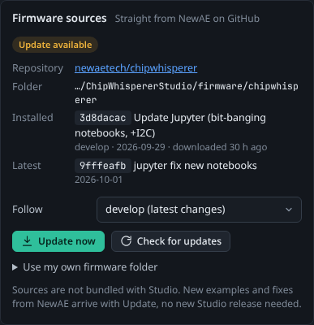

# Firmware Sources

To build target firmware, ChipWhisperer Studio needs ChipWhisperer's firmware source tree (`firmware/mcu`). Studio does not bundle it: it downloads it straight from NewAE's GitHub repository and can keep it up to date, so new examples and fixes from NewAE reach you without a new Studio release. You can also point Studio at your own ChipWhisperer checkout.

<picture><source media="(prefers-color-scheme: light)" srcset="images/firmware-sources-light.png"></picture>

*The Firmware sources card on the Firmware tab, showing the installed commit and the update status.*

## What gets downloaded

| Part | From | Goes to |
|------|------|---------|
| `firmware/mcu`: the example projects (`simpleserial-aes`, `simpleserial-glitch`, ...), the HALs for the main platforms, the crypto libraries and the shared makefiles | [newaetech/chipwhisperer](https://github.com/newaetech/chipwhisperer), at the commit your channel points to | `<data dir>/firmware/chipwhisperer/` |
| The extra HALs for many CW308 target boards (STM32F1/F2/F4, K82F, SAML11, NRF52, ...) | [newaetech/chipwhisperer-fw-extra](https://github.com/newaetech/chipwhisperer-fw-extra), at exactly the commit the ChipWhisperer repository pins as its submodule | `<data dir>/firmware/chipwhisperer/hal/chipwhisperer-fw-extra/` |

Only these folders are kept from the downloaded archives (about 110 MB to download, about 250 MB on disk). Studio records the repository, channel, commit, commit date and message in a small `.cwstudio-source.json` file inside the folder.

## Channels

The **Follow** setting chooses which version of ChipWhisperer the sources track:

| Choice | What it follows |
|--------|-----------------|
| **develop (latest changes)** | The newest commit on NewAE's `develop` branch. This is the default. |
| **Latest release** | The commit of NewAE's latest GitHub release. |
| **Tag or commit...** | Any branch name, tag (for example `v6.0.0`) or commit hash. Type it into the box that appears and press Enter. |

Changing the channel does not download anything by itself: press **Re-download** afterwards, or **Check for updates** and then **Update now**.

## Buttons and statuses

| Button | What it does |
|--------|--------------|
| **Download** | First download of the sources. |
| **Check for updates** | Asks GitHub which commit your channel points to now and compares it with what you have. |
| **Update now** | Shown when an update is available: downloads the newer commit. |
| **Re-download** | Downloads the channel's current commit again, for example to undo local edits. |

| Badge | Meaning |
|-------|---------|
| **Not downloaded** | No sources yet. |
| **Not checked** | Sources are installed, but you have not checked for updates in this session. |
| **Up to date** | Your sources match the channel's current commit. |
| **Update available** | The channel has moved on; the card shows the newer commit and its message. |
| **Your folder** | Studio is using your own firmware folder (see below). |

The card also shows the repository, the folder (hover for the full path) and the installed commit with its message, branch or tag, date and when you downloaded it.

> **Note:** An update replaces the whole downloaded folder. Build outputs inside the project folders are lost, but every successful build is also copied to `<data dir>/firmware/builds/`, which is kept. If you want to edit the firmware, use your own folder instead of editing the downloaded copy.

## When GitHub cannot be reached

If Studio cannot ask GitHub which commit to download (no internet, a firewall, or GitHub's rate limit), it falls back to a known-good commit pinned in Studio (ChipWhisperer `d5d0188`, with `chipwhisperer-fw-extra` at `e1a787f`) and says so in the log. This commit is known to build with Studio's pinned compilers. The downloads themselves still need access to `codeload.github.com`.

### GitHub's rate limit and GITHUB_TOKEN

GitHub allows 60 anonymous API requests per hour per IP address, shared by everyone behind the same address (a university or company network, for example). Each check or download uses a few requests. If you hit the limit, create a GitHub personal access token (no scopes are needed for public repositories) and set it before starting Studio:

```bash
export GITHUB_TOKEN=ghp_yourtoken      # Linux and macOS
set GITHUB_TOKEN=ghp_yourtoken         # Windows cmd
$env:GITHUB_TOKEN = "ghp_yourtoken"    # Windows PowerShell
```

Studio uses `GITHUB_TOKEN` (or `GH_TOKEN`) only for these lookups. See [Command Line and Configuration](Command-Line-and-Configuration).

## Using your own firmware folder

To build your own changes to the firmware, or a ChipWhisperer version Studio cannot download, open **Use my own firmware folder**, enter a path and press **Use this folder**. You can give either:

- the `firmware/mcu` folder of a ChipWhisperer checkout, for example `~/src/chipwhisperer/firmware/mcu`, or
- the root of the checkout, for example `~/src/chipwhisperer` (Studio finds `firmware/mcu` in it).

Studio checks that the folder contains `Makefile.inc` and `hal/Makefile.hal`. While a custom folder is in use, **Download**, **Update** and **Check for updates** are disabled (update it with git yourself), and the badge reads **Your folder**. **Back to downloaded sources** switches back.

> **Tip:** Many CW308 platforms need the `chipwhisperer-fw-extra` submodule. In a fresh clone, run `git submodule update --init firmware/mcu/hal/chipwhisperer-fw-extra`, otherwise those platforms are greyed out on the Firmware tab.

## Where things are stored

| Path | Contents |
|------|----------|
| `<data dir>/firmware/chipwhisperer/` | The downloaded `firmware/mcu` tree (with `hal/chipwhisperer-fw-extra`). |
| `<data dir>/firmware/settings.json` | Your channel and custom folder. |
| `<data dir>/firmware/builds/` | Copies of successful builds. |
| `<data dir>/firmware/uploads/` | Firmware files you uploaded on the Target tab. |

The [Notebook](Notebooks) tab links `<data dir>/notebooks/firmware/mcu` to the sources, so NewAE's tutorial notebooks can find the firmware at the relative path they expect.

## From the API and MCP

| Action | HTTP API | MCP tool |
|--------|----------|----------|
| State, projects and platforms | `GET /api/firmware` | `firmware_catalogue` |
| Set the channel | `PUT /api/firmware/channel` with `{"channel": "latest-release"}` | `firmware_set_channel` |
| Check for updates | `POST /api/firmware/sources/check` | `firmware_check_updates` |
| Download or update (optionally at a `ref`) | `POST /api/firmware/sources/fetch` with `{"ref": "v6.0.0"}` | `firmware_fetch_sources` |
| Cancel a download | `POST /api/firmware/sources/cancel` | |
| Use your own folder (or `null` to go back) | `PUT /api/firmware/sources` with `{"root": "..."}` | `firmware_set_folder` |

See [HTTP API](HTTP-API) and [MCP Server](MCP-Server).
