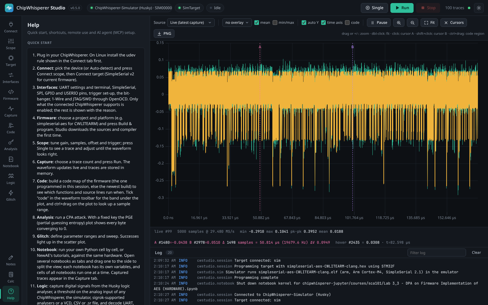

# Interface Tour

This page explains every part of the Studio window: the top bar, the navigation, the panels, the main area, the log drawer, themes and keyboard shortcuts. Studio opens in its own application window (or in your web browser with the Web build, `cw-studio-web` or `--browser`); either way the interface is a local web page served by Studio, so it looks the same everywhere and also works from another computer.

*The Studio window: top bar, navigation on the left, the panel of the current tab, the main area with the waveform, and the log drawer at the bottom.*

## Layout at a glance

| Area | Where | What it is for |
|------|-------|----------------|
| Top bar | Across the top | Connection status, quick capture buttons, trace count, theme switch |
| Navigation | Left edge | Switches between tabs (Connect, Scope, Target, Interfaces, Firmware, Capture, Code, Analysis, Notebook, Logic, Glitch, Notes, Calc, Help) |
| Panel | Left, next to the navigation | The controls of the current tab |
| Main area | Right | The live waveform (with the code band under it when it is on), the notebook editor in the Notebook tab, or the logic view in the Logic tab |
| Log drawer | Bottom right | Messages from Studio and the ChipWhisperer library, plus live selection statistics |

## Top bar

- **Logo, name and version.** The small badge next to the name shows the version you are running.
- **Status chips.** Three rounded chips show the scope, the target and the current job:
  - The **scope** chip shows the device name and serial number (for example `ChipWhisperer-Simulator · SIM000001`) with a green dot when connected, or **No scope**.
  - The **target** chip shows the target type (for example `SimpleSerial2`) or **No target**.
  - The **job** chip shows **Idle**, or the running job with its progress and rate (for example `capture: 120/500 · 850/s`) with a pulsing amber dot. It turns red if the last job ended with an error.
- **Single** captures one trace. **Run** starts a capture with the settings of the [Capture tab](Capturing-Traces). **Stop** stops the running capture or glitch sweep. Single and Run are disabled until a scope is connected.
- **Trace count** shows how many traces are stored in memory.
- **Connection dot.** A small green dot means the browser has a live connection to Studio (used for streaming traces and messages). It turns red if Studio has stopped or the connection dropped; the page reconnects automatically when Studio is back.
- **Theme button.** Switches between the dark and light theme (see [Themes](#themes)).

## Navigation and tabs

Each tab has an icon and a short label. Hover over a tab to see a description. Studio remembers the last tab you used and reopens it next time.

| Tab | What it is for | Page |
|-----|----------------|------|
| Connect | Choose and connect the scope and target, see drivers and status | [Connecting Hardware](Connecting-Hardware) |
| Scope | Every scope setting with documentation, plus default_setup, test trigger and FPGA reset | [Scope Settings](Scope-Settings) |
| Target | Program firmware, serial terminal, SimpleSerial commands, target settings | [Target and Programming](Target-and-Programming) |
| Interfaces | UART and terminal, SimpleSerial, SPI, GPIO, USERIO, triggers, bit-banger and 1-Wire, JTAG/SWD through OpenOCD, gated by the connected model | [Protocols and Interfaces](Protocols-and-Interfaces) |
| Firmware | Build ChipWhisperer firmware, manage firmware sources and compilers | [Firmware Builds](Firmware-Builds) |
| Capture | Capture traces, export and import trace sets | [Capturing Traces](Capturing-Traces) |
| Code | Which firmware functions and source lines run when, on the waveform | [Code on the Waveform](Code-on-the-Waveform) |
| Analysis | CPA key recovery and its plots | [Quick Start](Quick-Start#4-recover-the-key-with-cpa) |
| Notebook | Python notebooks that share Studio's hardware connection, as tabs and side by side | [Notebooks](Notebooks) |
| Logic | Logic analyser: capture digital signals and decode UART, SPI, I2C, 1-Wire, JTAG, SWD, CAN and SimpleSerial | [Logic Analyser](Logic-Analyser) |
| Glitch | Glitch parameter sweeps and their results | [Scope Settings](Scope-Settings#glitch-the-fault-injection-module) |
| Notes | A text pad that saves automatically | [Notes and Calculator](Notes-and-Calculator) |
| Calc | Calculator and statistics of the current selection | [Notes and Calculator](Notes-and-Calculator) |
| Help | Quick start, shortcuts, remote use and AI agent (MCP) setup | [MCP Server](MCP-Server) |

## Panels

The panel is the scrollable column between the navigation and the main area. Each panel starts with a title and a one line description, and is organised into cards with section headings. Controls follow the same conventions everywhere:

- Green buttons are the main action of a card (for example **Connect scope**, **Run**, **Build**).
- Red buttons stop or delete something.
- Small grey text under a card explains what it does or what to do next.
- Hover over a control or a setting name to see a tooltip with more detail.

## Main area

When any tab other than Notebook and Logic is open, the main area shows the [Waveform Viewer](Waveform-Viewer): a toolbar at the top, the plot, the [code band](Code-on-the-Waveform#the-code-band) under it when **code** is ticked, and a footer with statistics of the displayed trace. The **Notebook** tab shows the notebook editor instead, and the **Logic** tab the logic view; switching to any other tab brings the waveform back. Traces captured from a notebook appear in the waveform as well.

In a narrow window the layout adapts: below about 900 pixels the panel gets narrower, the status chips hide and notebook panes stack; below about 720 pixels the panel moves above the main area. Nothing scrolls sideways.

## Log drawer

The bottom of the main area holds the log.

- Click **Log** to collapse or expand the drawer. The number next to it counts the messages received.
- Messages show the time, the level (INFO in blue, WARNING in amber, ERROR in red) and where they came from (Studio or the ChipWhisperer library).
- Type in **Filter log** to show only matching messages. **Clear** empties the drawer (it does not delete anything else).
- Errors also appear as a toast (see below).
- **Selection statistics.** When you select text that contains numbers anywhere in Studio (a note, a notebook output, the log, the serial console), a blue badge appears in the log bar with the count, sum, mean, min and max. Click it to open the Calc tab with the full statistics. See [Notes and Calculator](Notes-and-Calculator).

<picture><source media="(prefers-color-scheme: light)" srcset="images/selection-stats-light.png"></picture>
*Selecting numbers in a note shows their statistics instantly in the log bar.*

When you open Studio, the most recent log messages from before the page loaded are shown too, so you do not miss what happened.

## Toasts

Short messages pop up in the bottom right corner for a few seconds: green for success (for example "Target programmed"), amber for warnings and red for errors. Error toasts stay a little longer. The same errors are also written to the log.

## Themes

Studio has a dark and a light theme. By default it follows your operating system's setting. Click the theme button (sun or moon icon) at the right end of the top bar to switch; your choice is remembered (in Studio's own window as well as in a browser), like the last tab, the notebook layout and the other view settings. Plots and charts switch colours with the theme.

*The same window in the light theme.*

## Keyboard shortcuts

These work when the cursor is not in a text field:

| Key | Action |
|-----|--------|
| S | Capture a single trace (from every tab, except while a notebook has the focus) |
| R | Run a capture with the Capture tab settings (from every tab, except while a notebook has the focus) |
| Esc | Stop the running capture or glitch sweep (in the Logic tab: stop the logic capture) |
| Space | Pause or resume the waveform display (capturing continues) |
| Left / Right arrow | Previous or next stored trace, when the waveform Source is "Browse stored traces" |
| + / - | Zoom the waveform in or out by a factor of two, around cursor A or the middle of the view |

Space, the arrows and + and - act on the waveform, so they do nothing in the Notebook and Logic tabs, which hide it.

In the waveform plot: drag to zoom into a range, double-click to fit, click to place cursor A, Shift+click to place cursor B, and Ctrl+drag (Cmd+drag on macOS, or Alt+drag) to pick a region for the [code map](Code-on-the-Waveform). See [Waveform Viewer](Waveform-Viewer).

In the Logic tab, with a capture shown:

| Key | Action |
|-----|--------|
| + / - (or the mouse wheel) | Zoom in or out around the mouse |
| Left / Right, Home / End | Pan, or go to the start or end of the capture |
| F | Fit the whole capture |
| A / B | Place cursor A or B at the mouse |
| Esc | Stop the logic capture |

See [Logic Analyser](Logic-Analyser#the-view).

In the notebook editor:

| Key | Action |
|-----|--------|
| Shift+Enter | Run the cell and move to the next one (a new cell is added at the end) |
| Ctrl+Enter (Cmd+Enter on macOS) | Run the cell and stay |
| Alt+Enter | Run the cell and insert a new code cell below |
| Tab | Indent by four spaces |
| Enter | New line, keeping the indentation (one level more after a colon) |
| Esc | Leave the cell editor (a text cell shows its formatted view again) |
| Ctrl+S (Cmd+S) | Save the notebook |

See [Notebooks](Notebooks) for more.

## Using Studio from another computer

Studio is a small web server. By default it only accepts connections from the same computer (`127.0.0.1`). To use it from a laptop while the ChipWhisperer is plugged into a lab machine or a Raspberry Pi:

1. Start Studio on the machine with the hardware: `cw-studio --host 0.0.0.0` (or `ChipWhispererStudio --host 0.0.0.0` for the bundle).
2. On your laptop, open `http://<that-machine>:8765/` in a browser.

> **Note:** Studio has no login. Anyone who can reach the port can control the hardware and run code in the notebook. Only use `--host 0.0.0.0` on a trusted network, or tunnel the port over SSH (`ssh -L 8765:localhost:8765 lab-machine`) instead.

Several windows (Studio's own and browser windows) can be open at the same time; they all show the same live session, and a notebook open in more than one of them stays in sync (see [Notebooks](Notebooks#changes-from-other-windows-and-agents)).

## Help tab

The **Help** tab repeats the quick start, lists the keyboard shortcuts, explains remote use and the HTTP API, and shows ready-to-copy configuration for connecting AI agents through MCP, with the command that fits your installation (`cw-studio.exe` in the Windows window build, the bundle's own executable otherwise, `cw-studio` for a pip install).

<picture><source media="(prefers-color-scheme: light)" srcset="images/help-light.png"></picture>
*The Help tab with quick start steps and shortcuts.*
