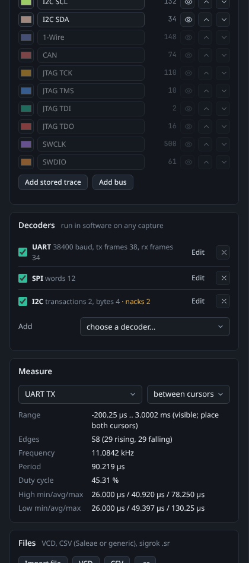

# Logic Analyser

The **Logic** tab captures digital signals and decodes the protocols on them. It works with every ChipWhisperer: the Husky's built-in logic analyser, one digital line through the analog input of any scope, external logic analysers through sigrok, files saved by PulseView, Saleae Logic or a simulator, and a simulated source with realistic traffic. Studio's own decoders handle UART, SPI, I2C, 1-Wire, JTAG, SWD, CAN and SimpleSerial, and run on any capture.

<picture><source media="(prefers-color-scheme: light)" srcset="images/logic-light.png"></picture>

*The simulator's demo traffic with the UART, SPI and I2C decoders: decoded bytes under each channel, the trigger at 0 ms, and the results table below.*

## Quick start

1. Connect a scope (or the [simulator](Simulator)) on the Connect tab.
2. Open the **Logic** tab, pick a **Source** in the **Capture** card and press **Capture**.
3. In the **Decoders** card choose a protocol under **Add**. Studio guesses the channels from their names; check them, set the options and press **Add decoder**. The decoded values appear under the channel and in the results table.
4. Zoom with the mouse wheel, place cursors, search, measure, and export the capture or the decoded results.

Times are shown relative to the trigger: t = 0 is the trigger, negative times are before it.

## Sources

| Source | Needs | Channels | What it is for |
|--------|-------|----------|----------------|
| **Husky logic analyser** | ChipWhisperer-Husky or Husky Plus | 9 per capture | The scope's built-in logic analyser: the 20-pin target header, the USERIO header or the glitch internals, sampled by the FPGA. |
| **Analog input (thresholded)** | any ChipWhisperer | 1 | One digital line wired to the scope's measure input, captured as traces and turned into logic levels. |
| **Simulator demo traffic** | the simulator connected | 18 | Realistic UART, SPI, I2C, 1-Wire, CAN, JTAG and SWD traffic around a SimpleSerial encryption, for learning the tab and testing decoders. |
| **External analyser (sigrok)** | `sigrok-cli` installed | as the device has | Saleae clones, DSLogic, fx2lafw and the other analysers [sigrok](https://sigrok.org) supports. Works without a ChipWhisperer. |
| **File** | nothing | as the file has | VCD, CSV and sigrok `.sr` files (see [Files](#files)). |

A source that cannot be used shows *(not available)* with the reason, for example *the built-in logic analyser is on the ChipWhisperer-Husky; use the analog input or an external analyser*. Which sources each model has is also in the [capability matrix](Protocols-and-Interfaces#pins-bit-banging-and-logic-capture).

### Husky logic analyser

Each capture records one group of nine signals:

| Group | Signals |
|-------|---------|
| **CW 20-pin** | IO1, IO2, IO3, IO4, HS1, HS2, AUX MCX, TRIG MCX, ADC clock |
| **USERIO 20-pin** | D0 to D7, CK (Studio sets the USERIO pins to inputs) |
| **glitch internals** | glitch out, source clock, MMCM1, MMCM2, glitch go, capture trigger, glitch enable, manual trigger, MMCM1 trigger |

| Setting | Meaning |
|---------|---------|
| **Clock** | **USB 96 MHz**, **target (HS1/AUX)** or **Husky PLL**: the clock the sampling clock is derived from. |
| **Oversampling**, **Downsample** | The sample rate is clock x oversampling / downsample (downsample 1 to 65,536, default 96, which gives 1 MHz from the USB clock). The rate line under the form shows the result, for example *1.000 MHz sampling, 16376 samples = 16.376 ms after the trigger*. The Husky's logic analyser is specified up to 250 MHz. |
| **Depth** | Samples per signal: up to 16,376 on the Husky and 65,535 on the Husky Plus (an even number). |
| **Trigger** | `capture` (the scope's capture trigger), `manual` (fires right after arming: shows whatever is on the pins), the glitch triggers (`glitch`, `glitch_source`, `glitch_trigger`, `trigger_glitch`), `HS1`, an edge on a TIO pin (`rising_tio1` ... `falling_tio4`) or a USERIO pin (`rising_userio_d0` ... `falling_userio_d7`). |
| **Fire target** | **send a SimpleSerial command** makes the target raise its trigger (the default for the capture and glitch triggers when a target is connected); **no** waits for the trigger. |
| **Also capture the ADC trace** | With the `capture` trigger, keeps the scope's power trace as an analog row on the same time base. |
| **Timeout (s)** | How long to wait for the trigger (default 5 s). |

The defaults are the same in the tab, the HTTP API and the MCP tools. The trigger is always sample 0: the Husky's logic analyser has no pre-trigger. If the clock does not lock at the chosen rate, Studio says so; change the clock source or the oversampling.

### Analog input on any scope

The Nano, Lite and Pro have no logic analyser, but any ChipWhisperer can record one digital line through its analog input: wire the signal to the scope's measure input (mind the input's voltage range), capture with the scope's current settings and Studio turns the samples into logic levels with a Schmitt trigger.

| Setting | Meaning |
|---------|---------|
| **Segments** | How many traces to capture (1 to 2000, default 20). Each one needs a trigger; they are placed end to end, so time between them is not captured. |
| **Samples each** | Samples per trace (temporarily changes `adc.samples`). |
| **Threshold** | `auto` (the middle between the low and high levels found) or a level in the ADC range (-0.5 to 0.5). |
| **Hysteresis** | `auto` (10 percent of the swing between the low and high levels, also with a numeric threshold) or the width of the band around the threshold. |
| **Fire target**, **Invert** | Send a SimpleSerial command for each segment; invert the levels. |

The analog samples stay visible as the **ADC input** row with the threshold drawn as a dashed line. With the simulator a **Simulated line** setting chooses which demo signal appears on the input.

### Simulator demo traffic

With the simulator connected (any model), this source generates 18 channels of traffic around a SimpleSerial encryption, with t = 0 at the trigger: the plaintext command on **UART RX** before the trigger, the ciphertext on **UART TX** after it, a **TRIG** pulse, a 1 MHz **CLK**, an SPI flash reading its JEDEC ID and data, an I2C EEPROM read with a repeated start and a NACKed probe, a 1-Wire reset, presence and Read ROM, a standard and an extended CAN frame, JTAG reading an Arm IDCODE, and SWD reading DPIDR with OK, WAIT and FAULT answers.

Settings: the sample rate (1 to 100 MHz, default 4 MHz), the duration (default 25 ms), how much is before the trigger (default 40 percent), which channels, edge jitter and noise spikes per millisecond (to try the glitch filter), and whether to send a real plaintext to the simulated target. A simulated Husky also has a simulated built-in logic analyser, with the same traffic wired to its pins.

### External analysers (sigrok)

Studio drives any analyser that [sigrok](https://sigrok.org) supports through `sigrok-cli`, which you install once:

| OS | Install |
|----|---------|
| Debian, Ubuntu, Kali | `sudo apt install sigrok-cli` |
| Fedora | `sudo dnf install sigrok-cli` |
| Arch | `sudo pacman -S sigrok-cli` |
| macOS | `brew install sigrok-cli` |
| Windows | the installer from [sigrok.org](https://sigrok.org/wiki/Downloads); add its folder to `PATH` |

On Linux, USB analysers also need sigrok's udev rules (they come with the distribution package) and a replug. Restart Studio afterwards, or set `CWSTUDIO_SIGROK_CLI` to the path of `sigrok-cli`. Then press **Scan for analysers**, choose the **Device** and set the sample rate, channels (for example `D0,D1,D2`, empty for all), the number of samples, an optional **Trigger** (`D0=r,D1=1`: levels 0 and 1, edges r, f and e) and extra driver options. Studio's own decoders and file import do not need sigrok.

### Repeat and history

**Repeat** captures again and again until you press **Stop** (or Esc, which also stops a first capture that is still waiting). A new capture from the same source keeps the channel names, colours, hidden channels and order you set, as in PulseView. The newest eight captures stay in memory; switch between them with the **Capture** menu at the top of the view. Tick **keep a copy on disk (.sr)** to save every capture to `logic/captures` in the data folder.

## The view

- **Zoom:** the mouse wheel (or **+** and **-**) zooms around the pointer, Shift+drag or dragging on the time axis zooms to a range, **Fit** (or **F**, or a double-click on the axis) shows the whole capture, and **A..B** zooms to the cursors. The view stops at 10 samples.
- **Pan:** drag the plot, use Shift+wheel, the arrow keys, Home and End, or the scrollbar.
- **Cursors:** click to place cursor A and right-click (or Alt+click) for cursor B; they snap to an edge of the channel you click on. Drag a cursor to move it. The footer shows both times, the difference, its sample count and 1/difference. **Cursors** clears them.
- **Samples** switches the time axis between seconds and sample numbers.
- Hover anywhere for the time, the sample, the decoded value under the pointer and the level of each channel.

The keys work in the Logic tab once a capture is shown and no text field has focus; zoom and the cursor keys (**A**, **B**) act at the mouse position. Very dense stretches are drawn as shaded blocks until you zoom in; the view asks Studio only for what is visible, so captures of millions of samples stay fast.

### Channels and buses

The **Channels** card lists every channel with its colour, name, edge count, a show/hide button and arrows to reorder it; you can also double-click a name in the view to rename it and drag rows to reorder them. **Add stored trace** shows the newest captured power trace as an analog row on the logic time base, and an analog row's waveform button sends it to the Capture tab's waveform view.

**Add bus** groups channels (most significant first, up to 32) into a value row shown in hex, decimal or binary. Buses refer to channels by name, so they follow renamed and reordered channels into later captures; a bus whose channels are missing from the current capture is disabled with a notice until they are back.

### Search

The **Find** bar searches from cursor A (or the edge of the view) forwards or backwards for:

- **Edge:** the next rising, falling or any edge on a channel.
- **Pattern:** a pattern over the shown channels, one character per channel from the top: `0`, `1` or `X` (any), for example `1X0`. Optionally only at an edge of another channel.
- **Decoded value:** text in the decoded results, such as `0x41`, `NACK` or `r 69`, in one decoder or all.

A hit moves cursor A there and centres the view.

### Measure

The **Measure** card measures a channel between the cursors, in the visible range or over the whole capture: rising and falling edges, frequency, average period, duty cycle, and the minimum, average and maximum high and low pulse widths.

## Decoders

<picture><source media="(prefers-color-scheme: light)" srcset="images/logic-panel-light.png"></picture>

Decoders run in software on whatever capture is shown, so they work the same for every source. Add one from **Add** in the **Decoders** card; each decoder can be edited, hidden or removed, and its summary shows what it found (for example *38400 baud, tx frames 50* or the number of errors). Results appear as rows under the channel they belong to and in the results table.

Every decoder has a **Glitch filter (ns)**: pulses shorter than this on the decoder's channels are ignored (0 turns it off), which helps with noisy captures.

Invalid options (for example a word size of 0) are refused when you add or edit a decoder. A decoder that fails on a particular capture shows its own error in its row, and the view and the other decoders keep working.

| Decoder | Channels | Options | What it shows |
|---------|----------|---------|---------------|
| **UART** | RX, TX (either or both) | Baud (`auto` detects it from the shortest pulses and snaps to a standard rate), data bits 5 to 9, parity, stop bits, bit order, inverted, show as hex, ASCII, decimal or binary | Each byte, with parity and framing errors and breaks. Tolerates the clock error of real targets. |
| **SPI** | CS (optional), SCK, MOSI and/or MISO | Mode 0 to 3 (or CPOL and CPHA, which override the mode over the API), bit order, word size, CS active low or high, show as | MOSI and MISO words, and with CS one summary per transfer (`MOSI 9F 00 00 00 / MISO FF EF 40 18`). Warns when SCK idles at the wrong level for the mode. |
| **I2C** | SCL, SDA | 7-bit or 8-bit addresses (10-bit addresses are recognised) | Start, repeated start, stop, read or write with the address, data bytes, ACK and NACK. Handles clock stretching. |
| **1-Wire** | Data | none | Resets, presence pulses, ROM and function commands by name, data bytes, and the ROM (family, serial, CRC check). Switches to overdrive timing after the overdrive commands, and back at the next standard reset. Needs at least 1 MHz sampling (2 MHz in overdrive). |
| **JTAG** | TCK, TMS, TDI, TDO (optional) | Start state of the TAP | The TAP state, IR and DR shifts with TDI and TDO values, Arm instruction names, and the IDCODE fields. |
| **SWD** | SWCLK, SWDIO | none | Line resets, the JTAG-to-SWD sequence, each request (DP or AP, read or write, register), the ACK (OK, WAIT, FAULT, no response) and the data, with parity checks. |
| **CAN** | CAN RX | Bit rate (`auto` or a number), sample point | Each field (ID, standard or extended, RTR, DLC, data, CRC check, ACK, EOF) and one summary row per frame, with stuff, form and CRC errors. **Classic CAN only:** CAN FD frames are marked *CAN FD frame ... not decoded* and skipped rather than misread; set the nominal rate when FD frames are on the bus. |
| **SimpleSerial** | Target RX, Target TX | Version (`auto`, 1 or 2) and the UART options | The ChipWhisperer SimpleSerial protocol on top of UART: commands and responses by name (`p` plaintext, `k` key, `r` response, `z`/`e` ack and so on) with their data, v2 frames (COBS and CRC checked) and errors. |
| **sigrok decoder** | given in the spec | a sigrok decoder spec such as `uart:rx=D0:baudrate=115200` (channels are `D0`, `D1`, ... in capture order) | Any of sigrok's protocol decoders, through `sigrok-cli`. |

Decoding a very large capture (more than about 300,000 edges) runs in a separate worker process, so the view and the rest of Studio stay responsive; the decoder and the results table say *decoding...* until it is done.

### Results table

Press **Results** in the toolbar to show the table of decoded values: time (or sample), decoder, row and value. Choose a decoder or all of them, filter by text or by a hex value (`0x41`), and click a row to jump to it. **CSV** downloads the table (start and end in seconds and samples, decoder, row, channel, kind, text and value).

## Files

The **Files** card imports and exports captures:

| Format | Import | Export |
|--------|--------|--------|
| **VCD** (value change dump) | 1-bit wires and vectors (split into one channel per bit), nested scopes, any timescale. From PulseView, simulators (Verilog, VHDL) and other tools. `x` and `z` read as 0. | Yes, with an exact timescale and Studio's sample rate and trigger in a comment. |
| **CSV** | A time column (Saleae Logic 1 `Time [s]`, Saleae Logic 2 timestamps, or a header with units) or a sample number column, then one 0/1 column per channel; every sample or only changes. sigrok and PulseView CSV comments (`; Samplerate: 1 MHz`) are read. | Yes, Saleae style (`Time [s]` from the trigger and one column per channel). |
| **sigrok session (.sr)** | PulseView and sigrok-cli sessions with any number of logic channels. Analog channels in mixed sessions are ignored. | Yes, sigrok's format with Studio's trigger and exact rate. |

**Import file** opens a file from your computer; files Studio saved or imported are listed under **On disk** and open with a click. A CSV without a time column asks for its sample rate. Negative times in a CSV (Saleae pre-trigger) keep the trigger at 0; a VCD starts at its first timestamp. Exports open back identically. Decoders, buses and analog rows are not part of the exported files.

Files live in the data folder under `logic/`: `captures/` (copies kept on disk), `exports/`, `imports/` (uploaded files) and `sigrok/` (sigrok-cli captures).

## Limits

| Item | Limit |
|------|-------|
| Captures kept in memory | 8 (newest) |
| Husky logic analyser | 9 signals per capture, 16,376 samples (Husky) or 65,535 (Husky Plus), no pre-trigger, specified up to 250 MHz |
| Analog input | 1 channel, up to 2000 segments |
| Simulated source | 18 channels, up to 100,000,000 samples |
| Bus | up to 32 channels |
| `.sr` export | up to 64 channels |

In Studio's tests, a capture of 10 channels with 10 million samples each (more than 12 million edges) answers every view request in under 0.2 s, from fully zoomed out to 50 samples.

## From the API and MCP

| Action | HTTP API | MCP tool |
|--------|----------|----------|
| Sources and what is available | `GET /api/la/sources` | `la_sources` |
| Capture | `POST /api/la/capture` (`/api/la/stop` stops it) | `la_capture` |
| Import and export | `POST /api/la/import`, `/api/la/import/upload`, `/api/la/export`, `GET /api/la/download/{fmt}` | `la_import`, `la_export` |
| Decode | `POST /api/la/decoders` (shown in the tab), `POST /api/la/decode` (once) | `la_decode` |
| Decoded results | `GET /api/la/annotations`, `/api/la/annotations.csv` | `la_decode` |
| Measure | `POST /api/la/measure` | `la_measure` |
| Channels and buses | `GET` / `PUT /api/la/channels` | `la_channels` |
| Search | `POST /api/la/search` | `la_search` |
| State and captures in memory | `GET /api/la`, `GET /api/la/captures`, `PUT /api/la/current` | `la_status`, `la_select` |

See [HTTP API](HTTP-API#logic-analyser) and [MCP Server](MCP-Server#logic-analyser) for the parameters.
