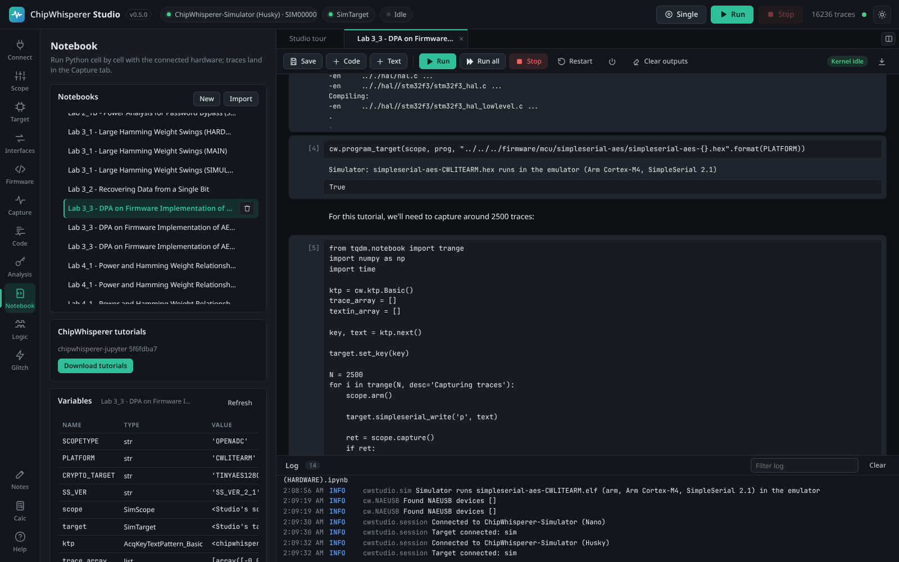

# Notebooks

The **Notebook** tab is a Jupyter-style editor built into ChipWhisperer Studio. You write Python cell by cell, run each cell and see its output, errors and plots underneath. Unlike a separate Jupyter server, notebook code shares Studio's hardware connection: `cw.scope()` and `cw.target()` give you the devices connected on the [Connect](Connecting-Hardware) tab, and every trace you capture appears live in the waveform view and the [Capture](Capturing-Traces) tab. NewAE's own tutorial notebooks run unmodified.

<picture><source media="(prefers-color-scheme: light)" srcset="images/notebook-light.png"></picture>

*The Notebook tab: files, tutorials and variables on the left, the notebook itself in the main area.*


## Creating and opening notebooks

The **Notebooks** card on the left lists every notebook in Studio's notebooks folder, grouped by sub-folder (click a folder name to expand it). Click a notebook to open it in a new tab (or switch to its tab if it is already open). The notebooks you had open, and how they were arranged, reopen when you return.

| Action | How |
|--------|-----|
| New notebook | **New**, then type a name. It starts with a short example (connect, capture 50 traces). |
| Import an `.ipynb` | **Import** and pick the file. It is copied into the `imported/` folder. |
| Save | Automatic 2.5 seconds after every change, when a cell finishes, and when you close the page. **Save** or Ctrl+S (Cmd+S on macOS) saves immediately. The toolbar shows *unsaved* or *saved*. |
| Export | The download button at the right of the toolbar saves the `.ipynb` through your browser, ready to open in Jupyter. |
| Rename | Double-click the notebook's tab and type a new name (a name with `/` moves it into a sub-folder). Its variables are kept. |
| Delete | Hover a notebook in the list and press its bin icon. An open notebook's tab closes. |

Notebooks are standard Jupyter `.ipynb` files (nbformat 4), so they move freely between Studio and Jupyter.

## Tabs and side by side

Every open notebook gets a tab above the notebook area. A tab shows the notebook's name and a dot: grey while it has unsaved changes, blue while its cells wait in the queue, amber (blinking) while one of its cells runs. Click a tab to show it, drag it along the tab bar to reorder, double-click it to rename, and press its **x** (or middle-click it) to close it.

To see two notebooks at once, split the notebook area into a left and a right pane, each with its own tabs:

| Action | How |
|--------|-----|
| Split | Press the split button at the right end of the tab bar (it moves the current notebook into a new pane on the right), or drag a tab onto the right half of the notebook area. You can also drag a notebook from the **Notebooks** list onto a pane. |
| Move a notebook to the other pane | Drag its tab onto the other pane (onto its tab bar to choose the position), or press the arrows button at the right end of the tab bar. |
| Resize | Drag the bar between the panes; double-click it to make both panes equal. |
| Unsplit | Close or move away the last tab of a pane; the other pane takes the whole area. |

<picture><source media="(prefers-color-scheme: light)" srcset="images/notebook-split-light.png"></picture>

*Two notebooks side by side: each pane has its own tabs, and each notebook its own kernel and variables.*


The pane you last clicked or typed in is the *focused* pane; its current tab is marked with a green line. Notebooks you open from the list open there, the **Variables** card shows that notebook's variables, and Ctrl+S saves it. Keyboard shortcuts in a cell always act on the notebook the cell belongs to. In a narrow window (below about 900 pixels) the panes are stacked, one above the other, and narrow panes show their toolbar buttons as icons only (hover a button for its name).

## Cells

There are two kinds of cell:

- **Code** cells hold Python. The number in brackets on the left is the execution count: `[3]` means it was the third cell run since the kernel started, `[*]` means it is running, `[ ]` means it is queued.
- **Text** cells hold Markdown (headings, lists, tables, links, images, code blocks). They are shown formatted; double-click one to edit it, and press Shift+Enter or Esc to show it formatted again.

Hover a cell (or select it) to see its tools on the right: run, move up, move down, switch between code and text (**M** / **Py**), and delete. Add cells with **+ Code** and **+ Text** in the toolbar (inserted below the selected cell) or the buttons at the end of the notebook.

### Keys

| Key | In a cell |
|-----|-----------|
| Shift+Enter | Run the cell and move to the next one (adds a new code cell at the end). |
| Ctrl+Enter (Cmd+Enter) | Run the cell and stay on it. |
| Alt+Enter | Run the cell and insert a new code cell below. |
| Enter | New line, keeping the indentation; one more level after a line ending in `:`. |
| Tab | Insert four spaces. |
| Esc | Leave the editor (and format a text cell). |
| Ctrl+S (Cmd+S) | Save the notebook in the focused pane. |

Studio's single-key shortcuts (S, R, Esc, Space, + and -) do nothing while a notebook has the focus (you are in a cell or clicked in the notebook), so a key pressed after leaving a cell never starts a capture by accident; use the **Single** and **Run** buttons in the top bar.

## Running code

| Toolbar button | What it does |
|----------------|--------------|
| **Run** | Runs the selected cell and moves on (like Shift+Enter). |
| **Run all** | Runs every code cell from the top, in order. If a cell fails, the remaining queued cells are cancelled, as in Jupyter (they keep their previous execution count). |
| **Stop** | Interrupts this notebook's running cell (it ends with `KeyboardInterrupt`) and clears its queued cells. Other notebooks keep running. |
| **Restart** | After confirmation, clears this notebook's variables. Other notebooks are not affected and Studio stays connected to the hardware. |
| Power button | **Shut down kernel**: after confirmation, frees this notebook's variables and memory. A new, empty kernel starts when you run a cell. |
| **Clear outputs** | Removes all outputs and execution counts from the notebook. |
| **View N traces** | Appears when cells captured traces; jumps to the Capture tab. |

The badge on the right shows **Kernel idle**, **Running** (with the number of this notebook's queued cells), **Queued** when its cells wait for another notebook's cell, or **No kernel** before the notebook has run anything.

### One kernel per notebook

As in Jupyter, every notebook has its own Python session (its *kernel*): a variable defined in one notebook is not visible in another, each notebook counts its own executions (`[1]`, `[2]`, ...), and **Stop**, **Restart** and the **Variables** card apply to one notebook only. A notebook's kernel starts when it first runs a cell and moves with the notebook when you rename it.

All kernels share Studio's hardware connection, trace store and `studio` helper, so two notebooks talk to the same scope and target. Their cells go through one queue and run one at a time, in the order you ran them, on Studio's hardware thread: while a cell of one notebook runs, cells of the others wait (their badge says **Queued**). Each cell runs with its notebook's folder as the working directory, so relative paths work as they do in Jupyter.

When you close a notebook in every Studio window, its kernel is shut down about 20 seconds later (long enough to survive reloading the page) and its memory is freed. Kernels started from the [HTTP API](HTTP-API) or [MCP](MCP-Server) for notebooks that are not open stay until they are shut down.

### Outputs

| Output | How it is shown |
|--------|-----------------|
| `print()` and other text | Streamed while the cell runs. Progress bars (tqdm) update in place; colour codes are removed. Text written to stderr has an amber background. Very long outputs show their last 100,000 characters (download the notebook for all of it). |
| The value of the last line | Shown like in Jupyter, unless it is `None` (or a matplotlib object). |
| Errors | The traceback in red. |
| matplotlib figures | Every open figure is shown as an image when the cell finishes, and `plt.show()` shows the current figures immediately, so output before and after it stays in order. |
| `display(obj)` | Rich output: HTML, Markdown, PNG, JPEG or SVG when the object provides it, text otherwise. |
| HTML | Shown in a sandbox where scripts cannot run, so saved outputs from imported notebooks cannot interfere with Studio. |

### Variables

The **Variables** card lists the variables defined in the focused notebook (its name is shown next to the title): name, type (with the shape of arrays) and a short value. It refreshes after every cell of that notebook and when you focus another notebook; press **Refresh** to update it by hand.

### Changes from other windows and agents

A notebook can be open in several Studio windows, and the [HTTP API](HTTP-API) and [MCP](MCP-Server) can run or rewrite it while it is open. Every save is announced to all windows:

- A tab without unsaved edits reloads the new version by itself (keeping its scroll position), for example after `notebook_run` saved its outputs.
- A tab with unsaved edits shows a notice instead of being overwritten: *This notebook was changed outside this tab ... Nothing is saved until you choose.* Choose **Reload from disk** or **Keep my version**.
- If the notebook was deleted or renamed elsewhere, a tab with edits offers **Save it again** or **Close**; a tab without edits closes. A rename in one window renames the tab in the others.

Saves never overwrite a newer version silently, and autosave never re-creates a deleted notebook.

## Using the hardware from a notebook


*Notebook cells run on Studio's hardware thread and use the same scope and target as the rest of the app; every notebook has its own namespace.*

Cells run on the same thread that talks to the ChipWhisperer, in turn with the rest of Studio, so the USB device is never used twice at once. Inside a notebook, `import chipwhisperer as cw` gives you the normal library with a few functions adapted to Studio:

| Call | In a Studio notebook |
|------|----------------------|
| `cw.scope()` | Returns Studio's connected scope. If none is connected, Studio connects one first: the simulator when Studio was started with `--simulate`, otherwise auto-detect. `name=` (for example `"Husky"`) and `sn=` are honoured when connecting. |
| `cw.target(scope, target_type)` | Returns Studio's connected target, connecting it if needed (SimpleSerial v2 by default, the type you pass otherwise, the simulated target when the scope is the simulator). |
| `cw.capture_trace(scope, target, text, key)` | Captures as usual and also stores the trace in Studio. |
| `cw.program_target(scope, prog, path)` | Programs the target. With the simulator, an ELF (or a `.hex` Studio built, which has its `.elf` next to it) runs in the [emulator](Simulator#running-your-own-firmware) from then on (*Simulator: ... runs in the emulator*); any other file is only checked to exist (*Simulator: pretending to program ...*). |
| `cw.plot(trace)` | Returns a plot that is drawn inline with matplotlib and also shows the trace in Studio's waveform view. Like ChipWhisperer's holoviews version, plots combine with `*` or `+` (`cw.plot(a) * cw.plot(b)`), `cw.plot()` with no data starts an empty plot to add to, and `.opts(title=..., width=..., height=...)` is accepted. |
| everything else | Unchanged: `cw.ktp`, `cw.targets`, `cw.programmers`, `cw.analyzer` and so on. |

The `scope` and `target` you get are thin stand-ins (their type is `StudioScope` and `StudioTarget`) that forward everything to the device Studio is connected to at that moment. `isinstance(scope, ...)` checks behave as for the real object, settings work as usual (`scope.gain.db = 25`, `scope.adc.samples = 5000`), and they keep working if you reconnect in the Connect tab.

### How traces reach the Capture tab

- Every trace returned by `cw.capture_trace()` is added to Studio's trace store with its plaintext, ciphertext and key.
- Manual capture loops, as used in many tutorials, work too: when the notebook calls `scope.get_last_trace()`, the trace is stored with the plaintext and key most recently sent with `target.simpleserial_write('p', ...)`, `target.simpleserial_write('k', ...)` or `target.set_key()`. The ciphertext is filled in when the notebook reads the response with `target.simpleserial_read()`.

The waveform view updates live while the cell runs. Afterwards, the **View N traces** button takes you to the Capture tab, and you can export the traces or run a CPA attack on them. Call `studio.store_traces(False)` to stop storing notebook captures.

> **Note:** While a cell runs, it has the hardware thread to itself. Actions in other tabs that use the hardware (connecting, changing settings, Single, Run) wait until the cell finishes. Use **Stop** to interrupt a long cell.

## The studio helper

Every notebook has a `studio` object:

| Member | What it does |
|--------|--------------|
| `studio.traces` | The stored traces. `len(studio.traces)`, `studio.traces[i]` gives `(wave, textin, textout, key)`, and `.waves`, `.textins`, `.textouts`, `.keys` give 2-D NumPy arrays of all traces. |
| `studio.add_trace(wave, textin=None, textout=None, key=None)` | Stores any 1-D array as a trace, so it appears in the waveform view and Capture tab. Returns its index. |
| `studio.clear_traces()` | Deletes all stored traces. |
| `studio.show(wave)` | Shows an array in the waveform view without storing it. |
| `studio.store_traces(enabled=True)` | Turns automatic storing of notebook captures on or off. |
| `studio.build_firmware(project="simpleserial-aes", platform="CWLITEARM", compiler="gcc", **options)` | Builds firmware exactly like the [Firmware tab](Firmware-Builds) (options such as `crypto_target`, `ss_ver`, `cflags`, `make_args`, `clean`) and returns the `.hex` path. Raises an error with the end of the build log if the build fails. `ss_ver` defaults to `SS_VER_2_1` like the Firmware tab; other options you leave out use the makefile's defaults. |
| `studio.program(hex_path=None, programmer=None)` | Programs the target, by default with the last build and its platform's programmer. |
| `studio.session` | Studio's internal session object, for advanced use. |

```python
hexfile = studio.build_firmware("simpleserial-aes", "CWLITEARM", crypto_target="TINYAES128C", ss_ver="SS_VER_2_1")
studio.program(hexfile)
waves = studio.traces.waves
print(waves.shape, waves.mean())
```

## IPython features

Studio supports the IPython syntax that ChipWhisperer's notebooks use. Line magics and `!` commands work wherever a statement starts, including inside loops and `if` blocks (but not inside brackets or strings, so `%` and `!` keep their Python meaning there). Cell magics must be the first line of the cell.

| Syntax | What it does |
|--------|--------------|
| `%run file.ipynb` | Runs every code cell of another notebook in the current namespace (paths relative to the working directory, quotes allowed). |
| `%run script.py` | Runs a Python file in the current namespace. |
| `!command` | Runs a shell command and shows its output. Studio's installed compilers and `make` are on `PATH`, and the [compatibility flags](Firmware-Builds#compatibility-flags-studio-adds) are in `CFLAGS`. |
| `{expr}` and `$name` in `!` commands | Replaced by the value of a Python expression or variable, for example `!make PLATFORM={PLATFORM} -j{n}`. Write `{{`, `}}` or `$$` for literal characters. |
| `files = !ls` | Runs the command and stores its output lines in a list. |
| `%%bash` (or `%%sh`) | Runs the whole cell with bash (or sh). `%%bash -s "$PLATFORM" "{x}"` passes the values as `$1`, `$2`, ... |
| `%%script name` | Runs the cell with the given interpreter. |
| `%cd folder`, `%pwd` | Change (and print) and show the working directory. A `%cd` lasts until the kernel restarts. |
| `%env`, `%env NAME`, `%env NAME=value` | Show all environment variables, one, or set one. |
| `%time statement`, `%%time` | Time one statement or the whole cell. |
| `%timeit statement` | Run a statement 7 times and print the average time. |
| `%who`, `%whos` | List variables. |
| `%pip ...`, `%conda ...` | Run pip in Studio's Python (`%conda` runs pip too). Not available in the standalone downloads. |
| `%sx command`, `%system command` | Run a command and return its output lines. |
| `%%capture [name]` | Run the cell without showing its output; store the output text in `name`. |
| `%%writefile [-a] file` | Write (or append) the cell's text to a file. |
| `%%html`, `%%markdown` | Show the cell as HTML or formatted Markdown. |
| `name?` or `name??` | Show help for an object. |
| `%config InlineBackend.figure_format = 'svg'` | Shows figures as SVG instead of PNG (`retina`, `jpeg` and `pdf` give PNG). Other `%config` settings are ignored. |
| `%matplotlib`, `%load_ext`, `%reload_ext`, `%autoreload`, `%aimport`, `%precision`, `%xmode`, and similar | Accepted and ignored, so notebooks written for Jupyter run unchanged. |

Other magics raise *UsageError: ... is not supported in Studio notebooks*. `!` commands run in your system's shell (cmd.exe on Windows). `%%bash` uses bash, or sh if bash is missing; on Windows install **GNU make + sh** on the [Toolchains](Toolchains) card to get sh.

Also available: `display()`, `from IPython.display import display, HTML, Markdown, Image, SVG, clear_output`, `from tqdm.notebook import trange, tqdm` (progress bars) and `get_ipython()` for `run_line_magic`, `run_cell_magic`, `system` and `getoutput`.

## ChipWhisperer tutorials

The **ChipWhisperer tutorials** card downloads NewAE's tutorial notebooks, the [chipwhisperer-jupyter](https://github.com/newaetech/chipwhisperer-jupyter) repository with the SCA101, SCA201, Fault101 and other courses plus demos. Press **Download tutorials**.

- Studio downloads the version of chipwhisperer-jupyter that matches your [firmware sources](Firmware-Sources): the commit the ChipWhisperer repository pins for its `jupyter` submodule. If you have no firmware sources yet, it uses your channel's current commit.
- The notebooks go into `<data dir>/notebooks/chipwhisperer-jupyter/` and appear in the **Notebooks** list.
- Studio links `<data dir>/notebooks/firmware/mcu` to the firmware sources (a symbolic link, or a directory junction on Windows), because the tutorials build firmware from `../../../firmware/mcu`. If the firmware sources are not downloaded yet, the card reminds you to download them first.
- Downloading again updates the tutorials and keeps your work: files you edited or added are left alone. If a file you edited also changed upstream, Studio lists them and asks: **Update, back up mine** installs the new version and keeps yours next to it as `<name>.local-YYYYMMDD-HHMMSS.ipynb`, **Keep mine** leaves your copies as they are and updates everything else, and **Cancel** changes nothing.

<picture><source media="(prefers-color-scheme: light)" srcset="images/notebook-tutorial-light.png"></picture>

*NewAE's Lab 3_3 running in Studio: setup, firmware build, programming and capture.*

### Walkthrough: Lab 3_3, DPA on firmware AES

NewAE's labs come in parts: a *(MAIN)* notebook with the exercise (it contains `raise NotImplementedError(...)` placeholders for you to replace), and *(HARDWARE)* and *(SIMULATED)* notebooks that do the capture. The MAIN notebook defines a few settings and then runs the HARDWARE notebook with `%run`. The quickest way to see the capture work in Studio is to run the HARDWARE notebook directly with those settings:

1. On the **Firmware** tab, download the firmware sources and install the **GNU Arm GCC** toolchain.
2. Connect the scope and target on the Connect tab (or start Studio with `--simulate` to use the simulator).
3. On the **Notebook** tab, press **Download tutorials**.
4. Open `chipwhisperer-jupyter/courses/sca101` and then *Lab 3_3 - DPA on Firmware Implementation of AES (HARDWARE)*.
5. Select the first cell and add a code cell above it (or edit the first, empty code cell) with the settings the MAIN notebook would define, changing `PLATFORM` to match your target:
   ```python
   SCOPETYPE = 'OPENADC'
   PLATFORM = 'CWLITEARM'
   CRYPTO_TARGET = 'TINYAES128C'
   SS_VER = 'SS_VER_2_1'
   ```
6. Press **Run all**.

What happens: `%run "../../Setup_Scripts/Setup_Generic.ipynb"` connects through Studio, the `%%bash` cell builds `simpleserial-aes` with Studio's compiler, `cw.program_target` flashes it (with the simulator, the firmware then runs in the emulator), and the capture loop records 2500 traces with a progress bar. The traces appear in the Capture tab with their plaintexts and keys; you can run Studio's own CPA attack on them. To do the full exercise, work through the MAIN notebook, which uses `trace_array` and `textin_array` from the capture.

## Limitations

- **holoviews and bokeh** are not included. Tutorial cells that only use `cw.plot()` work through Studio's stand-in, but cells that import holoviews or bokeh directly fail with an import error; use matplotlib instead.
- **Editing** is a plain text editor: no syntax colouring and no autocomplete.
- **One cell at a time:** a running cell holds the hardware thread; other hardware actions in Studio, and cells of other notebooks, wait until it finishes.
- **`input()`** is not supported; set values in code instead.
- **Stop** raises `KeyboardInterrupt` in the running code. If the code is waiting inside a USB call, the interrupt takes effect when that call returns.
- **Two panes at most** side by side; use tabs for more notebooks.
- `scope.dis()` in a notebook disconnects Studio's scope too (it is the same device); reconnect on the Connect tab.

## Where notebooks are stored

| Path | Contents |
|------|----------|
| `<data dir>/notebooks/` | Your notebooks (sub-folders allowed). |
| `<data dir>/notebooks/imported/` | Notebooks added with **Import**. |
| `<data dir>/notebooks/chipwhisperer-jupyter/` | NewAE's tutorials. |
| `<data dir>/notebooks/firmware/mcu` | Link to the firmware sources, for the tutorials. |

The data folder is `~/ChipWhispererStudio` unless you start Studio with `--data-dir`.

## From the API and MCP

| Action | HTTP API | MCP tool |
|--------|----------|----------|
| List notebooks and tutorial status | `GET /api/notebooks` | `notebook_list` |
| Read / write a notebook | `GET` / `PUT /api/notebooks/file` | `notebook_read` / `notebook_write` |
| Run code and wait for the output | `POST /api/kernel/run` with `{"code": "...", "kernel": "lab/a.ipynb"}` | `notebook_run_code` with `notebook_path` |
| Run a whole notebook (in its own kernel) and save its outputs | `POST /api/notebooks/run` with `{"path": "..."}` | `notebook_run` |
| Queue cells (as the UI does) | `POST /api/kernel/execute` with `kernel` | |
| Variables, interrupt, restart | `GET /api/kernel/variables`, `POST /api/kernel/interrupt`, `POST /api/kernel/restart`, each with an optional `kernel` | `kernel_variables`, `kernel_interrupt`, `kernel_restart`, each with an optional `notebook_path` |
| List and shut down kernels | `GET /api/kernels`, `POST /api/kernels/shutdown` | `kernel_list`, `kernel_shutdown` |
| Rename a notebook (its kernel follows) | `POST /api/notebooks/rename` | |
| Download or update the tutorials | `POST /api/notebooks/tutorials/fetch` (`on_modified`: `backup` or `keep` after a `confirm`) | `tutorials_fetch` |

A notebook's kernel id is its path relative to the notebooks folder. Without a kernel id, the API and MCP tools use a shared **default** kernel that no notebook tab uses, as before. See [HTTP API](HTTP-API) and [MCP Server](MCP-Server).
