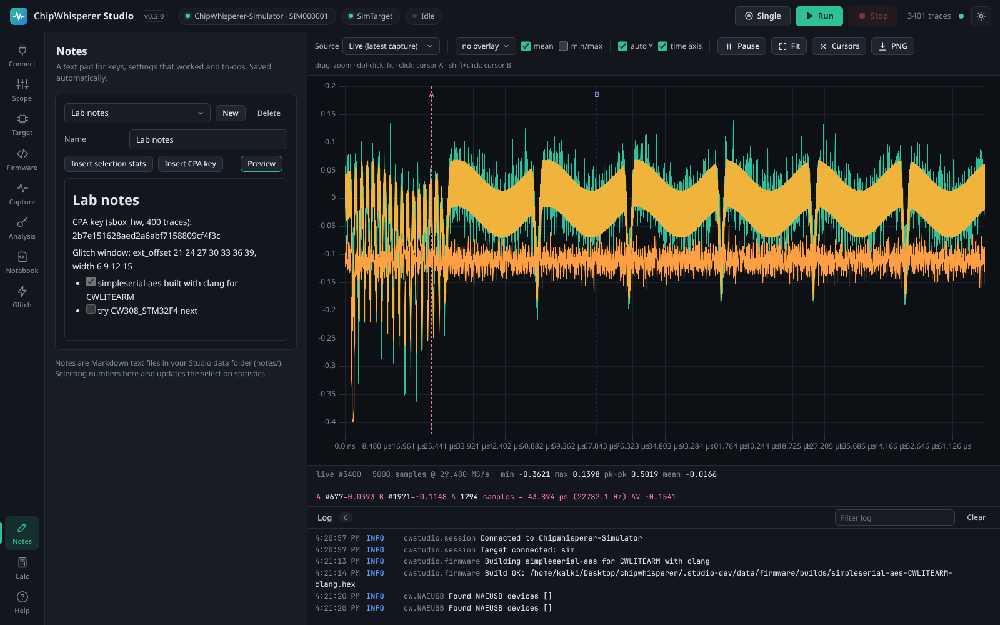
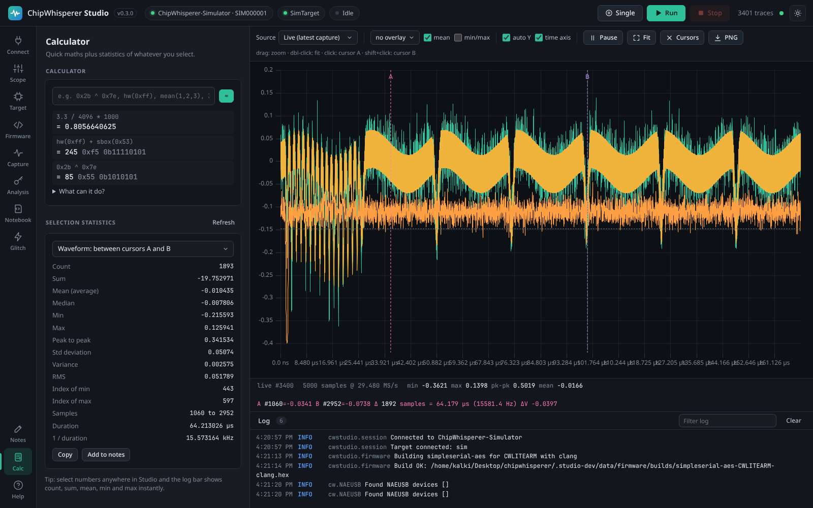
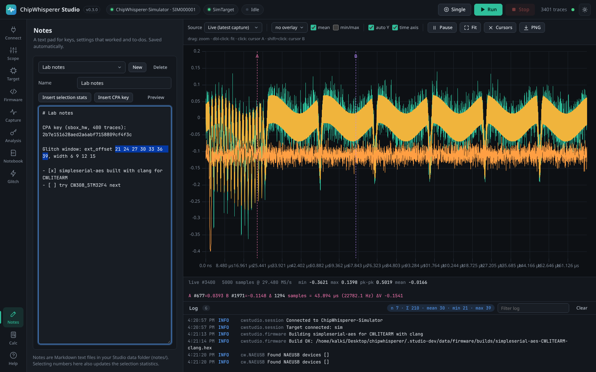

# Notes and Calculator

Two small tools for everyday lab work. **Notes** is a text pad for keys you recovered, glitch settings that worked and to-dos, saved automatically. **Calc** is a calculator with side-channel helpers, plus statistics (count, sum, mean, median, min, max, peak to peak, standard deviation, RMS) of whatever you select: part of the waveform, one sample across all traces, or numbers anywhere in Studio.

## Notes

*The Notes tab. Selecting numbers in a note shows their statistics in the log bar at the bottom.*

Open **Notes** in the left navigation (near the bottom).

| Control | What it does |
|---------|--------------|
| Note list | Switch between notes. The first time, Studio creates a note called *Notes*. |
| **New** | Creates a note named after the current date and time (for example *Note 2026-09-30 14.05*) and selects its name so you can type a better one. |
| **Delete** | Deletes the current note after confirmation. |
| Name | Rename the note: type a new name and press Enter or click elsewhere. Names must be unique. |
| **Insert selection stats** | Inserts a line with the statistics of your current selection (see below), for example *Selected text: count 4, sum 172, mean (average) 43, ...*. |
| **Insert CPA key** | Inserts the latest CPA result, for example *CPA (sbox_hw, 400 traces): key 2b7e1516...*. |
| **Preview** | Toggles between editing and a formatted view of the note. |
| Status | *Editing...* while you type, *Saved* once written to disk. |

Notes are saved automatically 0.7 seconds after you stop typing, and before you switch notes. Text is inserted at the cursor position.

Notes are plain text files written in [Markdown](https://www.markdownguide.org/basic-syntax/), so `# Heading`, `- list item`, `**bold**`, `` `code` `` and tables show up formatted in **Preview**. They are stored as `.md` files in `<data dir>/notes/` (by default `~/ChipWhispererStudio/notes/`); you can open them with any editor, and `.txt` files you put there appear in the list too.

## Calculator

*The Calc tab: calculator history at the top, statistics of the waveform between cursors A and B below.*

Type an expression and press Enter (or **=**). Results appear in a history list, newest first. Integer results also show their hexadecimal and binary form. Click a result to put it back into the input (in hex if your expression used hex). Press the Up and Down arrow keys to recall earlier expressions.

### Numbers and operators

| Kind | Syntax |
|------|--------|
| Numbers | `42`, `3.3`, `1e-6`, hexadecimal `0x2b`, binary `0b1011`, octal `0o17` |
| Arithmetic | `+ - * /`, integer division `//`, remainder `%`, power `**` |
| Bitwise | `^` is **XOR** (as in C and Python, not power), `&` AND, `\|` OR, `~` NOT, `<<` and `>>` shifts |
| Comparisons | `==`, `!=`, `<`, `<=`, `>`, `>=` give 1 (true) or 0 (false) |
| Lists | `[1, 2, 3]`, for functions that take several values |
| Constants | `pi`, `e`, `tau`, `inf` |

### Functions

| Function | What it returns |
|----------|-----------------|
| `hw(x)`, `popcount(x)` | Hamming weight: the number of 1 bits in `x`. |
| `hd(a, b)` | Hamming distance: the number of bits that differ between `a` and `b`. |
| `sbox(x)` | The AES S-box value of the byte `x`, for example `sbox(0x53)` is `0xed`. |
| `db(ratio)`, `undb(dB)` | Amplitude ratio to decibels (`20 * log10(ratio)`) and back. |
| `mean(...)`, `avg(...)` | Average of the values (as separate arguments or one list). |
| `median(...)` | Median. |
| `std(...)`, `var(...)` | Population standard deviation and variance (divide by n). |
| `rms(...)` | Root mean square. |
| `sum(...)`, `min(...)`, `max(...)` | Sum, smallest and largest value. |
| `abs`, `round`, `int`, `float` | As in Python. |
| `hex`, `bin`, `oct`, `chr`, `ord` | Conversions, as in Python. |
| `sqrt`, `exp`, `log` (natural), `log2`, `log10` | Roots and logarithms. |
| `sin`, `cos`, `tan`, `asin`, `acos`, `atan`, `atan2`, `sinh`, `cosh`, `tanh`, `degrees`, `radians` | Trigonometry (radians). |
| `floor`, `ceil`, `factorial`, `gcd`, `hypot`, `isqrt`, `comb`, `perm` | Other maths functions from Python's `math` module. |

### Variables

- `ans` is always the last result: `ans * 2`.
- `name = expression` stores a variable: `vref = 3.3`, then `vref / 4096`.
- Variables live in Studio (not in the browser), so they are shared by every open Studio window and by [AI agents](MCP-Server), and they reset when Studio restarts.

### Examples

| Expression | Result |
|------------|--------|
| `0x2b ^ 0x7e` | 85 (0x55): XOR of two key bytes |
| `hw(sbox(0x00 ^ 0x2b))` | Hamming weight of the first-round S-box output, the leakage the `sbox_hw` CPA model uses |
| `hd(0x3c, 0xc3)` | 8: all bits differ |
| `3.3 / 4096 * 1000` | 0.8056640625: millivolts per step of a 12-bit ADC at 3.3 V |
| `1 / 7.37e6 * 1e9` | about 135.7: nanoseconds per clock cycle at 7.37 MHz |
| `mean(1, 2, 3, 10)` | 4 |

The calculator is deliberately limited to maths: it cannot run Python code, access files or call arbitrary functions, and very large powers and shifts are refused.

## Selection statistics

The **Selection statistics** card computes statistics of a set of numbers you pick. Choose the source at the top of the card:

| Source | What is measured |
|--------|------------------|
| **Selected text (anywhere in Studio)** | The numbers in the text you have selected: in a note, a notebook output, the log, the serial console, a settings value, anywhere. Updates as you select. |
| **Waveform: between cursors A and B** | The samples of the displayed trace between the two cursors (click the plot for cursor A, Shift+click for cursor B). |
| **Waveform: visible (zoomed) range** | The samples currently visible in the waveform view. |
| **Waveform: whole displayed trace** | Every sample of the trace shown in the waveform view (the live trace, or the one you are browsing). |
| **Stored traces: value at cursor A across traces** | The value of one sample (the one under cursor A) in every stored trace: how that point varies from trace to trace. |
| **Numbers I type or paste** | Numbers you type or paste into the box, separated by spaces, commas or new lines. |

*Selecting numbers anywhere shows their count, sum, mean, min and max in the log bar.*

### The statistics

| Statistic | Meaning |
|-----------|---------|
| Count | How many numbers. |
| Sum | Their total. |
| Mean (average) | Sum divided by count. |
| Median | The middle value when sorted (the average of the two middle values for an even count). |
| Min, Max | The smallest and largest value. |
| Peak to peak | Max minus min. |
| Std deviation | Sample standard deviation (divides by count minus 1). |
| Variance | The square of the standard deviation. |
| RMS | Root mean square: the square root of the average of the squares. |
| Index of min, Index of max | Position of the smallest and largest value, counted from 0 within the selection. |

For the waveform sources the card also shows the sample range and, when the scope's sample rate is known, the **Duration** of the range in microseconds and **1 / duration** in kHz, handy for measuring the length of an operation or the period of a repeating pattern.

> **Note:** The calculator's `std()` and `var()` functions use the population formula (divide by n), while the Selection statistics card uses the sample formula (divide by n minus 1). For large selections the difference is negligible.

**Copy** puts a one-line summary on the clipboard; **Add to notes** inserts it into the current note. **Refresh** recalculates (the card also refreshes when you open the tab, when the selection changes, and after each capture for the waveform sources).

### The selection badge in the log bar

Whenever you select text that contains numbers, anywhere in Studio, a small badge appears in the log bar at the bottom: *n 4 · Σ 172 · mean 43 · min 3 · max 126*, like the status bar of a spreadsheet. With a single number it shows *Selected: 42*. Click the badge to open the Calc tab.

Numbers are recognised in decimal (`42`, `-3.5`, `.5`), scientific (`1e-6`, `2.5E3`) and hexadecimal with a `0x` prefix (`0x2b`). Other hexadecimal text, such as a key written as `2b7e1516`, is not recognised as one number: parts of it are read as separate decimal (or scientific) numbers, so select plain numbers, or `0x` prefixed ones, for meaningful results. Numbers inside words (for example the `2` in `SS_VER_2_1`) are counted too. Selections longer than 500,000 characters are ignored.

## From the API and MCP

| Action | HTTP API | MCP tool |
|--------|----------|----------|
| List notes | `GET /api/notes` | `notes_list` |
| Create a note | `POST /api/notes` with `{"name": "..."}` | `note_write` creates missing notes |
| Read a note | `GET /api/notes/{name}` | `note_read` |
| Write or rename a note | `PUT /api/notes/{name}` with `{"text": "...", "rename": "new name.md"}` | `note_write` (append by default) |
| Delete a note | `DELETE /api/notes/{name}` | |
| Evaluate an expression | `POST /api/calc` with `{"expr": "0x2b ^ 0x7e"}` | `calculate` |
| Calculator variables | `GET /api/calc/variables` | |
| Statistics | `POST /api/calc/stats` with `{"values": [...]}`, `{"source": "trace", "index": -1, "start": 0, "end": 100}` or `{"source": "sample", "sample": 1500}` | `selection_stats` |

See [HTTP API](HTTP-API) and [MCP Server](MCP-Server).
