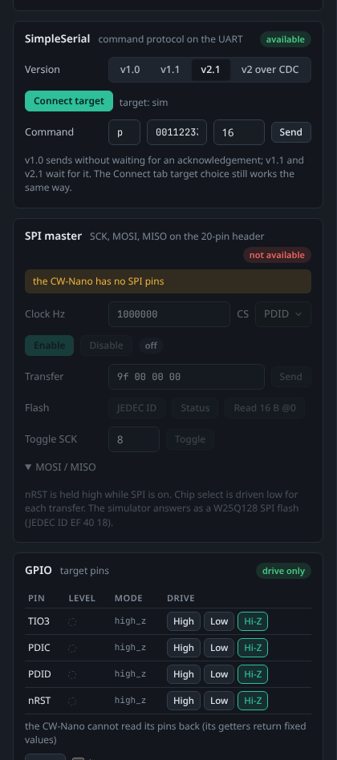
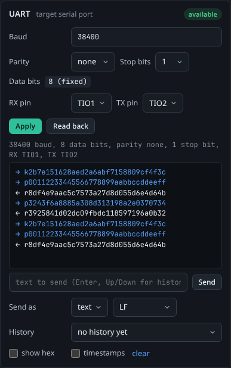
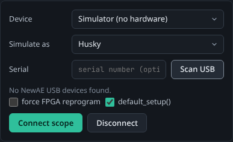

# Protocols and Interfaces

The **Interfaces** tab gathers everything that talks to the target other than capture: the target UART with a terminal, SimpleSerial, an SPI master (with SPI flash shortcuts), GPIO on the target pins, the Husky's USERIO header, capture triggers, the Husky bit-banger and 1-Wire, and JTAG/SWD debugging through OpenOCD. ChipWhisperer models differ a lot in what their hardware can do, so Studio checks the connected scope and enables only what it supports; everything else stays visible, disabled, with the reason. This page explains each section, lists what every model supports and where those facts come from.

<picture><source media="(prefers-color-scheme: light)" srcset="images/interfaces-light.png"></picture>

*The Interfaces tab with the simulator posing as a Husky: the badges at the top show what is available, the UART card below has the terminal.*

## How Studio decides what is available

- **The model.** Studio reads the connected scope's type from the `chipwhisperer` library (Nano, Lite, Pro, Husky or Husky Plus). With the simulator, the model you choose under **Simulate as** on the Connect tab counts instead (see [Simulate as](#simulate-as)).
- **The scope firmware.** Some features need a firmware feature that older scope firmware lacks: the SPI master (`TARGET_SPI`), JTAG and SWD (`MPSSE`), SWD on the Husky (`HUSKY_PIN_CONTROL`, SAM firmware 1.4 or newer) and the USB-CDC serial port (`CDC`). Studio asks the scope (`scope.check_feature()`) and says when the firmware is too old: *update it with scope.upgrade_firmware() (for example in a Notebook cell)*, which is how the `chipwhisperer` library updates scope firmware; see [NewAE's firmware page](https://chipwhisperer.readthedocs.io/en/latest/firmware.html).
- **The library.** The Husky bit-banger and its 1-Wire helper exist only in ChipWhisperer's `develop` branch, not in the 6.0.0 release on PyPI that the standalone bundles and a plain `pip install` use. With 6.0.0 they show *needs a Husky and a chipwhisperer library newer than 6.0.0*. Install the library from NewAE's repository into a pip installation of Studio to use them.
- **No scope connected:** everything says *connect a scope first*. A scope type the Interfaces tab does not know (a CW305 or CW310 board connected as the scope, for example) says *this scope type (...) is not supported by the Interfaces tab*.

The same rules gate choices elsewhere in Studio: the Scope tab's settings tree offers only the trigger modules and pin modes the model has (for example TIO4 cannot be `serial_rx`, and `clock.adc_mul` exists only on the Husky), and the Target tab offers only the programmers the model can drive. Over the API, `GET /api/capabilities` returns the whole table for the connected scope, each entry as `{available, reason, ...details}`.

## Capability matrix

What each ChipWhisperer supports, as Studio applies it. "fw" means the feature needs that scope firmware version or newer. The reason in the last column is what Studio shows when the feature is not available.

### Target communication

| Feature | Nano | Lite | Pro | Husky | Husky Plus | Reason shown when not available |
|---------|------|------|-----|-------|------------|---------------------------------|
| Target UART (baud 500 to 2,000,000, parity none/odd/even/mark/space, 1, 1.5 or 2 stop bits, always 8 data bits) | yes | yes | yes | yes | yes | |
| UART pin choice | fixed: RX TIO1, TX TIO2 | RX on TIO1-3, TX on TIO1-4 | as Lite | as Lite | as Lite | *TIO4 cannot receive serial data* |
| SimpleSerial 1.0, 1.1 and 2.1 | yes | yes | yes | yes | yes | |
| SimpleSerial 2 over the scope's USB-CDC port | fw 0.30 | fw 0.30 | fw 1.30 | fw 1.0 | yes | *this firmware has no USB-CDC serial port* |
| SPI master on the 20-pin header | no | fw 0.60 | fw 1.60 | fw 1.1 | fw 1.0 | *the CW-Nano has no SPI pins* |
| I2C, CAN, LIN | no | no | no | no | no | no ChipWhisperer has hardware for them (use the [Logic analyser](Logic-Analyser) to decode them) |

### Programming

| Programmer | Nano | Lite | Pro | Husky | Husky Plus | Reason shown when not available |
|------------|------|------|-----|-------|------------|---------------------------------|
| STM32F (serial bootloader) | yes | yes | yes | yes | yes | |
| XMEGA (PDI) | no | yes | yes | yes | yes | *the CW-Nano programs STM32F targets only* |
| AVR (ISP) | no | yes | yes | yes | yes | *AVR ISP needs the SPI pins, which the CW-Nano does not have* |
| SAM4S (SAM-BA) | no | yes | yes | yes | yes | *SAM-BA programming is not supported on the CW-Nano* |
| NEORV32, iCE40, XC7A35T (need the SPI master) | no | fw 0.60 | fw 1.60 | fw 1.1 | fw 1.0 | *the CW-Nano has no SPI pins* |
| OpenOCD (flash through JTAG/SWD) | no | as JTAG | as JTAG | as JTAG | as JTAG | as JTAG below |

For the Nano, NewAE's documentation lists STM32F programming only; XMEGA and SAM-BA are marked unknown or untested in the library, so Studio does not offer them.

### Debug and trace

| Feature | Nano | Lite | Pro | Husky | Husky Plus | Reason shown when not available |
|---------|------|------|-----|-------|------------|---------------------------------|
| JTAG through OpenOCD (MPSSE), 20-pin header | no | fw 0.60 | fw 1.60 | fw 1.1 | fw 1.0 | *the CW-Nano's 20-pin header has no TCK/TDI/TDO (SPI) lines* |
| SWD through OpenOCD (MPSSE) | no | fw 0.60 | fw 1.60 | fw 1.4 | fw 1.4 | as JTAG; on the Husky also *SAM firmware 1.4 or newer* |
| JTAG/SWD on the USERIO header | no | no | no | yes | yes | |
| Arm trace (SWO and parallel, TraceWhisperer) | no | no | no | yes | yes | *Arm trace needs a ChipWhisperer-Husky* |

The library lists the MPSSE feature for the Nano too, but the Nano has no SPI lines on its header, which JTAG needs, and NewAE's wiring documentation conflicts; Studio does not offer it. OpenOCD needs real hardware: with the simulator these entries say *needs real hardware: OpenOCD cannot drive the simulator*.

### Triggers

| Trigger | Nano | Lite | Pro | Husky | Husky Plus | Reason shown when not available |
|---------|------|------|-----|-------|------------|---------------------------------|
| Edge or level on pins | TIO4 rising edge only | TIO1-4, nRST | adds SMA/AUX | adds SMA/AUX and USERIO D0-D7 | as Husky | *the CW-Nano triggers on a rising edge only* |
| Pin combinations (OR, AND, NAND) | no | yes | yes | yes | yes | *the CW-Nano triggers on TIO4 only* |
| SAD (sum of absolute differences) | no | no | yes (128 samples) | yes | yes | *SAD triggering needs a ChipWhisperer-Pro or Husky* |
| UART byte pattern (I/O decode) | no | no | yes | no | no | *the I/O decode trigger is a ChipWhisperer-Pro feature (the Husky has the UART trigger instead)* |
| UART pattern rules | no | no | no | 2 rules | 8 rules | *the UART pattern trigger needs a ChipWhisperer-Husky* |
| Edge counter | no | no | no | yes | yes | *edge counting needs a ChipWhisperer-Husky* |
| ADC level | no | no | no | yes | yes | *ADC level triggering needs a ChipWhisperer-Husky* |
| Trigger sequencer (two triggers in order) | no | no | no | yes | yes | *the trigger sequencer needs a ChipWhisperer-Husky* |
| Arm trace trigger | no | no | no | yes | yes | *Arm trace needs a ChipWhisperer-Husky* |
| Bit-banger trigger | no | no | no | develop library | develop library | *the bit-banger is on the Husky only* |
| Trigger output | no | no | AUX | MCX | MCX | *a trigger output needs a ChipWhisperer-Pro (AUX) or Husky (MCX)* |

NewAE's Pro documentation mentions an SPI decode trigger, but the library implements UART only; no ChipWhisperer has an SPI or I2C decode trigger.

### Pins, bit-banging and logic capture

| Feature | Nano | Lite | Pro | Husky | Husky Plus | Reason shown when not available |
|---------|------|------|-----|-------|------------|---------------------------------|
| Drive target pins | TIO3, PDIC, PDID, nRST | TIO1-4, PDIC, PDID, nRST | as Lite | as Lite | as Lite | |
| Read target pins back | no | TIO1-4 | TIO1-4 | TIO1-4, nRST, PDIC, PDID, MISO, MOSI, SCK | as Husky | *the CW-Nano cannot read its pins back (its getters return fixed values)* |
| USERIO header (D0-D7, CK) as GPIO | no | no | no | yes | yes | *the USERIO header is on the Husky only* |
| Bit-banger (synchronous data and clock) | no | no | no | USERIO pins, develop library | USERIO, TIO1-4, target_pwr, nRST, develop library | *the bit-banger is on the Husky only* |
| 1-Wire (on the bit-banger) | no | no | no | develop library | develop library | as the bit-banger |
| Built-in logic analyser | no | no | no | 9 signals, 16,376 samples | 9 signals, 65,535 samples | *the built-in logic analyser is on the ChipWhisperer-Husky; use the analog input or an external analyser* |
| One digital line through the analog input | yes | yes | yes | yes | yes | |

See [Logic Analyser](Logic-Analyser) for the logic capture sources.

### Not supported by any ChipWhisperer

- **I2C, CAN and LIN:** there is no target-facing I2C master, sniffer or trigger, and nothing for CAN or LIN; the library's I2C code drives only internal chips (clock generators, the CW310 USB-PD controller). Decode these buses from a [logic capture](Logic-Analyser) instead.
- **SPI or I2C decode triggers**, on any model.
- **Smartcard (ISO 7816):** removed from the library.
- **Debugging from Python:** use OpenOCD with GDB (below). The library's SWD helper on the bit-banger is meant for triggering, not as a debugger.
- **Vendor bootloaders** other than the programmers listed (LPC and others): through OpenOCD only.
- **XON/XOFF flow control:** CW310 only.

## The Interfaces tab

The tab starts with the connected model (*(simulated)* for the simulator) and a badge per interface, green when available and red when not; hover a red badge for the reason. The sections follow in this order. Each has an **available** or **not available** badge; an unavailable section shows the reason and its controls are disabled, and single choices that do not apply (a pin, a trigger type) are disabled with the reason as a tooltip. The tab refreshes when it opens and whenever a scope or target connects or disconnects.

<picture><source media="(prefers-color-scheme: light)" srcset="images/interfaces-nano-light.png"></picture>

*The same tab for a CW-Nano: no SPI master, and the trigger is fixed to a rising edge on TIO4.*

### UART and terminal

**Baud** (500 to 2,000,000, with common rates to pick from), **Parity**, **Stop bits** and the **RX pin** and **TX pin**. Data bits are always 8 on the ChipWhisperer's USART. **Apply** writes them to the connected target (or, without one, to the scope's USART) and **Read back** shows what is set. On models that can move the UART, a pin that was RX or TX before and is no longer used goes to high impedance.

<picture><source media="(prefers-color-scheme: light)" srcset="images/interfaces-terminal-light.png"></picture>

The **terminal** below shows all serial traffic with the target in both directions (arrows mark sent and received data), including traffic from captures, notebooks and agents. Type text and press Enter to send it, choose **Send as** text or hex and the line ending (none, LF, CR or CR LF), and use Up and Down (or **History**) for the last 30 lines sent. **show hex** shows every byte in hex and **timestamps** adds the time to each line. The terminal needs a connected target. The Target tab has the same terminal.

### SimpleSerial

Pick the protocol version (**v1.0**, **v1.1**, **v2.1** or **v2 over CDC**) and press **Connect target**, then send commands: a one-character **Command**, a hex payload and the expected response length. v1.0 sends without waiting for an acknowledgement; v1.1 and v2.1 wait for it. Use v2.1 for current ChipWhisperer firmware (`SS_VER_2_1`). **v2 over CDC** talks SimpleSerial 2 through the scope's USB-CDC serial port instead of its USART, when the scope firmware has one. The simulator offers it like the model it stands in for, and its simulated target answers SimpleSerial v2.

### SPI master and SPI flash

Choose the **Clock** (1 kHz to 20 MHz) and the chip select pin (**CS**: PDID, PDIC, TIO3 or TIO4) and press **Enable**. SCK, MOSI and MISO are the SPI pins of the 20-pin header; nRST is held high while SPI is on, and chip select goes low for each transfer. **Transfer** sends the hex bytes on MOSI and shows what came back on MISO; the table keeps the last 12 transfers. **Toggle SCK** sends 1 to 255 clock pulses with chip select high.

For SPI flash chips there are shortcuts: **JEDEC ID** (`9f`), **Status** (`05`) and **Read 16 B @0** (`03 00 00 00`). Write enable (`06`), page program (`02`) and the erase commands (`20`, `52`, `d8`, `c7`) are sent as plain transfers. The simulator answers as a Winbond W25Q128 (JEDEC ID `EF 40 18`, 16 MiB) and implements reads, writes, erases and the status register, so you can try a whole flash session without hardware.

### GPIO

A table of the target pins with their mode and level, and **High**, **Low** and **Hi-Z** buttons for the pins the model can drive. **Read** reads the levels once, **live** reads them about twice a second while the tab is open. **Reset pulse** pulls nRST (or PDIC) low for 1 to 5000 ms and releases it, which resets most targets. The CW-Nano can drive pins but not read them (its card says *drive only*).

### Husky USERIO

The Husky's USERIO header (D0 to D7 and CK). Each pin shows its level, an **in**/**out** switch and, for outputs, the level to drive. Direction and drive apply in the header's normal mode; **Set normal** switches the header back to it if a trace or debug mode was selected elsewhere. JTAG/SWD routing to this header is done by the OpenOCD section, and trace by NewAE's trace notebooks.

### Triggers

Choose what starts a capture and press **Apply trigger**; the next capture uses it, and the **Active** line (also shown on the Capture tab) says what is set. Trigger types the model lacks are disabled with the reason.

| Type | Settings |
|------|----------|
| **Edge / level on pins** | One or more pins (TIO1-4, nRST, SMA/AUX, USERIO D0-D7, as the model allows), how to combine them (OR, AND, NAND) and the mode (rising edge, falling edge, high, low). |
| **UART byte pattern (Pro I/O decode)** | RX pin, baud (up to 1,000,000) and a pattern of up to 8 bytes, written as quoted text (`'r'`) or hex (`72 XX`, where `XX` matches any byte). Triggers after the match. |
| **UART pattern rules (Husky)** | RX pin, baud, pattern, rule number (2 rules on the Husky, 8 on the Husky Plus), data bits (5 to 9), stop bits and parity. No don't-care bytes. |
| **Edge counter (Husky)** | Trigger after 1 to 65,536 edges on a pin. |
| **ADC level (Husky)** | Trigger when the analog signal crosses a level (-0.5 to 0.5, like trace values). |
| **Trigger sequencer (Husky)** | Two pins that must trigger in order, optionally within a window of ADC cycles. |
| **SAD pattern match** | A reference cut from the newest stored trace (from the given sample; 128 samples on the Pro) and a threshold: the capture triggers when the signal matches the reference closely enough. |

**all trigger settings in the Scope tab** opens the full trigger settings, including the trigger outputs of the Pro and Husky. A trigger changed in the Scope tab shows on the Capture tab's trigger line too.

### Bit-banger and 1-Wire

The Husky's bit-banger sends a synchronous bit pattern on a data pin with an optional clock on another pin, one bit per time slot (**Clock div**: an even number of ADC clock cycles per slot), and can release the data line in chosen slots and record what the target drives there. Enter the bits to **Send** and a **Record** mask (1 = release and record that slot) and press **Send**; the recorded bits come back. On the Husky the data and clock pins are the USERIO pins; the Husky Plus can also use TIO1-4, target_pwr and nRST.

**1-Wire** runs on the same hardware: **Reset / presence** checks whether a device answers, and **Read ROM (0x33)** reads its 64-bit ROM and shows the family code, serial number and whether the CRC is correct. The simulator has a DS18B20-style device (family `0x28`) on the bus.

### JTAG and SWD (OpenOCD)

Studio debugs and flashes targets through [OpenOCD](https://openocd.org/), using the scope as a JTAG or SWD adapter (its FTDI-compatible MPSSE mode). OpenOCD is installed like a compiler: press **Install OpenOCD** (about 3 MB, xPack OpenOCD 0.12.0, checked against a pinned SHA-256), or install it on the Firmware tab's [Toolchains](Toolchains) card. An `openocd` already on your `PATH` is used too.

1. Choose **JTAG** or **SWD** and the header: the 20-pin target header, or the Husky's USERIO header (standard 20-pin JTAG pinout).
2. **Enable MPSSE**. The scope re-enumerates as a debug adapter, so Studio releases it: capturing, the USB-CDC serial port and the native programmers are unavailable until you press **Restore normal mode**, which switches back and reconnects the scope. If Studio starts (or the scope is plugged in) while the scope is still in MPSSE mode, for example after Studio was closed with MPSSE on, Studio recognises it from its USB configuration (two vendor interfaces and no CDC port), shows a banner, and **Restore normal mode** brings it back.
3. Pick the **Target** configuration from OpenOCD's scripts (type to filter, for example `stm32f3`) and the ports (GDB 3333, telnet 4444, TCL 6666), then **Start server**.
4. Use the command box to run OpenOCD commands (`targets`, `halt`, `reg`, `mdw 0x08000000 4`, `reset run`), **Flash** a `.hex`, `.elf` or `.bin` (a `.bin` needs the flash address) with optional verify and reset, or connect GDB with `target extended-remote localhost:3333`.

Wiring on the 20-pin header: SCK to TCK/SWCLK, PDID to TMS/SWDIO, MISO to TDO, MOSI to TDI, PDIC to TRST. The adapter runs at about 500 kHz (fixed). OpenOCD needs real hardware; the simulator cannot act as a debug adapter.

### Arm trace and programmers

**Arm trace** (Husky) explains how to capture SWO or parallel trace with NewAE's trace notebooks in the [Notebook](Notebooks) tab (SWO wiring: TMS to D0, TCK to D1, TDO to D2 on the USERIO header). The [Code tab's exact mode](Code-on-the-Waveform#exact-mode-husky-swo) uses SWO program counter sampling directly. **Programmers** lists every programmer with whether the connected model supports it, and links to the [Target](Target-and-Programming) tab.

## Simulate as

With **Device** set to **Simulator** on the Connect tab, **Simulate as** chooses which ChipWhisperer the simulator stands in for: Husky (the default), Husky Plus, Pro, Lite or Nano. Studio then offers exactly the protocols, triggers, programmers and settings of that model, so you can see what a Nano or a Pro can do before buying or borrowing one. The choice is remembered; over the API it is `sim_model` in `POST /api/scope/connect`. Connecting again with another model switches without disconnecting first.

<picture><source media="(prefers-color-scheme: light)" srcset="images/simulate-as-light.png"></picture>

The scope then appears as, for example, **ChipWhisperer-Simulator (Husky)**. The simulated model also brings model-specific settings (only the Husky has `clock.adc_mul` and a logic analyser) and simulated devices behind the interfaces:

| Interface | In the simulator |
|-----------|------------------|
| UART, SimpleSerial | The simulated target (see [Simulator](Simulator)); baud, parity and stop bits are stored on it. |
| SPI master | A W25Q128 SPI flash (JEDEC ID `EF 40 18`) with a short text at address 0, reads, page program, erases and status register. |
| GPIO | Driven pins read back what is driven; undriven pins read their idle levels (TIO1-3, PDIC, PDID, nRST high; TIO4 low). |
| USERIO | Inputs show a slow counter; outputs read back their drive level. |
| Bit-banger, 1-Wire | A loopback (recorded slots that Studio drives echo the sent bit) and a DS18B20-style 1-Wire device. |
| Triggers | The simulated target drives its trigger on TIO4, as ChipWhisperer firmware does: a basic trigger that includes TIO4 fires, a trigger on other pins times out as it would on hardware. The special triggers (the Husky's UART pattern rules, the Pro's UART decode trigger, the edge counter, the ADC level, SAD and the trigger sequencer) are evaluated on what the simulated target really does: its serial traffic (it receives on TIO2 and sends on TIO1 at its baud rate, parity and stop bits) and its trigger pin, laid out in time like on the wire, so the capture starts where the trigger would fire on hardware. The default UART trigger (TIO1, pattern `'r'`) fires on the target's response. A trigger that never fires times out, with a log message saying why. SAD needs a captured trace first (its reference is cut from it), and with the default threshold of 10 it usually times out in the simulator because of the noise; raise the threshold. Only the Arm trace and bit-banger triggers are not simulated: they fall back to the TIO4 edge, with a warning in the log. |
| JTAG, SWD, OpenOCD | Not available (needs real hardware). |
| Logic analyser | The Husky models have a simulated built-in logic analyser; every model has the demo traffic source. See [Logic Analyser](Logic-Analyser). |

## Where the facts come from

Every rule above comes from NewAE's `chipwhisperer` library (paths relative to `software/chipwhisperer/` in [newaetech/chipwhisperer](https://github.com/newaetech/chipwhisperer), `develop` branch) and its documentation:

| Fact | Source |
|------|--------|
| Scope type and per-model attributes (`SAD`, `decode_IO` on the Pro; `LA`, `userio`, `bitbanger`, `UARTTrigger` on the Husky) | `capture/scopes/OpenADC.py` (`_getCWType`, the attributes created in `con()`), `capture/scopes/cwnano.py` |
| Firmware features and minimum versions per product (`TARGET_SPI`, `MPSSE`, `CDC`, `HUSKY_PIN_CONTROL`) | `hardware/naeusb/naeusb.py` (feature table and `check_feature`) |
| UART settings, 8 data bits | `hardware/naeusb/serial.py` (`USART.init`), `capture/targets/SimpleSerial.py`, `capture/targets/SimpleSerial2.py` |
| Pin modes per TIO pin (TIO4 cannot receive), Nano's fixed TIO1/TIO2 | `capture/scopes/cwhardware/ChipWhispererExtra.py` (`GPIOSettings`), `capture/scopes/cwnano.py` |
| Pin read back (`tio_states`, Husky-only `pdic_state` and others), Nano getters returning constants | `capture/scopes/cwhardware/ChipWhispererExtra.py`, `capture/scopes/cwnano.py` |
| SPI master and its pins (unused on the Nano) | `hardware/naeusb/spi.py`; docs `Capture/20-pin-connector.md` |
| Programmers | `capture/api/programmers.py`, `hardware/naeusb/programmer_*.py`, `hardware/naeusb/bootloader_sam3u.py` |
| MPSSE JTAG/SWD, wiring, 500 kHz | `capture/scopes/OpenADC.py` (`enable_MPSSE`), `hardware/naeusb/naeusb.py`; docs `debugging.rst`; NewAE's `openocd/cw_openocd.cfg` |
| Trigger modules per model, pins, combinations, Husky extras (edges, level, sequencer) | `capture/scopes/cwhardware/ChipWhispererExtra.py` (`TriggerSettings`, `ProTrigger`, `HuskyTrigger`) |
| Pro I/O decode trigger (UART only) | `capture/scopes/cwhardware/ChipWhispererDecodeTrigger.py`; docs `Capture/ChipWhisperer-Pro.md` |
| Husky UART trigger (2 or 8 rules) | `capture/trace/TraceWhisperer.py` (`UARTTrigger`) |
| SAD (128 samples on the Pro) | `capture/scopes/cwhardware/ChipWhispererSAD.py` |
| USERIO modes, bit-banger and 1-Wire (develop only) | `capture/scopes/cwhardware/ChipWhispererHuskyMisc.py` (`USERIOSettings`), `capture/scopes/cwhardware/ChipWhispererHuskyBitBanger.py` |
| Logic analyser (groups, depth 16,376 and 65,535, clock sources, triggers) | `capture/scopes/cwhardware/ChipWhispererHuskyMisc.py` (`LASettings`) |
| Arm trace | `capture/trace/TraceWhisperer.py` |

Studio's own rules live in `src/cwstudio/capabilities.py`, and its tests check every entry of the matrix for each simulated model. These facts were checked against the library source; Studio has not yet been verified on every physical model, so please [report](https://github.com/keyuraghao/chipwhisperer-studio/issues) anything your hardware does differently.

## From the API and MCP

| Action | HTTP API | MCP tool |
|--------|----------|----------|
| What the connected scope supports | `GET /api/capabilities` | `hardware_capabilities` |
| State of every interface | `GET /api/interfaces` | `interfaces_status` |
| UART settings | `GET` / `PUT /api/interfaces/uart` | `uart_configure` |
| SimpleSerial | `POST /api/interfaces/simpleserial/connect`, `/send` | `simpleserial_connect` (then `simpleserial`) |
| SPI | `POST /api/interfaces/spi/enable`, `/disable`, `/transfer`, `/toggle_sck` | `spi_enable`, `spi_disable`, `spi_transfer` |
| GPIO | `GET` / `PUT /api/interfaces/gpio`, `POST /api/interfaces/gpio/pulse` | `gpio_read`, `gpio_set`, `gpio_pulse` |
| USERIO | `GET` / `PUT /api/interfaces/userio` | `userio_set` |
| Triggers | `GET` / `PUT /api/interfaces/trigger` | `trigger_configure` |
| Bit-banger, 1-Wire | `POST /api/interfaces/bitbang`, `POST /api/interfaces/onewire` | `bitbang`, `onewire` |
| OpenOCD | `/api/interfaces/openocd/*` | `openocd_status`, `openocd_mpsse`, `openocd_start`, `openocd_stop`, `openocd_command`, `openocd_program` |

See [HTTP API](HTTP-API#interfaces) and [MCP Server](MCP-Server#interfaces) for the parameters.
