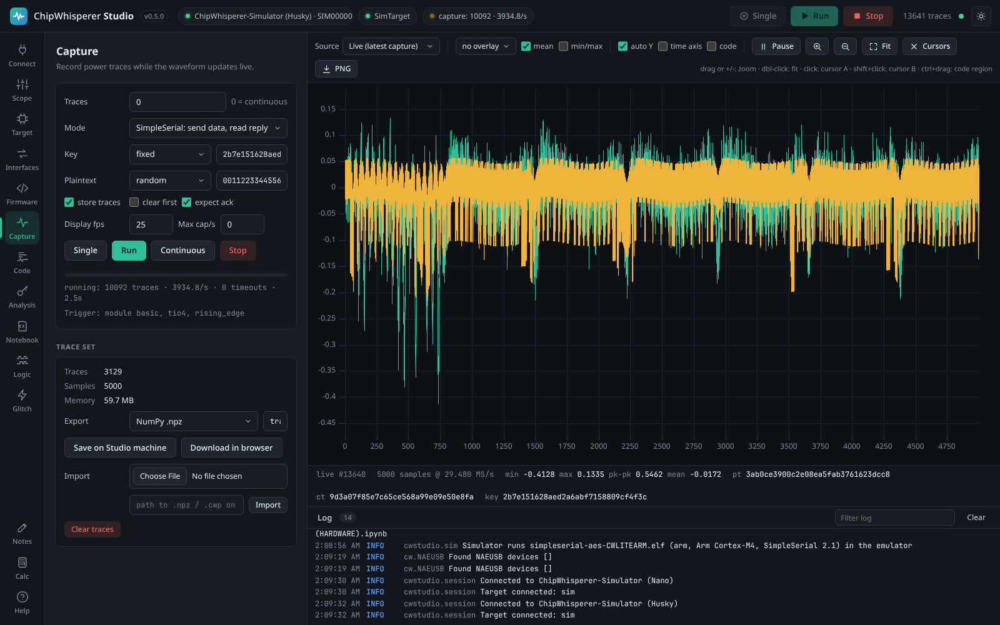
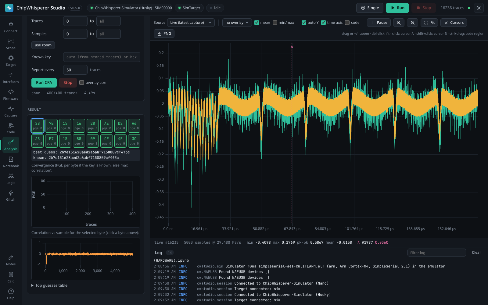

# Quick Start

This page takes you from a fresh install to a recovered AES key in a few minutes. Walkthrough 1 uses the built-in simulator, so you can follow it on any computer; walkthrough 2 does the same with a real ChipWhisperer-Lite ARM.

Before you start, [install Studio](Installation) and start it. Studio opens in its own window (or in your browser with the Web build) with the **Connect** tab open.

## Walkthrough 1: the simulator (no hardware)

The [simulator](Simulator) behaves like a ChipWhisperer scope attached to an unprotected AES target, so every feature works exactly as with real hardware.

### 1. Connect to the simulator

1. In the left navigation, click **Connect**.
2. Under **Scope**, set **Device** to **Simulator (no hardware)**. The target **Protocol** switches to **Simulated AES target** automatically. Leave **Simulate as** on **Husky**.
3. Leave **default_setup()** ticked and click **Connect scope**.

Studio connects the simulated scope, then connects the simulated target for you, and switches to the **Scope** tab. The chips in the top bar now read **ChipWhisperer-Simulator (Husky) · SIM000001** and **SimTarget** with green dots.

> **Tip:** Starting Studio with `--simulate` (or `ChipWhispererStudio-simulator.bat` on Windows) preselects the simulator in the Connect tab.

### 2. Look at one trace

Click **Single** in the top bar (or press **S**). One power trace appears in the waveform area on the right. The footer under the plot shows the number of samples, the sample rate, min, max, peak to peak and mean, and the plaintext (pt), ciphertext (ct) and key used for this trace.

### 3. Capture 500 traces

1. Click **Capture** in the left navigation.
2. Set **Traces** to `500`.
3. Leave **Mode** on **SimpleSerial: send data, read reply**, **Key** on **fixed** (the default key `2b7e151628aed2a6abf7158809cf4f3c`) and **Plaintext** on **random**.
4. Click **Run** (in the panel or in the top bar, or press **R**).

The waveform updates live while the progress bar fills. When the capture finishes, the top bar shows **500 traces** and the **Trace set** card shows the number of traces, samples per trace and memory used.

<picture><source media="(prefers-color-scheme: light)" srcset="images/capture-light.png"></picture>
*The Capture tab with a finished capture; the waveform shows the latest trace.*

### 4. Recover the key with CPA

1. Click **Analysis** in the left navigation.
2. Leave **Leakage model** on **HW of SBox output (round 1, software AES)**. That matches software AES implementations such as the simulator and NewAE's TINYAES128C firmware.
3. Leave the other fields as they are and click **Run CPA**.

Within a few seconds all 16 key bytes appear as tiles under **Result**. Because the key is stored with every trace, Studio knows the correct key and colours each tile green when the best guess is correct. The line below shows `best guess:` and `known:`; with 500 simulated traces they match. The **Convergence** plot shows the partial guessing entropy (PGE) of every byte dropping to 0 as more traces are used.

<picture><source media="(prefers-color-scheme: light)" srcset="images/analysis-light.png"></picture>
*All 16 key bytes recovered; the PGE plot shows how many traces each byte needed.*

That is the whole attack. From here you can try a glitch sweep in the **Glitch** tab (the simulator also models glitches, see [Simulator](Simulator#simulated-glitches)), explore the [Waveform Viewer](Waveform-Viewer), or open a [notebook](Notebooks).

## Walkthrough 2: real hardware (ChipWhisperer-Lite ARM)

This walkthrough uses a ChipWhisperer-Lite with its built-in STM32F3 (ARM) target, platform `CWLITEARM`. Other hardware works the same way with a different platform and programmer; see [Firmware Builds](Firmware-Builds) and [Target and Programming](Target-and-Programming).

> **Note:** Studio has been tested with the simulator and in CI, but not yet on physical ChipWhisperer hardware. If a step behaves differently on your device, please [open an issue](https://github.com/keyuraghao/chipwhisperer-studio/issues).

### 1. Prepare the computer (once)

- **Windows:** make sure the WinUSB driver is installed (see [Installation](Installation#windows)).
- **Linux:** install the udev rule shown in the Connect tab, log out and in again, and re-plug the device (see [Installation](Installation#linux)).
- **macOS:** nothing to do.

### 2. Connect the scope and target

1. Plug in the ChipWhisperer-Lite.
2. In the **Connect** tab, click **Scan USB**. Your device should be listed with its serial number.
3. Set **Device** to **Auto-detect** (or **ChipWhisperer-Lite**), keep **default_setup()** ticked and click **Connect scope**.
4. Studio switches to the Scope tab. Go back to **Connect**, set the target **Protocol** to **SimpleSerial v2 (default firmware)** and click **Connect target**.

Both chips in the top bar should turn green. If the scope is not found, see [Connecting Hardware](Connecting-Hardware#common-problems).

### 3. Build and program the firmware

The target needs NewAE's `simpleserial-aes` firmware. Studio builds it for you.

1. Click **Firmware** in the left navigation.
2. Scroll to the **Firmware sources** card and click **Download**. Studio downloads ChipWhisperer's firmware folder from NewAE's GitHub. This happens only once.
3. Back in the **Build firmware** card, set **Project** to `simpleserial-aes` and **Platform** to `CWLITEARM · CW-Lite Arm (STM32F3)`.
4. Leave **Compiler** on **GCC**, **Crypto** on `TINYAES128C` and **SimpleSerial** on `v2.1`.
5. The **Toolchain** line tells you whether a compiler is installed. If it says **No GCC for Arm Cortex-M**, click **Install now** and wait for the download (about 300 MB) to finish in the **Toolchains** card.
6. Click **Build & program**.

Studio builds the firmware, shows the result (sizes and the `.hex` path), and programs the target with the STM32F programmer. A toast confirms how many bytes were written.

<picture><source media="(prefers-color-scheme: light)" srcset="images/firmware-light.png"></picture>
*A successful build of simpleserial-aes for CWLITEARM, ready to program.*

### 4. Check the target answers

1. Click **Target**.
2. In the **SimpleSerial** card, click **Send key**, then click **Send** next to **Command** `p`.

The response box should show `r` followed by 16 bytes of ciphertext. If it shows `(no response)`, check that the firmware was programmed and that the protocol is SimpleSerial v2. See [Target and Programming](Target-and-Programming).

### 5. Capture and attack

1. Click **Single** in the top bar. You should see an AES power trace. If the trace is flat or clipped at the top and bottom, adjust `gain.db` in the **Scope** tab (see [Scope Settings](Scope-Settings)).
2. In the **Capture** tab set **Traces** to `500` and click **Run**.
3. In the **Analysis** tab click **Run CPA** with the default leakage model.

With an unprotected software AES, a few hundred traces are usually enough for every key byte to turn green. If some bytes stay red, capture more traces (with **clear first** unticked they are added to the existing ones) and run CPA again.

## What next?

- Save your traces: **Capture** tab, **Export** as a ChipWhisperer project (`.cwp`) or NumPy file. See [Capturing Traces](Capturing-Traces).
- Learn the rest of the window: [Interface Tour](Interface-Tour).
- Try fault injection: the **Glitch** tab sweeps glitch parameters; set up the glitch module first in the **Scope** tab (see [Scope Settings](Scope-Settings#glitch-the-fault-injection-module)).
- Run NewAE's tutorials: [Notebooks](Notebooks).
