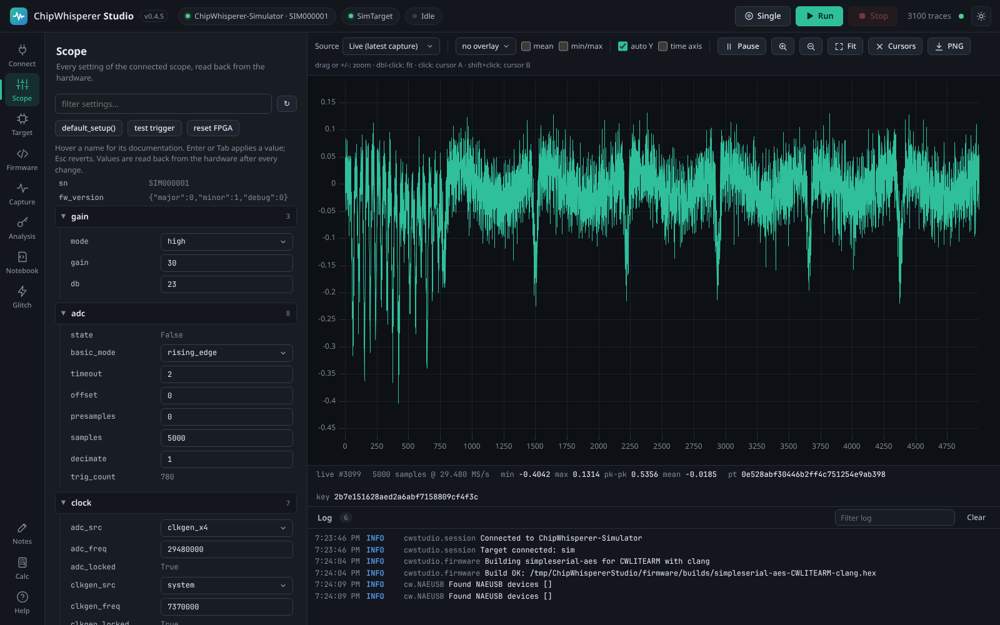

# Scope settings

The **Scope** tab of ChipWhisperer Studio shows every setting of the connected ChipWhisperer scope as an editable tree, read directly from the hardware. This page explains how the tree works and which settings matter most for a first capture.

<picture><source media="(prefers-color-scheme: light)" srcset="images/scope-light.png"></picture>

*The settings tree: groups on the left, current values on the right, documentation on hover.*

## How the settings tree works

Studio does not have a hand-written form for each scope model. Instead it asks the `chipwhisperer` library for the scope's settings (the same values you see when you `print(scope)` in Python) and builds the tree from them. That means Nano, Lite, Pro and Husky all work without special code, and new settings added to the library appear automatically.

For every setting Studio shows:

| Part | Meaning |
|------|---------|
| Name | The setting's name, for example `samples` inside the `adc` group. Hover over it to see the full path (`adc.samples`) and the documentation from the ChipWhisperer library. |
| Value box | An editable field for settings you can change. Settings with a fixed set of choices (for example `gain.mode` or `trigger.triggers`) use a drop-down, and true/false settings use a True/False drop-down. |
| Plain text | A read-only value, such as the serial number, firmware version, `adc.trig_count` or `clock.adc_locked`. These are information only. |
| Number on a group header | How many settings the group contains. Click the header to open or close the group. |

The `adc`, `gain`, `clock`, `trigger` and `io` groups start open; other groups (such as `glitch`) start closed.

### Changing a value

1. Click the value box and type the new value (or pick one from the drop-down).
2. Press **Enter** or **Tab**, or click somewhere else, to apply it. Press **Esc** to cancel and go back to the current value.
3. Studio sends the value to the scope and then reads it back from the hardware, so the box always shows what the scope really accepted. Some settings round your value (for example a clock frequency the PLL cannot hit exactly), and you will see the rounded value.

While you type, the box is outlined in amber (**pending**). After a successful change it flashes green (**saved**). If the scope rejects the value, the box turns red (**error**), the error message appears as a pop-up notification and as the box's tooltip, and the log at the bottom shows the details.

Studio converts what you type to the type of the current value: `5000` becomes a whole number for `adc.samples`, `25.5` a decimal for `gain.db`, and `true`, `false`, `1`, `0`, `yes`, `no`, `on`, `off` all work for true/false settings. Whole number settings also accept hexadecimal such as `0x10`. Typing `None` sets a setting to nothing where that is allowed.

### Filter and refresh

- The **filter settings** box at the top narrows the tree to settings whose path or current value contains your text, for example `glitch`, `trig` or `serial`. Matching groups open automatically.
- The **refresh** button (↻) reloads the whole tree from the scope. Values are also re-read automatically after every change you make, when you switch to the **Scope** tab, and after scope actions.

### Scope actions

Three buttons above the tree run common scope operations:

| Button | What it does |
|--------|--------------|
| `default_setup()` | Runs ChipWhisperer's `scope.default_setup()`, which restores sensible defaults for capturing from a standard target (see the table below). Studio also runs this automatically when you connect with **default_setup()** ticked on the **Connect** tab. |
| test trigger | Arms the scope and waits for one trigger without talking to the target, then reports whether it captured or timed out. Use it to check your trigger wiring and settings when you are using your own target firmware. A pop-up says "arm+capture done" or "arm+capture (timeout)". |
| reset FPGA | Calls `scope.reset_fpga()` when the connected scope supports it. This is a recovery step if the scope stops responding correctly. Scopes without this function report an error. |

## The settings that matter most

The full list of settings is long and differs between scope models. The [ChipWhisperer documentation](https://chipwhisperer.readthedocs.io) is the complete reference for every one of them. This section covers the settings you will touch most often, with sensible starting values.

### What default_setup() sets

On the CW-Lite and CW-Pro, ChipWhisperer's `default_setup()` sets the following (the Husky uses the same idea with its own clock settings):

| Setting | Value after default_setup() | Why |
|---------|-----------------------------|-----|
| `gain.db` | 25 dB | A good middle gain for the standard targets. |
| `adc.samples` | 5000 | Enough to cover the first round of a software AES on the standard targets. |
| `adc.offset` | 0 | Start recording right at the trigger. |
| `adc.basic_mode` | `rising_edge` | Trigger when the trigger line goes high. |
| `trigger.triggers` | `tio4` | The standard targets raise TIO4 when their operation starts. |
| `io.tio1` / `io.tio2` | `serial_rx` / `serial_tx` | The target's UART, used by SimpleSerial. |
| `io.tio4` | `high_z` | TIO4 is an input (the trigger). |
| `io.hs2` | `clkgen` | Send the scope's generated clock to the target. |
| `clock.clkgen_freq` | 7.37 MHz | The standard target clock. |
| `clock.adc_src` (Lite, Pro) or `clock.adc_mul` (Husky) | `clkgen_x4` or 4 | Sample at four times the target clock. |

If captures stop working after experimenting, press `default_setup()` to get back to a known good state.

### gain: input amplification

| Setting | What it does | Suggested start |
|---------|--------------|-----------------|
| `gain.db` | The amplifier gain in decibels. Higher gain makes small power variations bigger, but too much gain clips the signal (flat tops or bottoms in the waveform). | 25, then adjust |
| `gain.mode` | The amplifier's `low` or `high` gain range. Hover the name for the library's description of how it relates to `gain.db` on your scope. | as set by `default_setup()` |
| `gain.gain` | The raw gain register value that corresponds to `gain.db`. | leave alone |

> **Tip:** Look at a single trace in the [Waveform Viewer](Waveform-Viewer). If the trace hits the top or bottom of the scale, lower `gain.db`. If the interesting part only moves a tiny amount, raise it. Leaving some headroom is better than clipping, because clipped samples destroy the information CPA needs.

### adc: what and when to record

| Setting | What it does | Suggested start |
|---------|--------------|-----------------|
| `adc.samples` | How many samples to record after the trigger (plus any presamples). More samples cover more of the operation but make captures and analysis slower. | 5000 |
| `adc.offset` | How many samples to skip after the trigger before recording starts. Use it to move the capture window to a later part of the operation. | 0 |
| `adc.presamples` | How many samples to keep from before the trigger. | 0 |
| `adc.basic_mode` | Which trigger condition starts a capture: `rising_edge`, `falling_edge`, `low` or `high`. | `rising_edge` |
| `adc.timeout` | How long (in seconds) the scope waits for a trigger before giving up. Captures that time out are counted as timeouts in the **Capture** tab. | as set by the library |
| `adc.decimate` | Keep only every Nth sample, to record a longer time span with the same number of samples. | 1 |
| `adc.trig_count` | Read-only: how long the trigger line was active during the last capture, in ADC clock cycles. Useful to see how long the target's operation takes. | read only |

### clock: target clock and sample rate

| Setting | What it does | Suggested start |
|---------|--------------|-----------------|
| `clock.clkgen_freq` | The frequency of the clock the scope generates for the target. | 7.37 MHz for the standard targets |
| `clock.adc_src` (Lite, Pro) | Where the ADC's sample clock comes from, for example `clkgen_x4` (four times the generated clock) or `clkgen_x1`. Sampling synchronously with the target clock gives very stable traces. | `clkgen_x4` |
| `clock.adc_mul` (Husky) | The Husky's equivalent: the ADC samples at `adc_mul` times the generated clock. | 4 |
| `clock.freq_ctr` | Read-only: the measured frequency of the selected clock source. | read only |
| `clock.adc_locked` / `clock.clkgen_locked` | Read-only: whether the clock PLLs have locked. If a clock does not lock, captures are unreliable; run `default_setup()` again. | read only |

Studio reads the ADC sample rate from the clock settings to label the waveform's **time axis** and to convert cursor distances into time and frequency (see [Waveform Viewer](Waveform-Viewer)).

### trigger: what starts a capture

| Setting | What it does | Suggested start |
|---------|--------------|-----------------|
| `trigger.triggers` | Which input line triggers the capture, for example `tio4` (the standard target trigger), `tio1` to `tio3`, `nrst` or `sma`. Some scopes accept combinations; see the library documentation. | `tio4` |
| `trigger.module` | On scopes that support advanced triggers (Pro, Husky), selects the trigger type, such as the basic edge trigger or pattern based triggers. | `basic` |

### io: target connections

| Setting | What it does | Typical value |
|---------|--------------|---------------|
| `io.tio1`, `io.tio2` | Function of the target IO lines 1 and 2. For SimpleSerial they must be `serial_rx` and `serial_tx`. | `serial_rx`, `serial_tx` |
| `io.tio3`, `io.tio4` | Other target IO lines; `tio4` is normally the trigger input (`high_z`). | `high_z` |
| `io.hs2` | What the high speed output HS2 carries: `clkgen` (the target clock), `glitch` (the clock with glitches inserted) or disabled. | `clkgen` |
| `io.nrst` | The target reset line. Set to `low` to hold the target in reset and back to `high_z` to release it. | `high_z` |
| `io.pdic`, `io.pdid` | Programming and debug lines, used for example by the XMEGA programmer. `pdic` can also reset some targets. | `high_z` |
| `io.target_pwr` | Switch the target's power on or off. Turning it off and on is a hard reset. | `True` |
| `io.glitch_hp`, `io.glitch_lp` | Enable the high power and low power crowbar MOSFETs used for voltage glitching. Leave them off unless you are voltage glitching. | `False` |

> **Tip:** To reset the target by hand, set `io.nrst` to `low`, then back to `high_z`. A sweep in the **Glitch** tab can do this automatically after a crash.

### glitch: the fault injection module

The `glitch` group is closed by default. Open it, or filter for `glitch`, when you want to inject faults.

<picture><source media="(prefers-color-scheme: light)" srcset="images/scope-glitch-light.png"></picture>

*The glitch module settings, reached by typing glitch into the filter box.*

| Setting | What it does |
|---------|--------------|
| `glitch.clk_src` | The clock the glitch module works from: `clkgen` (the scope's generated clock, the usual choice), `target` (an external target clock) or `pll` (Husky). |
| `glitch.output` | What the glitch module outputs: `clock_xor` (the clock with glitch pulses XORed in, for clock glitching), `clock_or`, `glitch_only` (just the pulses, for voltage glitching), `clock_only` or `enable_only`. |
| `glitch.trigger_src` | When glitches are inserted: `manual` (only when triggered from software), `ext_single` (once per scope arm, when the external trigger fires, the usual choice), `ext_continuous` (every time the trigger fires) or `continuous`. |
| `glitch.width` | The width of each glitch pulse. On the Lite and Pro this is a percentage of a clock period (roughly -49.8 to 49.8). |
| `glitch.offset` | Where in the clock period the glitch starts, in the same units as `width`. |
| `glitch.ext_offset` | How many clock cycles after the trigger the glitch is inserted. This picks which instruction you attack. |
| `glitch.repeat` | How many consecutive clock cycles receive a glitch. |
| `glitch.width_fine`, `glitch.offset_fine` | Fine adjustment of width and offset. |

The Husky's glitch module works differently in the details (it uses a PLL and different units). Check the ChipWhisperer documentation for your scope. To sweep these values automatically, use the **Glitch** tab.

### Husky extras

The ChipWhisperer-Husky exposes extra groups, such as its logic analyzer, trace interface, user IO header and ADC mode settings. They all appear in the tree and can be edited like any other setting, but Studio has no special controls for them. See the ChipWhisperer documentation for what each one does.

## Changing settings from code

Everything in the tree can also be changed programmatically:

- In a [Notebook](Notebooks), `scope.gain.db = 30` changes the same scope Studio is using.
- Through the [HTTP API](HTTP-API): `PUT /api/scope/settings` with `{"path": "gain.db", "value": 30}`.
- Through the [MCP Server](MCP-Server): the `scope_set_setting` and `scope_set_settings` tools.

## See also

- [Connecting Hardware](Connecting-Hardware) for connecting the scope in the first place.
- [Capturing Traces](Capturing-Traces) for using these settings to record traces.
- [Troubleshooting](Troubleshooting) if captures time out or look wrong.
