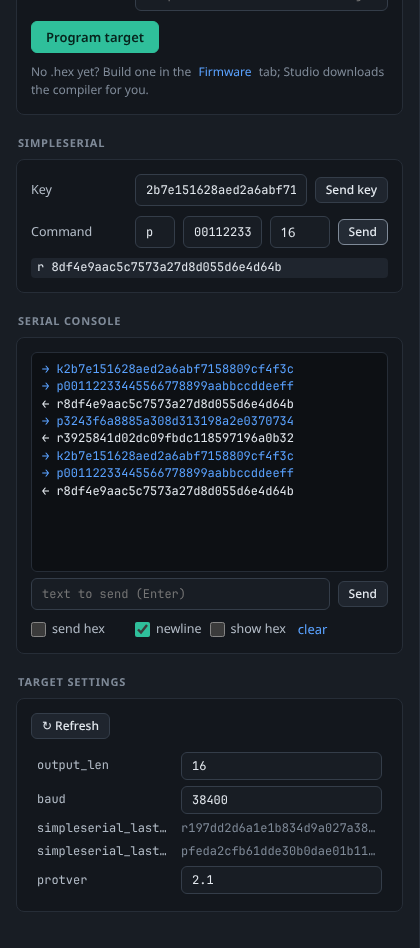

# Target and programming

The **Target** tab is where you put firmware on the target microcontroller and talk to it: program a `.hex` file, watch the serial port, send SimpleSerial commands by hand and change the target interface settings.

*Program firmware at the top, SimpleSerial helper and serial console below.*

> **Note:** ChipWhisperer Studio has so far been tested with its built-in [Simulator](Simulator) and in CI, not yet on physical hardware. Programming uses ChipWhisperer's own programmer classes, the same ones the Python library uses, but please report any differences you see with real devices.

Before using this tab, connect a scope and a target on the [Connect](Connecting-Hardware) tab. Programming only needs the scope; the serial console and SimpleSerial helper need the target connection too.

## Programming firmware

### Choosing the programmer

The programmer must match the microcontroller on your target board:

| Programmer | Use it for |
|------------|------------|
| STM32F | STM32 targets: CW-Lite ARM (`CWLITEARM`), the CW308 STM32F0 to F4 boards and the CW-Nano's built-in STM32F0 (`CWNANO`). |
| XMEGA | XMEGA targets: CW-Lite XMEGA (`CWLITEXMEGA`, `CW303`) and the CW308 XMEGA board. |
| AVR | ATmega targets such as the CW308 AVR board and the CW304 (ATmega328P). |
| SAM4S | SAM4S targets: the CW308/CW312 SAM4S boards and the target built into the ChipWhisperer-Husky (`CWHUSKY`). |
| NEORV32 | The NEORV32 RISC-V soft core on the iCE40 FPGA target. |

Other platforms (for example the NXP, Nordic or Silicon Labs CW308 boards) are not programmed by these built-in programmers; use the vendor's tools with the `.hex` Studio builds.

### Three ways to get firmware onto the target

1. **Upload a file from your computer:** pick the programmer, choose a `.hex` file (`.bin` and `.elf` are also accepted by the file picker) with **Hex file**, and press **Program target**. The browser uploads the file to Studio, which stores it in the `firmware/uploads` folder of the data directory and programs it.
2. **Use a path on the Studio machine:** leave the file picker empty and type the full path of a firmware file into the box below it. This is handy when Studio runs on a lab PC and you use it from another computer's browser, because the file never has to travel through the browser.
3. **Build it in Studio:** the [Firmware Builds](Firmware-Builds) tab builds ChipWhisperer's firmware projects and has a **Build & program** button that picks the right programmer for the platform automatically. The link under the Program card takes you there.

Programming can take a few seconds to a minute. The status line under the button says **Programming… (watch the log)** while it runs, and the log at the bottom of the window shows the programmer's messages. When it finishes you see **Done: N bytes written**.

### What "simulated" means

When the scope is the [Simulator](Simulator), nothing is programmed: Studio checks that the file exists, waits briefly and reports **Done: N bytes written (simulated)**. The simulated target always behaves like an AES target, whatever file you "program".

## SimpleSerial helper

ChipWhisperer's example firmware talks the **SimpleSerial** protocol: a one letter command, a hex payload, and a reply. The standard AES firmware, for example, uses `k` to set the key and `p` to encrypt a plaintext, and answers with `r` followed by the ciphertext.

| Control | What it does | Default |
|---------|--------------|---------|
| Key + **Send key** | Sends command `k` with the key in hex, without waiting for a reply. | `2b7e151628aed2a6abf7158809cf4f3c` |
| Command | The one letter command to send. | `p` |
| Payload | The data to send, in hex (spaces are ignored). | `00112233445566778899aabbccddeeff` |
| Response length | How many bytes of reply to wait for. | 16 |
| **Send** | Sends the command and shows the reply as `r <hex>`, or `(no response)` if nothing valid came back within about half a second. | |

Both directions also appear in the serial console, so you can see exactly what went over the wire.

**SimpleSerial v1 or v2?** Studio talks to the target through ChipWhisperer's own target classes, which handle the protocol's framing for you, so the helper looks the same for both. What matters is that the protocol version you select on the Connect tab (**SimpleSerial v2** for current firmware, **SimpleSerial v1** for legacy firmware) matches the version your firmware was built with (`SS_VER` in the [Firmware Builds](Firmware-Builds) tab). If replies never arrive, a version mismatch is the most common cause.

## Serial console

The serial console shows everything the target sends, plus what you send.

*Sent lines start with →, received lines with ←.*

| Control | What it does | Default |
|---------|--------------|---------|
| Text box + **Send** (or Enter) | Sends the text to the target. | |
| send hex | Treat the text as hex bytes (for example `70 00 11 22`) instead of characters. | off |
| newline | Add a newline (`\n`) to text you send, unless it already ends with one. Not applied in hex mode. | on |
| show hex | Show each line as hex bytes instead of text. Newlines in text mode appear as ⏎. | off |
| clear | Empty the console view. | |

Studio polls the serial port about ten times a second while no capture or glitch sweep is running (during those jobs the target's replies are consumed by the job itself). The console keeps the most recent 500 lines.

> **Tip:** If your firmware prints a banner or debug messages, they appear here. If nothing ever appears, check that `io.tio1` and `io.tio2` are set to `serial_rx` and `serial_tx` on the [Scope Settings](Scope-Settings) tab, and that the baud rate in the target settings matches your firmware.

## Target settings

The **Target settings** card shows the target interface's own settings (such as the serial baud rate and protocol details) as a tree that works exactly like the [Scope Settings](Scope-Settings) tree: hover a name for documentation, press Enter to apply, and values are read back after every change. Press **↻ Refresh** to reload it. The tree refreshes automatically when a target connects or disconnects.

## Resetting the target

There is no separate reset button on the Target tab. To reset the target by hand:

1. Open the [Scope Settings](Scope-Settings) tab and filter for `nrst` (or `pdic` for XMEGA targets).
2. Set `io.nrst` to `low`, then back to `high_z`.

Setting `io.target_pwr` to `False` and back to `True` power cycles the target. The Glitching sweep can reset the target automatically after a crash.

## Doing the same from code

- In a [Notebook](Notebooks): `cw.program_target(scope, cw.programmers.STM32FProgrammer, "fw.hex")`, `target.simpleserial_write('p', data)` and `target.simpleserial_read('r', 16)` work as in Jupyter, on the same connection Studio uses.
- [HTTP API](HTTP-API): `POST /api/target/program`, `/api/target/program/upload`, `/api/target/simpleserial` and `/api/target/serial/write`.
- [MCP Server](MCP-Server): `target_program`, `firmware_program`, `simpleserial`, `serial_write` and `serial_read`.

## See also

- [Firmware Builds](Firmware-Builds) to compile firmware without installing a toolchain.
- [Capturing Traces](Capturing-Traces) once the target answers.
- [Troubleshooting](Troubleshooting) if programming fails or the target is silent.
