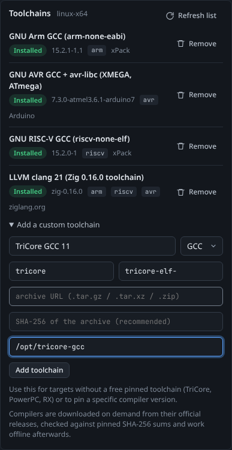

# Toolchains

Studio does not ship compilers inside its download, because they would add hundreds of megabytes for every platform. Instead it downloads official compiler releases the first time a [firmware build](Firmware-Builds) needs them, checks each download against a pinned SHA-256 checksum, and works offline from then on. This page explains the pinned toolchains, how installation works, and how to add your own.

<picture><source media="(prefers-color-scheme: light)" srcset="images/toolchains-light.png"></picture>

*The Toolchains card (bottom of the Firmware tab) with the status of each compiler.*

## The pinned toolchains

| Toolchain | Version | Builds firmware for | Source | Download size | Size on disk |
|-----------|---------|---------------------|--------|---------------|--------------|
| GNU Arm GCC (`arm-none-eabi`) | 15.2.1-1.1 | Arm Cortex-M: CW-Lite Arm, Nano, Husky, STM32, SAM4S, K82F and more | [xPack](https://xpack-dev-tools.github.io/arm-none-eabi-gcc-xpack/) | 294 to 336 MB | about 1.1 GB |
| GNU AVR GCC + avr-libc | 7.3.0-atmel3.6.1-arduino7 | AVR and XMEGA: CW-Lite XMEGA, CW304 and more | [Arduino](https://github.com/arduino/toolchain-avr) | 37 to 53 MB | about 214 MB |
| GNU RISC-V GCC (`riscv-none-elf`) | 15.2.0-1 | RISC-V: NEORV32, Ibex, FE310 | [xPack](https://xpack-dev-tools.github.io/riscv-none-elf-gcc-xpack/) | 401 to 465 MB | about 1.6 GB |
| LLVM clang 21 (Zig 0.16.0 toolchain) | zig-0.16.0 | Arm, AVR and RISC-V, for [clang builds](Firmware-Builds#gcc-and-clang-builds) | [ziglang.org](https://ziglang.org/download/) and its mirrors | 51 to 97 MB | about 390 MB |
| GNU make + sh | 4.4.1-3 | Windows only: the `make` and shell that ChipWhisperer's makefiles need | [xPack](https://xpack-dev-tools.github.io/windows-build-tools-xpack/) | 3 MB | a few MB |

Downloads exist for Linux (x64 and arm64), macOS (Intel and Apple Silicon) and Windows (x64). Exact download sizes per platform:

| Toolchain | Linux x64 | Linux arm64 | macOS Intel | macOS Apple Silicon | Windows x64 |
|-----------|-----------|-------------|-------------|---------------------|-------------|
| GNU Arm GCC | 307 MB | 303 MB | 298 MB | 294 MB | 336 MB |
| GNU AVR GCC | 38 MB | 38 MB | 37 MB | uses the Intel build (Rosetta) | 53 MB |
| GNU RISC-V GCC | 434 MB | 425 MB | 406 MB | 401 MB | 465 MB |
| LLVM clang (Zig) | 56 MB | 51 MB | 57 MB | 52 MB | 97 MB (also Windows arm64: 93 MB) |
| GNU make + sh | not needed | not needed | not needed | not needed | 3 MB |

> **Note:** The clang toolchain is Zig's bundled clang, used through its `zig clang` command. It is a complete clang 21 with the Arm, AVR and RISC-V back ends, in a much smaller download than an official LLVM release (which is 1 to 2 GB and has no Intel macOS build). A clang build also needs the GCC toolchain for the same architecture, which provides the C library and does the linking.

> **Note:** On Linux and macOS Studio uses the `make` already on your system. Install it with your package manager (for example `sudo apt install make`) or, on macOS, with `xcode-select --install`. The Windows build tools entry only appears on Windows.

## Statuses

Each row shows the toolchain name, a status badge, the version, the architectures it serves, the download size and the source.

| Badge | Meaning |
|-------|---------|
| **Installed** | Studio downloaded and unpacked this toolchain; builds use it. |
| **On system PATH** | Not installed by Studio, but the compiler was found on your `PATH` (hover to see where). Builds use it if nothing is installed. |
| **Not installed** | Available to download. Press **Install**. |
| **Downloading NN%** / **Unpacking...** | An installation is in progress; a progress bar shows below the row. |
| **Failed** | The last installation failed; the error is shown under the row (hover the badge too). Press **Install** to try again. |

When several toolchains could serve a build, Studio prefers, in order: a pinned toolchain installed by Studio, then an installed custom toolchain, then a compiler on your `PATH`.

## Installing, cancelling and removing

- **Install** downloads and unpacks the toolchain in the background. You can keep working; the Firmware tab's **Install now** link does the same. Installing a toolchain that is already installed does nothing.
- **Cancel** (while downloading) stops the download and deletes the partial files.
- **Remove** deletes an installed toolchain from disk. You can install it again later.

### What installation does

1. Downloads the archive for your operating system and CPU into `<data dir>/toolchains/.downloads/` (as a `.part` file until complete).
2. Computes the SHA-256 of the downloaded bytes and compares it with the checksum pinned in Studio. A mismatch aborts the installation and deletes the file, so a corrupted or tampered download is never used.
3. If a server fails, or stays slower than 256 KB/s after the first 15 seconds, Studio switches to the next mirror (the clang toolchain lists several: Fastly, hexops, linus.dev, squirl.dev and ziglang.org). The last mirror is used whatever its speed. Every mirror is verified against the same checksum.
4. Unpacks the archive, refusing any file path or link that would land outside the target folder.
5. Creates extra tool names where ChipWhisperer's makefiles expect them. For example the NEORV32 and Ibex makefiles call `riscv32-unknown-elf-gcc` or `riscv64-unknown-elf-gcc`, so Studio adds those names next to xPack's `riscv-none-elf-gcc` (as hard links, or copies where links are not possible).
6. Moves the result to `<data dir>/toolchains/<id>/<version>/`, records what was installed, and deletes the archive.

From then on the toolchain works without an internet connection.

## Refresh list

The pinned list of toolchains (versions, URLs and checksums) ships with Studio in `resources/toolchains.json`. **Refresh list** downloads the latest copy of that file from the Studio repository on GitHub. If it has a higher revision number and every download in it has an `https://` URL and a SHA-256 checksum, Studio saves it as `<data dir>/toolchains/registry.json` and uses it from then on. This lets new compiler versions reach you without installing a new version of Studio. The toast says either *Toolchain list updated (revision N)* or *Toolchain list is up to date*.

## Custom toolchains

Use a custom toolchain when Studio has no download for your target (TriCore for CW308_AURIX, PowerPC for CW308_MPC5676R, Renesas RX for CW308_RX65N), or when you want a specific compiler version. Open **Add a custom toolchain** at the bottom of the card.

<picture><source media="(prefers-color-scheme: light)" srcset="images/toolchains-custom-light.png"></picture>

*The custom toolchain form.*

| Field | What it means | Required |
|-------|---------------|----------|
| Name | A name for the list, for example `TriCore GCC 11`. | recommended |
| Compiler | `GCC` or `clang`. | yes (default GCC) |
| Arch | The architectures it serves, separated by commas: `arm`, `avr`, `riscv`, `tricore`, `ppc`, `rx`, `pic24`. These must match the architecture Studio shows for the platform. | yes |
| Prefix | The tool prefix, so that `<prefix>gcc`, `<prefix>objcopy` and so on exist, for example `arm-none-eabi-` or `tricore-elf-`. | yes for GCC |
| Archive URL | A `.tar.gz`, `.tar.xz`, `.tar.bz2` or `.zip` to download and install the same way as pinned toolchains. | either this or a folder |
| SHA-256 | The checksum of the archive. Strongly recommended: without it the download is not verified. | no |
| Existing folder | A toolchain already installed on your computer: its folder or its `bin` folder. Studio checks that `<prefix>gcc` (or `clang`) is there. | either this or a URL |

Press **Add toolchain**. A toolchain given as a URL then appears with an **Install** button; one given as a folder is ready at once. **Delete** removes the entry (and the files Studio downloaded for it, but never an existing folder you pointed at).

### Example: use a system arm-none-eabi compiler

If you already have Arm's GCC in `/opt/arm-gnu-toolchain-13.3/bin`:

1. Name: `Arm GCC 13.3 (system)`
2. Compiler: `GCC`
3. Arch: `arm`
4. Prefix: `arm-none-eabi-`
5. Existing folder: `/opt/arm-gnu-toolchain-13.3`
6. Press **Add toolchain**.

It shows as **Installed**. Note that a pinned toolchain Studio installed itself still takes priority; **Remove** that one if you want builds to use yours.

### Example: a TriCore toolchain for CW308_AURIX

1. Download a TriCore GCC (for example a `tricore-elf` build) as an archive, and note its SHA-256.
2. Name `TriCore GCC`, Compiler `GCC`, Arch `tricore`, Prefix `tricore-elf-`, Archive URL and SHA-256 filled in.
3. Press **Add toolchain**, then **Install**.
4. On the Firmware tab choose platform `CW308_AURIX`; the toolchain line now shows your compiler.

Custom toolchains are stored in `<data dir>/toolchains/custom.json`. Through the HTTP API (`POST /api/toolchains/custom`) you can also set `version` and `bin` (the sub-folder holding the tools, default `bin`).

> **Note:** A custom clang can only be used for clang builds on Arm, AVR and RISC-V platforms, the architectures Studio knows the clang target for.

## Where toolchains are stored

| Path | Contents |
|------|----------|
| `<data dir>/toolchains/<id>/<version>/` | One folder per installed toolchain, for example `arm-gcc/15.2.1-1.1/`. |
| `<data dir>/toolchains/.downloads/` | Archives while they download (deleted after installation). |
| `<data dir>/toolchains/custom.json` | Your custom toolchains. |
| `<data dir>/toolchains/registry.json` | A newer toolchain list fetched with **Refresh list**, if any. |
| `<data dir>/toolchains/.zig-cache/` | Zig's cache, used by clang builds. |

The data folder is `~/ChipWhispererStudio` unless you start Studio with `--data-dir`. The Arm and RISC-V toolchains together need about 3 GB of disk space. See [Command Line and Configuration](Command-Line-and-Configuration).

## HTTPS, certificates and proxies

All downloads use HTTPS and verify the server's certificate:

1. Studio first uses your operating system's trust store (through the `truststore` package), the same certificates your browser trusts, including root certificates installed by your IT department.
2. If that is not available, it uses Mozilla's certificate bundle from the `certifi` package, which ships inside the standalone downloads.
3. If you set `SSL_CERT_FILE` (a PEM file) or `SSL_CERT_DIR`, Studio uses exactly those instead.

If verification still fails, the error names the server and explains what to do, for example: *could not verify the HTTPS certificate of github.com ... If your network inspects HTTPS traffic, install its root certificate in the system store, or point SSL_CERT_FILE at a PEM bundle that contains it, then restart Studio.*

Proxies: Studio uses Python's standard proxy support, so the usual `HTTPS_PROXY`, `HTTP_PROXY` and `NO_PROXY` environment variables work. Set them before starting Studio.

> **Tip:** On a machine without internet access, install the toolchains on a connected machine with the same operating system, then copy the whole `<data dir>/toolchains` folder across. Or point a custom toolchain at compilers you already have.

## Using toolchains from the API and MCP

| Action | HTTP API | MCP tool |
|--------|----------|----------|
| List with status | `GET /api/toolchains` | `toolchains_list` |
| Install | `POST /api/toolchains/{id}/install` (add `?force=true` to reinstall) | `toolchain_install` |
| Cancel a download | `POST /api/toolchains/{id}/cancel` | `toolchain_cancel` |
| Remove | `DELETE /api/toolchains/{id}` | `toolchain_remove` |
| Add a custom toolchain | `POST /api/toolchains/custom` | `toolchain_add_custom` |
| Delete a custom toolchain | `DELETE /api/toolchains/custom/{id}` | `toolchain_remove_custom` |
| Refresh the list | `POST /api/toolchains/refresh` | `toolchains_refresh` |

The ids of the pinned toolchains are `arm-gcc`, `avr-gcc`, `riscv-gcc`, `clang` and `win-build-tools`. See [HTTP API](HTTP-API) and [MCP Server](MCP-Server).
