# Video Tour

A walkthrough of every feature of ChipWhisperer Studio in a few minutes, recorded with the built-in [simulator](Simulator), so everything shown also works without hardware.

Each feature has a short clip below that plays by itself. The full captioned walkthrough is also available as one video:

[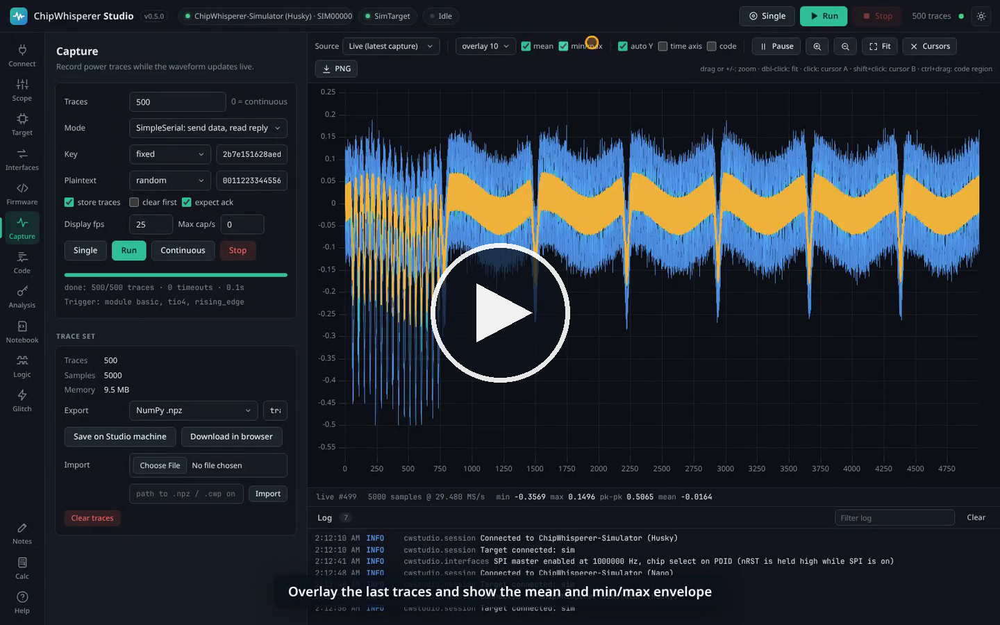](https://github.com/keyuraghao/chipwhisperer-studio/releases/download/v0.5.0/chipwhisperer-studio-demo.mp4)

**[Watch or download the video (MP4, 11.8 MB, 3:53)](https://github.com/keyuraghao/chipwhisperer-studio/releases/download/v0.5.0/chipwhisperer-studio-demo.mp4)**

## Chapters

| Time | Chapter | What you see |
|------|---------|--------------|
| 0:01 | Introduction | What Studio is. |
| 0:09 | Connect | Pick the simulator (posing as a Husky) and connect the scope; the target connects with it. |
| 0:20 | Scope settings | The settings tree with its groups open, the glitch group opened with a click, and filtering by name. |
| 0:31 | Target I/O | Send a key and a plaintext with SimpleSerial and watch the serial terminal. |
| 0:39 | Interfaces | Read the simulated SPI flash's JEDEC ID, then simulate a CW-Nano and see SPI disabled with the reason. |
| 1:01 | Capture | Capture 500 traces while the waveform updates live. |
| 1:08 | Waveform view | Overlay of the last 10 traces, the mean and the min/max envelope. |
| 1:17 | Cursors and zoom | Cursors A and B, the zoom in and zoom out buttons, the + and - keys, drag to zoom and Fit. |
| 1:35 | CPA key recovery | Run CPA and recover the AES key, then overlay the correlation on the waveform. |
| 1:49 | Glitch sweep | A clock glitch sweep over offset and width with the live result plot. |
| 2:06 | Firmware build | Build simpleserial-aes for CWLITEARM with clang. |
| 2:18 | Code on the waveform | The build runs in the simulator; build the code map, show the code band, Ctrl+drag a region and click a source line. |
| 2:36 | Notebooks | Run a notebook that captures through Studio and plots the mean trace. |
| 2:48 | Notebooks side by side | Open a second notebook in a pane on the right and run it in its own kernel. |
| 2:55 | Logic analyser | Capture the simulator's demo traffic, add decoders and zoom in on decoded UART, SPI and I2C. |
| 3:11 | Notes | Insert the CPA key into a note and preview the Markdown. |
| 3:19 | Calculator | Side-channel expressions and statistics between the waveform cursors. |
| 3:32 | AI agents (MCP) | The MCP setup for Claude and other agents. |
| 3:38 | Themes | Switch between the dark and light themes. |
| 3:45 | Get it | Where to download Studio. |

## Clips by feature

### Connect

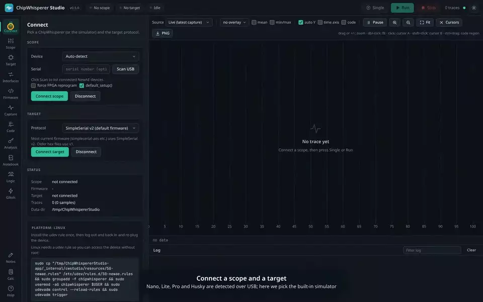

### Scope settings

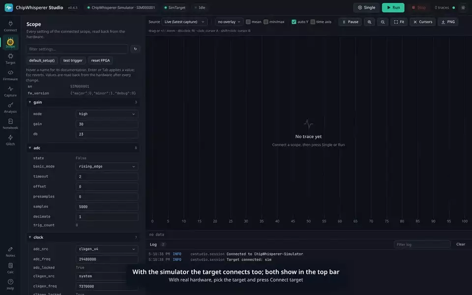

### Target I/O

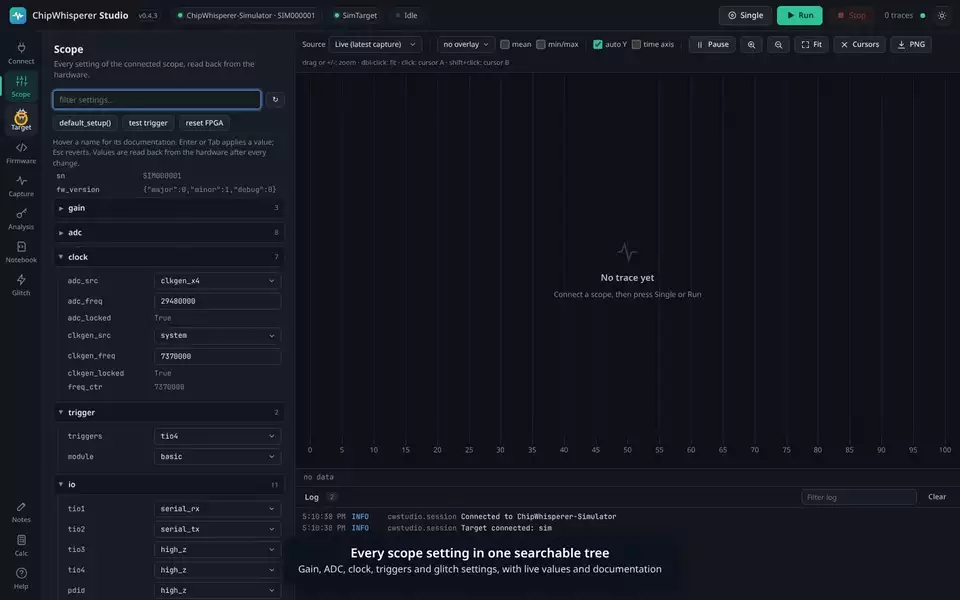

### Interfaces

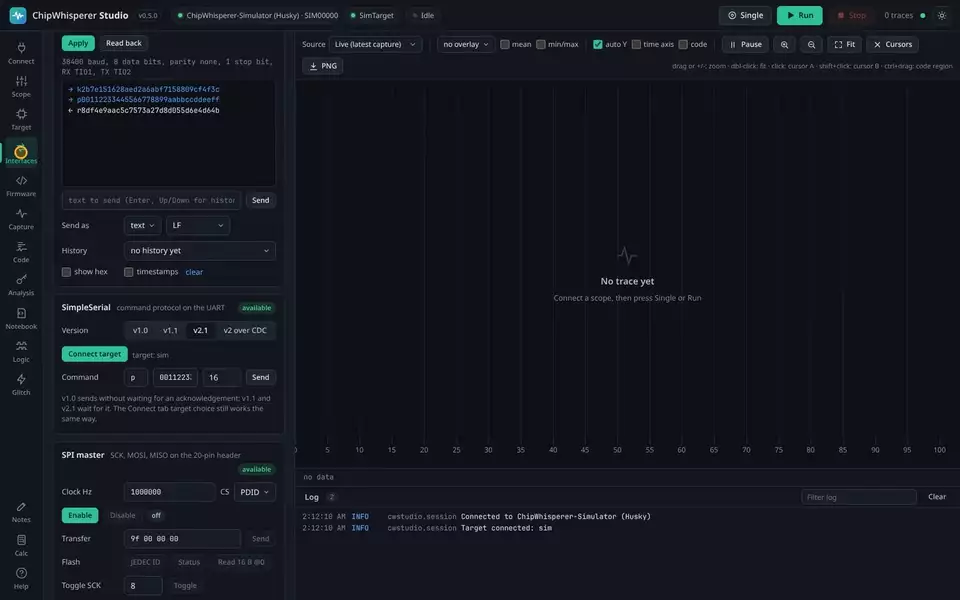

### Capture

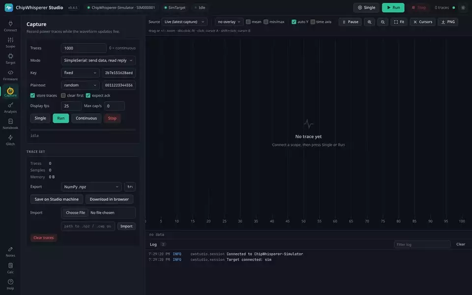

### Waveform view

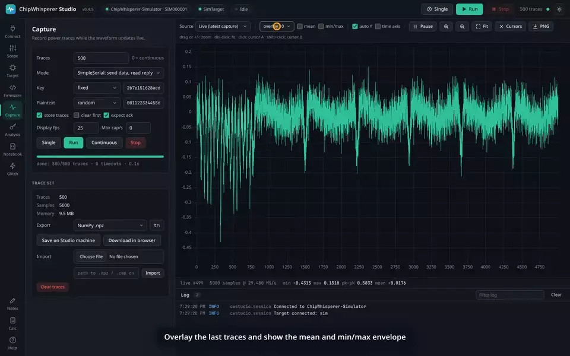

### Cursors and zoom

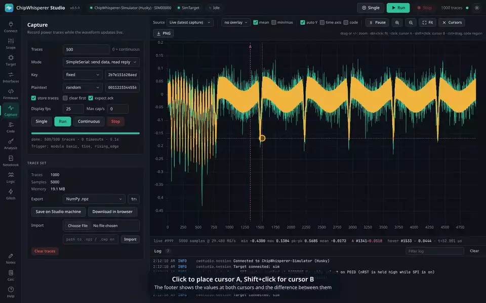

### CPA key recovery

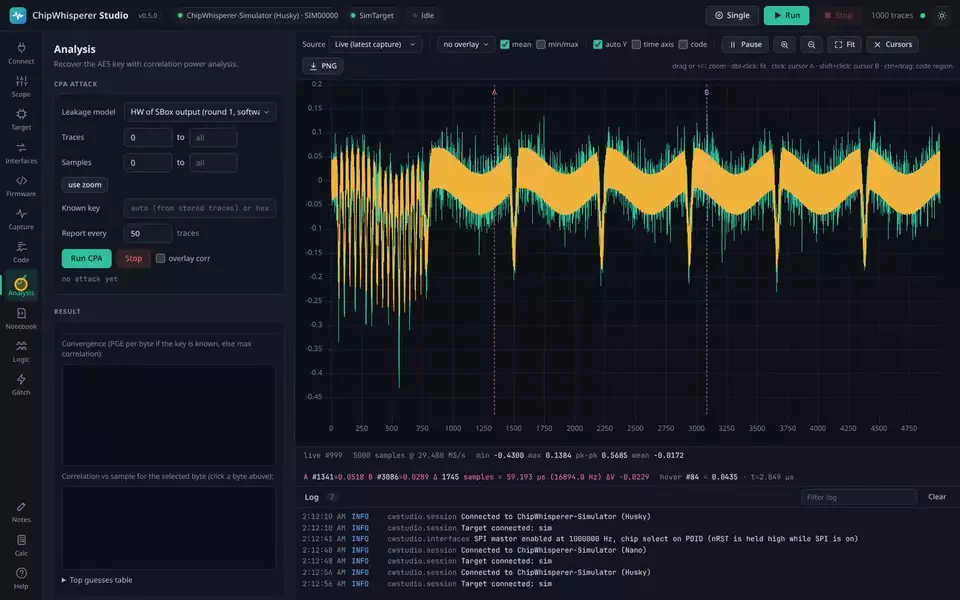

### Glitch sweep

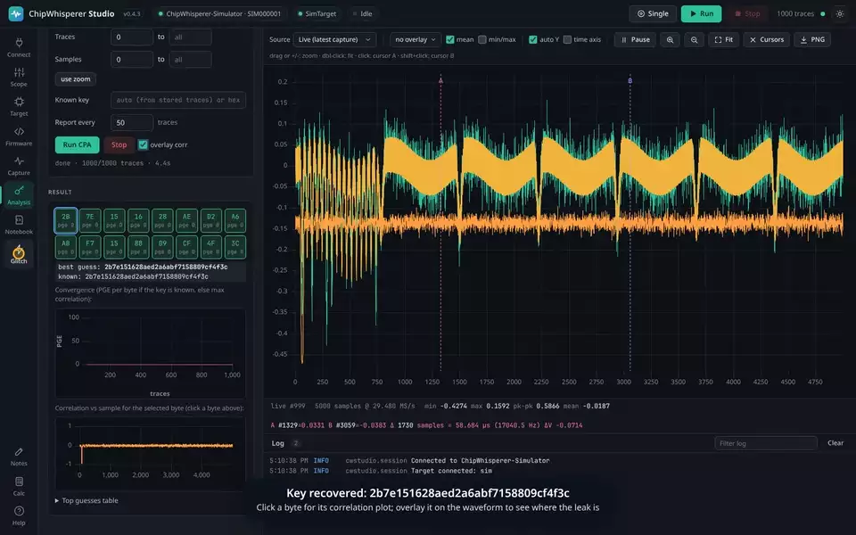

### Firmware build

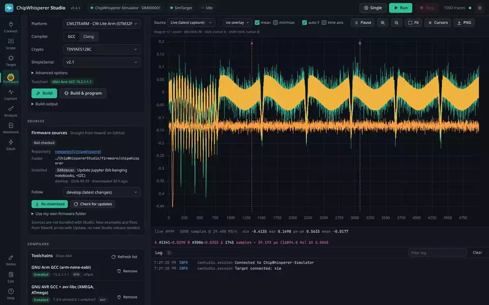

### Code on the waveform

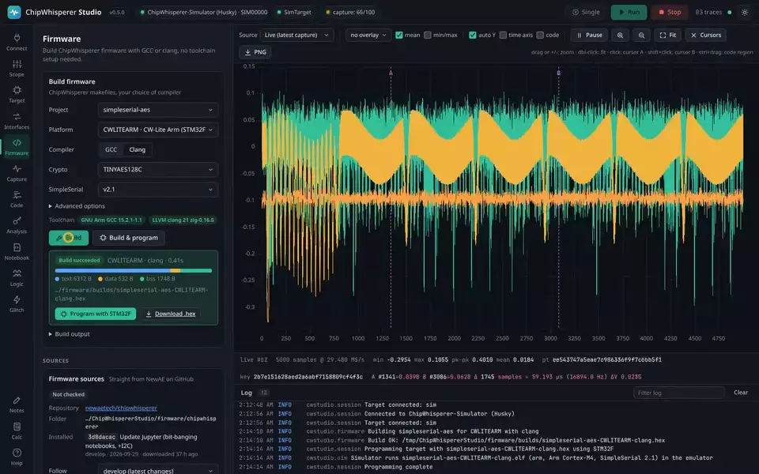

### Notebooks

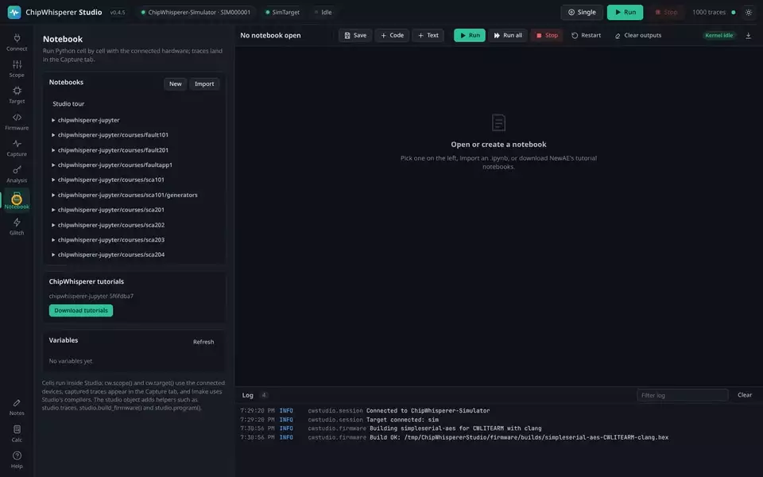

### Notebooks side by side

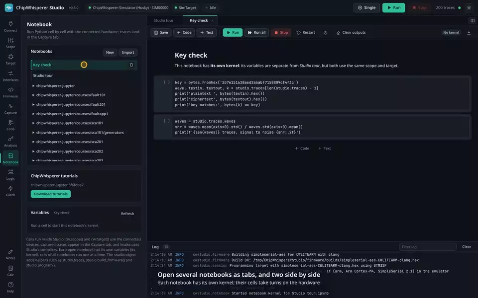

### Logic analyser

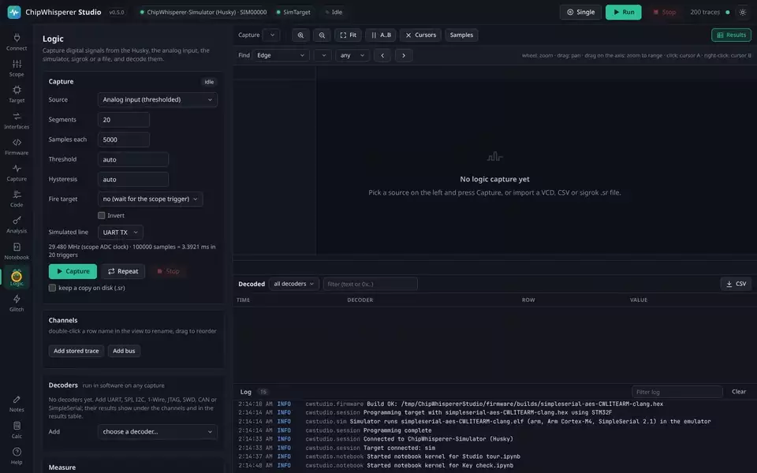

### Notes

### Calculator

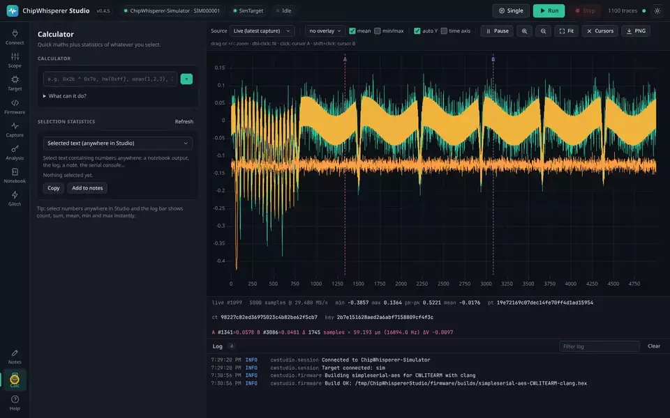

### AI agents (MCP)

### Themes

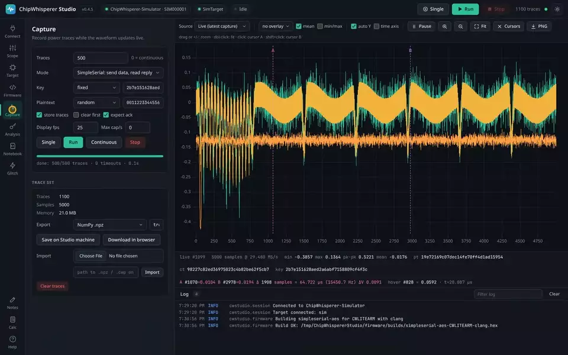

## Making the video

The video is generated by `tools/demo_video.py`, which drives the real UI with Playwright and cuts each chapter into the clips above; see [Development and Releases](Development-and-Releases#demo-video). Regenerate it after UI changes so it stays accurate.
