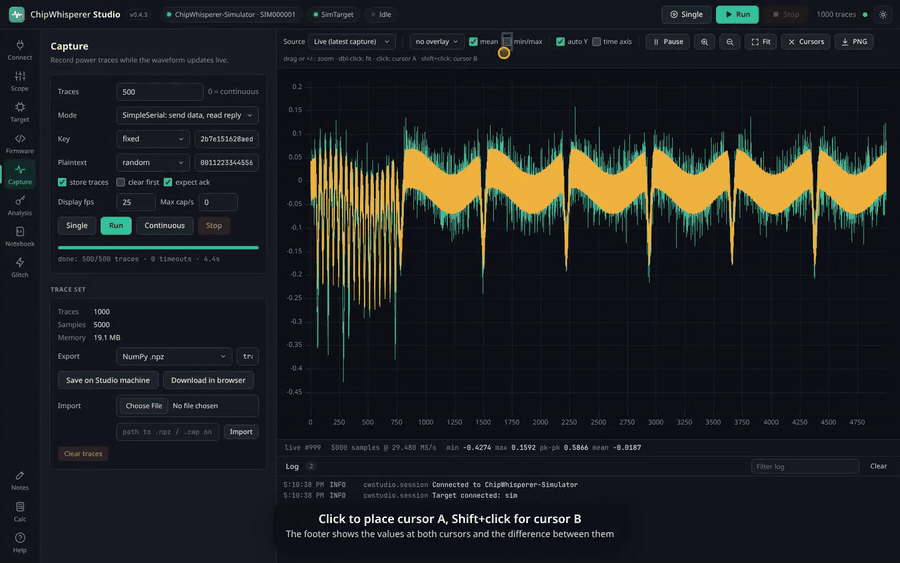

# Video Tour

A walkthrough of every feature of ChipWhisperer Studio in under three minutes, recorded with the built-in [simulator](Simulator), so everything shown also works without hardware.

**[Watch or download the video (MP4, 6.5 MB)](https://github.com/keyuraghao/chipwhisperer-studio/releases/download/v0.4.3/chipwhisperer-studio-demo.mp4)**

## Chapters

| Time | Chapter | What you see |
|------|---------|--------------|
| 0:01 | Introduction | What Studio is. |
| 0:08 | Connect | Pick the simulator and connect the scope; the target connects with it. |
| 0:17 | Scope settings | The searchable settings tree: gain, ADC and the glitch module. |
| 0:28 | Target I/O | Send a key and a plaintext with SimpleSerial and watch the serial console. |
| 0:35 | Capture | Capture 500 traces while the waveform updates live. |
| 0:42 | Waveform view | Overlay of the last 10 traces, the mean and the min/max envelope. |
| 0:51 | Cursors and zoom | Cursors A and B, the zoom in and zoom out buttons, the + and - keys, drag to zoom and Fit. |
| 1:08 | CPA key recovery | Run CPA and recover the AES key, then overlay the correlation on the waveform. |
| 1:21 | Glitch sweep | A clock glitch sweep over offset and width with the live result plot. |
| 1:38 | Firmware build | Build simpleserial-aes for CWLITEARM with clang. |
| 1:48 | Notebooks | Run a notebook that captures through Studio and plots the mean trace. |
| 2:00 | Notes | Insert the CPA key into a note and preview the Markdown. |
| 2:07 | Calculator | Side-channel expressions and statistics between the waveform cursors. |
| 2:21 | AI agents (MCP) | The MCP setup for Claude and other agents. |
| 2:26 | Themes | Switch between the dark and light themes. |
| 2:33 | Get it | Where to download Studio. |

## Zooming in the waveform

See [Waveform Viewer](Waveform-Viewer) for every zoom and cursor control.

## Making the video

The video is generated by `tools/demo_video.py`, which drives the real UI with Playwright; see [Development and Releases](Development-and-Releases#demo-video). Regenerate it after UI changes so it stays accurate.
