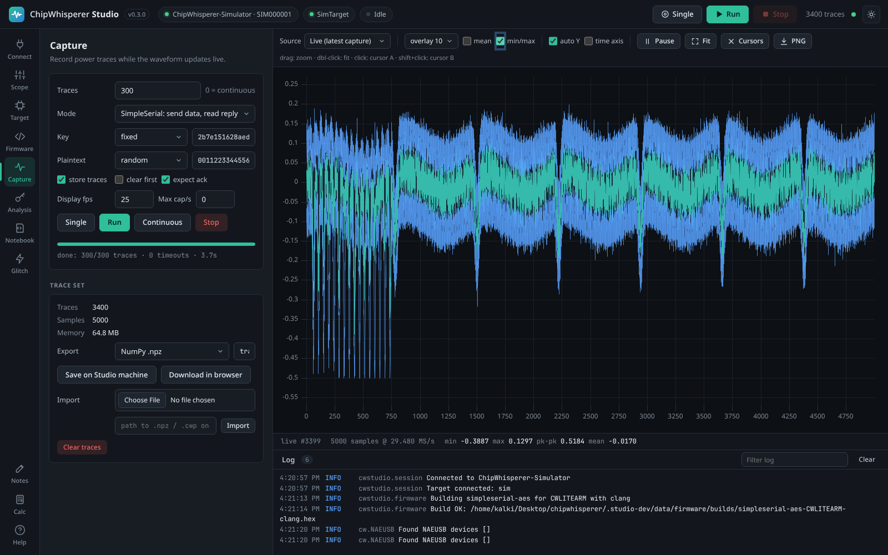
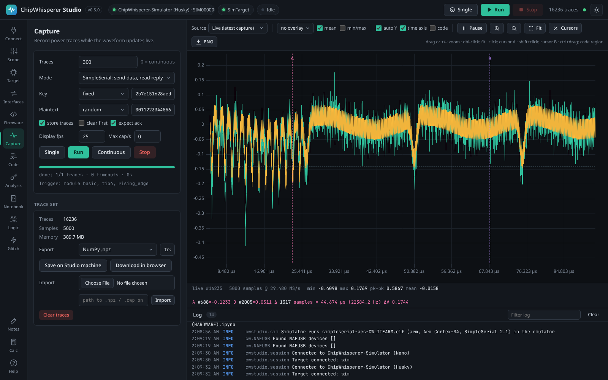

# Waveform viewer

The waveform viewer is the large plot in the middle of Studio. It shows every trace as it is captured, lets you overlay and average traces, browse stored traces, zoom, and measure with two cursors.

*The toolbar at the top controls what is drawn; the footer below the plot shows statistics of the displayed trace.*

The viewer is visible on every tab except [Notebooks](Notebooks), which uses the main area for its cells. Traces captured by notebook code still appear here when you switch back.

## Toolbar

| Control | What it does | Default |
|---------|--------------|---------|
| Source | **Live (latest capture)** shows each new trace as it arrives. **Browse stored traces** shows one stored trace at a time, chosen with the **#** number box or the slider next to it. | Live |
| Overlay | Draws the last 5, 10, 25 or 50 live traces behind the current one, fading older traces. Use it to see how stable your traces are: well aligned traces overlap tightly. Overlay collects traces from the moment you turn it on. | no overlay |
| mean | Draws the average of all stored traces. | off |
| min/max | Draws a shaded envelope between the lowest and highest value of all stored traces at every sample. | off |
| auto Y | Rescales the vertical axis to fit each trace. Turn it off to keep the vertical scale fixed while traces update. | on |
| time axis | Labels the horizontal axis in time units instead of sample numbers, using the ADC sample rate read from the scope's clock settings. If Studio does not know the sample rate, the axis keeps showing sample numbers. | off |
| Pause / Resume | Freezes the display while captures continue in the background. Also on the **Space** key. | running |
| Zoom in / Zoom out (magnifier buttons) | Halves or doubles the visible range of samples, centred on cursor A when it is in view, otherwise on the middle of the view. The **+** and **-** keys do the same. | |
| Fit | Resets the zoom to show the whole trace. Double-clicking the plot does the same. | |
| Cursors | Removes both cursors. | |
| PNG | Saves the current plot as `trace.png`, with a background matching the current theme. | |

The mean and min/max statistics are computed over all stored traces. They are refreshed when a capture finishes and when you turn them on, not after every single trace.

## Zooming

- **Drag** horizontally across the plot to zoom into that range of samples.
- Press the **zoom in** and **zoom out** buttons (or the **+** and **-** keys) to zoom in steps of two around cursor A or the middle of the view.
- **Double-click** or press **Fit** to zoom back out.

While you are zoomed in, new live traces keep your zoom. The CPA Analysis tab's **use zoom** button copies the zoomed range into the attack's sample range, so you can attack only the part of the trace you are looking at.

## Cursors and measurements

*Cursor A (pink) and cursor B (purple) with the difference shown in the footer.*

- **Click** the plot to place cursor **A**.
- **Shift+click** to place cursor **B**.
- **Cursors** in the toolbar removes both.

With both cursors placed, the footer shows:

| Read-out | Meaning |
|----------|---------|
| `A #n=v`, `B #n=v` | Sample index and value at each cursor. |
| `Δ n samples` | Distance between the cursors in samples. |
| `= t (f Hz)` | The same distance in time and as a frequency (1 divided by the time), when the sample rate is known. Handy for measuring how long an operation takes or the period of a repeating pattern. |
| `ΔV` | Difference in value between the two cursors (in the scope's normalised units). |

Moving the mouse over the plot also shows a **hover** read-out with the sample index, value and time under the pointer.

> **Tip:** The [Calculator](Notes-and-Calculator) can compute the mean, RMS, peak to peak and more for the samples between the two cursors: choose **Waveform: between cursors A and B** as the source.

## Footer

The footer under the plot describes the displayed trace:

| Field | Meaning |
|-------|---------|
| `live #n` or `trace #n` | The trace's index in the trace set, or "not stored" if **store traces** was off. |
| samples @ rate | Number of samples and the sample rate in MS/s (when known). |
| min, max, pk-pk, mean | Statistics of the displayed trace. |
| pt, ct, key | The plaintext sent, the ciphertext received and the key used for this trace, in hex. |

## Keyboard shortcuts

| Key | Action |
|-----|--------|
| S | Capture a single trace |
| R | Run a capture |
| Esc | Stop the running capture or sweep |
| Space | Pause or resume the display |
| Left / Right | Previous or next trace (in Browse mode) |

Shortcuts are ignored while you are typing in a text box.

## Performance

Captures can run much faster than a screen can redraw. Studio sends at most **Display fps** traces per second (25 by default, set on the [Capturing Traces](Capturing-Traces) tab) to the viewer and always sends the final trace of a run, while every trace is still stored. Traces travel to the browser as compact binary data, and the plot uses the uPlot library, so traces with tens of thousands of samples stay smooth.

## See also

- [Capturing Traces](Capturing-Traces) for recording traces.
- CPA Analysis, whose **overlay corr** option draws the correlation of a key byte on top of the waveform.
- [Interface Tour](Interface-Tour) for the rest of the window.
